# Topic Modeling and Analysis: Finding Patterns in User Feedback

## Learning Objectives

By the end of this chapter, you will be able to:

1. **Apply the 80/20 rule to RAG improvement** - Identify how fixing 20% of query segments can solve 80% of user problems using systematic segmentation rather than random improvements
2. **Build query segmentation systems** - Transform user feedback into actionable segments using K-means clustering and analyze patterns within each cluster for targeted improvements
3. **Master the 2x2 prioritization matrix** - Use volume vs satisfaction analysis to identify danger zones (high volume, low satisfaction) that require immediate attention
4. **Implement the Expected Value formula** - Calculate Impact × Volume % × Success Rate to make data-driven decisions about which improvements to prioritize
5. **Detect user adaptation patterns** - Recognize when users modify their behavior to work around system limitations, preventing misleading satisfaction metrics
6. **Build production classification systems** - Create real-time query classification that routes queries to appropriate segments and tracks performance trends

These objectives build directly on the feedback collection techniques from Chapter 3 and prepare you for the strategic roadmapping decisions in Chapter 4.2.

### Key Insight

**Not all query failures are equal—fixing 20% of segments can solve 80% of user problems.** Segmentation transforms vague complaints into actionable insights. Use the 2x2 matrix (volume vs satisfaction) to identify your danger zones: high-volume, low-satisfaction segments that are killing your product. The formula is simple: Expected Value = Impact × Volume % × Success Rate.

!!! info "Learn the Complete RAG Playbook"
    All of this content comes from my [Systematically Improving RAG Applications](https://maven.com/applied-llms/rag-playbook?promoCode=EBOOK) course. Readers get **20% off** with code EBOOK. Join 500+ engineers who've transformed their RAG systems from demos to production-ready applications.

## Introduction

Remember that feedback collection from Chapter 3? You've got all this data - thousands of queries, ratings, signals. Your manager asks "What should we improve next?" and suddenly you realize you have no idea.

I've been there. We had tons of data but no systematic way to find patterns. Remember that $100M company with 30 evals from Chapter 1? This is what happens next - you collect the feedback, but then you need to make sense of it.

**Where We've Been:**
- **Chapter 1**: Built evaluation framework (your baseline)
- **Chapter 2**: Turned evals into training data (the flywheel) 
- **Chapter 3**: Collected real user feedback (the fuel)

**Now What?** Topic modeling and clustering. Instead of reading feedback one by one, you group similar queries and find the real problems worth fixing.

Here's the thing: not all improvements matter equally. Some query types affect 80% of your users. Others might be rare but critical for your biggest customers. You need to know the difference.

## Why Segmentation Beats Random Improvements

Let me share an analogy from marketing that really drives this home. Imagine you're selling a product and sales jump 80%. Sounds great, right? But you don't know why. Was it the Super Bowl ad? The new packaging? Pure luck?

Without segmentation, you're flying blind. But if you segment your data, you might discover that 60% of the increase came from 30-45 year old women in the Midwest. Now you know exactly where to double down.

### The Marketing Parallel

This is exactly what we did at Stitch Fix. Sales jumped 80% and we didn't just celebrate - we segmented everything. Found that 60% came from 30-45 year old women in the Midwest. That insight was worth millions in targeted spend.

Same with RAG queries. Without segmentation: "70% satisfaction, we're doing okay." 

With segmentation? You discover:
- Document search: 85% satisfaction (crushing it!)
- Schedule queries: 35% satisfaction (yikes!)
- Comparison queries: 60% satisfaction (fixable)

Now you know where to focus. Remember from Chapter 2 - systems at 70% can reach 85-90%. But you need to know which 70% to focus on first.

## The Core Formula for Decision Making

Every improvement decision should be based on this formula:

**Expected Value = Impact × Query Volume % × Probability of Success**

Let's break this down:
- **Impact**: How valuable is solving this? (revenue, user retention, etc.)
- **Query Volume %**: What percentage of total queries fall into this segment?
- **Probability of Success**: How well does your system handle these queries?

### Practical Example: E-commerce Search

| Segment | Impact | Volume % | Success % | Expected Value |
|---------|--------|----------|-----------|----------------|
| Product by SKU | $100/query | 30% | 95% | 28.5 |
| "Affordable shoes" | $50/query | 45% | 40% | 9.0 |
| "Gift ideas under $50" | $75/query | 15% | 20% | 2.25 |
| Technical specs | $25/query | 10% | 85% | 2.13 |

Even though "affordable shoes" has lower individual impact, its high volume and low success rate makes it the #2 priority. This is how you make data-driven decisions.

## Practical Implementation: From Raw Data to Insights

### Step 1: Initial Clustering

Start with embeddings and K-means. Don't overthink this—you're looking for patterns, not perfection.

The process is straightforward:
1. Embed all your queries
2. Use K-means clustering (start with 20 clusters)
3. Group similar queries together
4. Analyze patterns within each cluster

Don't overthink the clustering algorithm—simple K-means works fine. The insights come from manually reviewing the clusters, not from fancy algorithms.

### Step 2: Analyze Each Cluster

For each cluster, you need to understand:
1. What are users actually asking? (sample 10-20 queries)
2. How well are we performing? (average satisfaction)
3. How big is this segment? (percentage of total)

!!! tip "The 10-10 Rule"
    For each cluster, manually review:
    - 10 queries with positive feedback
    - 10 queries with negative feedback
    
    This tells you what's working and what's broken in that segment.

### Step 3: Build a Classification Model

Once you understand your clusters, build a classifier to categorize new queries in real-time:

Build a few-shot classifier using examples from each cluster. Take 3-5 representative queries per cluster and use them to classify new incoming queries. This lets you track segment distributions in real-time without re-clustering everything.

## The 2x2 Prioritization Matrix

Once you have your segments, plot them on this matrix:

```mermaid
graph TD
    subgraph "Prioritization Matrix"
        A[High Volume<br>High Satisfaction<br>✅ Monitor Only] 
        B[Low Volume<br>High Satisfaction<br>📢 Promote Features]
        C[High Volume<br>Low Satisfaction<br>🚨 DANGER ZONE]
        D[Low Volume<br>Low Satisfaction<br>🤔 Cost-Benefit Analysis]
    end
    
    style C fill:#FF6B6B,stroke:#C92A2A,stroke-width:3px
    style A fill:#51CF66,stroke:#2B8A3E,stroke-width:2px
    style B fill:#4DABF7,stroke:#1864AB,stroke-width:2px
    style D fill:#FFE066,stroke:#F59F00,stroke-width:2px
```

### What to Do in Each Quadrant

**High Volume + High Satisfaction (Monitor Only)**
- You're doing great here
- Set up alerts if performance drops
- Use as examples of what works
- Consider if you can break this down further

**Low Volume + High Satisfaction (Promote Features)**
- Users don't know you're good at this
- Add UI hints showing these capabilities
- Include in onboarding
- Show example queries below search bar

**High Volume + Low Satisfaction (DANGER ZONE)**
- This is killing your product
- Immediate priority for improvement
- Conduct user research to understand why
- Set sprint goals to fix this

**Low Volume + Low Satisfaction (Cost-Benefit)**
- Maybe you don't need to solve this
- Could be out of scope
- Consider explicitly saying "we don't do that"
- Or find low-effort improvements

## Real-World Case Study: Construction Project Management

Let me share a story that shows why this analysis matters. We built a RAG system for construction project management. The product team was convinced scheduling was the killer feature.

### The Initial Hypothesis
- Product team: "Scheduling is critical"
- Overall metrics: 70% satisfaction (seems okay)
- Decision: Keep improving generally

### What the Data Actually Showed

Query Distribution:
- Document search: 52% of queries (70% satisfaction)
- Scheduling: 8% of queries (25% satisfaction)
- Cost lookup: 15% of queries (82% satisfaction)
- Compliance: 12% of queries (78% satisfaction)
- Other: 13% of queries (65% satisfaction)

But here's the twist—when we looked at user cohorts:

**The Hidden Pattern**: Users were adapting to our failures! They wanted scheduling but learned it didn't work, so they switched to document search (which worked better).

### The Solution

We fixed scheduling search by:
1. Extracting date metadata from all documents
2. Building a specialized calendar index
3. Adding explicit date filtering capabilities
4. Training the router to detect scheduling queries

Results:
- Scheduling satisfaction: 25% → 78%
- New user retention: +35%
- Document search volume actually increased (users trusted the system more)

!!! warning "User Adaptation Blindness"
    Users adapt to your system's limitations. High satisfaction in one area might be masking failures elsewhere. Always look at user journeys, not just aggregate metrics.

## Advanced Segmentation Techniques

### Beyond Simple Clustering

Topic modeling is just the start. Here are advanced techniques that actually move the needle:

#### 1. Multi-Dimensional Segmentation

Don't just cluster by query text. Combine multiple signals:

Don't just cluster by query text. Combine multiple dimensions:
- **Query embeddings**: What they're asking
- **User metadata**: Who's asking (role, account tier)
- **Temporal patterns**: When they ask (hour, day of week)
- **Session context**: What they asked before

This multi-dimensional view reveals patterns invisible in simple clustering. For example, you might find that executives ask comparison queries on Monday mornings while engineers ask debugging queries on Friday afternoons.

#### 2. Conversation Flow Analysis

Look at query sequences, not just individual queries:

Look at query sequences within sessions to identify conversation patterns. Track transitions between query types to understand user journeys.

Common patterns we've found:
- General question → Specific follow-up (good flow)
- Specific question → Rephrase → Rephrase (retrieval failing)
- Question → "Show me more" → Question on different topic (satisfaction signal)

#### 3. Failure Mode Analysis

Group queries by why they failed, not just that they failed:

Common failure modes to track:
- **No results**: Lexical search returned nothing
- **Low similarity**: Best match below 0.5 cosine similarity
- **Wrong intent**: Misclassified query type
- **Missing metadata**: Required filter not available
- **Timeout**: Query took over 10 seconds
- **Hallucination**: Answer not grounded in sources

This tells you exactly what to fix for each segment.

## Building Your Classification Pipeline

### From Exploration to Production

Once you've identified your segments, you need a production pipeline:

### From Exploration to Production

Once you've identified your segments, build a production pipeline that:
1. Classifies incoming queries in real-time
2. Detects required capabilities (comparison, summarization, filtering)
3. Assigns queries to appropriate segments
4. Tracks expected difficulty and historical satisfaction
5. Suggests the best retriever for each segment

Capability detection is simple pattern matching:
- Words like "compare", "versus" → comparison capability
- Words like "summarize", "overview" → summarization capability
- Year patterns (2022, 2023) → temporal filtering
- Question words (how, why, what) → explanation capability

### Monitoring Dashboard Essentials

Track these metrics for each segment:

Essential metrics to track for each segment:
- **Volume percentage**: What % of total queries
- **Satisfaction score**: Average user satisfaction
- **Retrieval quality**: Average cosine similarity
- **Response time**: P50 and P95 latency
- **Trend direction**: Improving or declining
- **User retention**: Do users return after these queries
- **Escalation rate**: How often users contact support

!!! example "Dashboard Implementation"
    Your dashboard should show:
    - Volume as percentage of total
    - Average satisfaction score
    - Retrieval quality distribution
    - Top 5 failure examples
    - Trend over time
    - Actionable recommendations
    - Alert conditions (performance drops)

## Common Patterns and Anti-Patterns

### Patterns That Work

**1. The Other Category**
Always include an "other" category in your classification. When it grows above 10-15%, it's time to re-cluster.

**2. Cohort-Based Analysis**
Look at segments across user cohorts:
- New vs. returning users
- Free vs. paid tiers
- Different industries/use cases

**3. The Feedback Loop**
Successful improvements change user behavior. After fixing scheduling (from our case study), document search queries actually increased because users trusted the system more.

### The Automation Paradox

I learned this from an operations book years ago, and it applies perfectly to RAG systems: automation saves time, but issues multiply if left unchecked.

Imagine a machine punching holes in metal sheets. If it's miscalibrated by an inch, and you don't check for a week, you've ruined thousands of products. The same principle applies to RAG—small retrieval issues compound into major user experience problems if you're not monitoring.

The solution is high-quality sampling at regular intervals. Check your segments weekly. Monitor that "other" category religiously—when it grows above 10%, it's time to re-cluster. This is your early warning system for concept drift.

Think of the "other" category as your canary in the coal mine. New query patterns emerge here first. Maybe you onboarded a new customer with different needs. Maybe a product update changed how users interact with your system. The "other" category tells you when your current segmentation is becoming stale.

### Anti-Patterns to Avoid

**1. Over-Segmentation**
Having 100 micro-segments isn't actionable. Start with 10-20 and refine from there.

**2. Ignoring Cross-Segment Patterns**
The same capability issue (like date filtering) might affect multiple topic segments.

**3. Static Segmentation**
User behavior evolves. Re-run clustering monthly and track drift in your "other" category.

## Practical Exercises

### Exercise 1: Identify Your Segments

1. Load your query logs
2. Generate embeddings for all queries
3. Cluster into 15-20 groups
4. For each cluster:
   - Check the size (% of total)
   - Review sample queries
   - Calculate satisfaction metrics
   - Identify whether it's inventory or capability issue

### Exercise 2: Build Your Classification Model

1. Take 10 examples from each analyzed cluster
2. Create a few-shot classifier with these examples
3. Test on 100 recent queries
4. Validate classifications against manual labels
5. Aim for 80%+ accuracy before deploying

## Real-World Validation: Anthropic's Clio Analysis

Anthropic used their Clio tool—a privacy-preserving analysis system—to analyze millions of Claude conversations. The results were striking: computer science and mathematics usage was dramatically above baseline compared to other fields.

Clio revealed that Natural Sciences and Mathematics showed 15.2% representation in Claude.ai compared to only 9.2% student enrollment in these fields. This over-indexing suggests Claude provides exceptional value for technical tasks.

But here's the strategic question this raises: Should Anthropic double down on computer/math capabilities where they're already strong? Or invest in underperforming areas like humanities and social sciences that have growth potential?

This is exactly the kind of decision your segmentation analysis enables. The data transforms subjective debates ("I think we should focus on X") into objective discussions ("Segment X represents 40% of queries with only 30% satisfaction").

## Comparing Organizations

When you have multiple customers or organizations using your system, compare their patterns. We had a client onboard Home Depot and Walmart on consecutive days. By comparing average Cohere ranker scores between them, we discovered Walmart's data was less rich, leading to worse retrieval.

This organization-level comparison helps identify:
- Data quality issues
- Different use patterns
- Training needs
- Custom requirements per customer

## Integration with Other Chapters

This segmentation analysis feeds directly into:

- **[Chapter 5](chapter5-1.md)**: Building specialized retrievers for identified segments
- **[Chapter 6](chapter6-1.md)**: Routing queries to appropriate specialized systems
- **[Chapter 2](chapter2.md)**: Creating training data for underperforming segments

## Key Takeaways

1. **Segmentation reveals hidden patterns** - Aggregate metrics hide important details
2. **Use the 2x2 matrix** - Volume vs. satisfaction tells you what to prioritize
3. **Users adapt to failures** - Look at journey patterns, not just point-in-time metrics
4. **Topic ≠ Capability** - Segment by both what users ask and what they want done
5. **Monitor the "other" category** - Growing "other" means new patterns emerging

## Next Steps

In [Chapter 4-2](chapter4-2.md), we'll dive into how to turn these segments into a strategic roadmap, distinguishing between inventory and capability issues, and building a systematic improvement plan.

---

