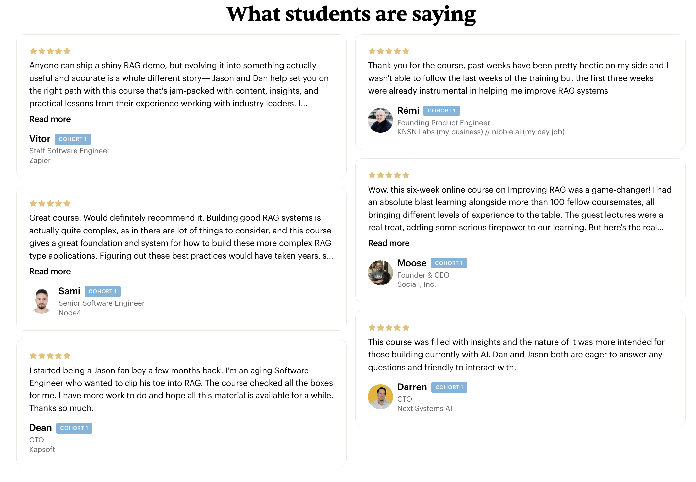

# Systematically Improve Your RAG Applications

Elevate your Retrieval-Augmented Generation (RAG) systems with our intensive, industry-leading course launching February 2024.

This program has attracted students from tech giants like Amazon, Adobe, Zapier, Meta, Intuit, Shopify, Neo4j, Cisco, as well as numerous independent AI consultants. Our approach decomposes your system into its core components, identifying bottlenecks and guiding you through focused experiments to enhance your system's performance end to end.

We transcend vague directives like "just make it better," offering tangible, step-by-step instructions on how to effectively analyze and leverage your data. Learn what it means to 'look at your data' and how to use it to build better products.

Enroll now to benefit from:

- Hands-on, practical learnin
- Real-world case studies
- 12 hours of dedicated office hours with expert instructors
- A community of like-minded professionals

Don't miss this opportunity to transform your RAG skills and stay ahead in the competitive AI landscape.

This is for professionals who are serious about building production-ready RAG systems. 

## Why now?

- RAG is a new field, creating a level playing field for all learners
- Everyone is starting from the ground up, regardless of prior experience
- This course offers a unique opportunity to get ahead of the curve
- Early understanding of RAG principles can lead to significant competitive advantages
- The timing is perfect to build a strong foundation in this emerging technology
- Instructor's insights are particularly valuable in this nascent stage of RAG development

## Won't a lot change by February?

- Course focuses on timeless fundamentals of problem decomposition
- You'll learn to conduct rapid evaluations and identify bottlenecks
- Emphasis on efficient resource allocation for RAG systems
- Skills in building UIs that generate valuable training data
- These core competencies remain relevant regardless of technological changes

## Why does my team need this?

- Align your team on RAG best practices
- Save months of trial and error
- Build scalable systems that prevent future rewrites
- Foster a data-driven culture of continuous improvement
- Bridge gaps between technical and business teams
- Learn from real-world case studies across industries
- Connect with professionals facing similar challenges

## What are people saying?

### Max (Software Engineer, Launch School)
⭐⭐⭐⭐⭐
This course was exactly what I was looking for, as an engineer building a production RAG system. I took away practical lessons from every lecture that I could go back and implement in my own work. More than that, interacting with the other students and guest speakers felt like I was learning from a community on the vanguard of this emerging field. A lot of the best practices in this field are still unpublished (or buried in technical papers). This course was a head start on what I suspect will be established conventions in a few years.

### Christopher (Senior Data/AI Architect, Procurement Sciences AI)
⭐⭐⭐⭐⭐
This course does an excellent job of stressing the fundamentals while providing useful metric tools to measure the current state of your RAG system and then show concrete improvement. The teachers have a deep background in RAG and recommendation system. The guest speakers are professionals working at the edges of RAG technologies and share their insights and journey. The peer group is also fantastic and built from peers also working in the field on actual RAG implementations.

### Vitor (Staff Software Engineer, Zapier)
⭐⭐⭐⭐⭐
Anyone can ship a shiny RAG demo, but evolving it into something actually useful and accurate is a whole different story-- Jason and Dan help set you on the right path with this course that's jam-packed with content, insights, and practical lessons from their experience working with industry leaders. I especially enjoyed the emphasis on looking at your data and building a flywheel that's grounded on evaluations and metrics, and not "vibes"-based AI engineering. If you want to get serious about building RAG systems, this course can save you months of trial and error. Highly recommended!

### Moose (Founder & CEO, Sociail, Inc.)
⭐⭐⭐⭐⭐
Wow, this six-week online course on Improving RAG was a game-changer! I had an absolute blast learning alongside more than 100 fellow coursemates, all bringing different levels of experience to the table. The guest lectures were a real treat, adding some serious firepower to our learning. But here's the real kicker — despite our varied backgrounds, Jason and Dan somehow managed to create a solid baseline for everyone. They've got this knack for breaking down complex RAG concepts into a framework that just clicks, no matter where you're starting from. I walked away with great validation and practical ideas we could apply to our production RAG implementation right away in our startup, which is precisely what I was hoping for. The course delivered great value, striking that perfect balance between theory and real-world application. It's pretty amazing how they pulled it off, considering they only had six weeks and how quickly the RAG field is evolving. Kudos to Jason, Dan, and the whole team for putting together such an incredible learning experience!

## Our Guarantee

If you don't feel better about the progress you're making in 4 weeks, you'll get your money back no questions asked.

[Enroll now on Maven (starts Feb 4)](https://maven.com/applied-llms/rag-playbook){ .md-button .md-button--primary }

??? note "How to get reimbursed"

    Hey {manager},

    There's a course called Systematically Improving RAG Applications that I'd love to enroll in. It's a live, online course with peers who are in similar roles to me, and it's run on Maven, where 40,000+ professionals from companies like Meta, Google, Airbnb, and NASA go to level up when they need to learn quickly and efficiently.

    A few highlights:

    Direct access to Jason Liu and Dan Becker, the expert instructors teaching the course
    Hands-on working sessions to test new tactics and ideas
    Latest thinking in the space on how to solve problems we're facing

    I anticipate being able to put my learnings directly into practice during the course. After the course, I can share the learnings with the team so our entire team levels up.

    The course costs $1,650. If you like, you can review course details here, including the instructor’s bio: https://maven.com/applied-llms/rag-playbook

    What do you think?

    Thanks,
    {Your Name}

    P.S. Other teams have sent a few people to the course together because it's an efficient way to get shared context that otherwise takes back-and-forth time to build. It might make sense for us to send a few folks to this course.

## Limited Availability: Expert RAG Consulting

I can also help you with tailored solutions to your specific challenges through my Applied AI Consulting Services. With 8 years of experience at companies like Stitchfix, Meta, and NYU, I specialize in:

- Designing self-improving AI systems with robust feedback loops
- Developing and implementing Vision/Text based search systems
- Crafting comprehensive evaluation frameworks for search and recommendation systems
- Making strategic AI research bets and evaluating vendors

My services include:

1. **Subscription-based Support**: Flexible, on-demand assistance with weekly check-ins, unlimited communication, and strategic guidance.

2. **Strategic Consulting**: Implement effective AI strategies to boost productivity, revenue, and market value. Includes weekly 1:1 syncs, asynchronous support, and access to my expert network.

3. **Comprehensive Consulting**: Enhance AI capabilities through prototyping, research, process optimization, and team training.

I've worked with companies backed by top VC firms and can help turn your AI challenges into opportunities for growth.

[Explore Consulting Services](services.md){ .md-button .md-button--secondary }

Minimum engagement: 
- Async Support: $9,500 per month
- Strategic Consulting: Starts at $50,000 for a 3-month engagement
- Comprehensive Consulting: Starts at $120,000 for a 3-month engagement