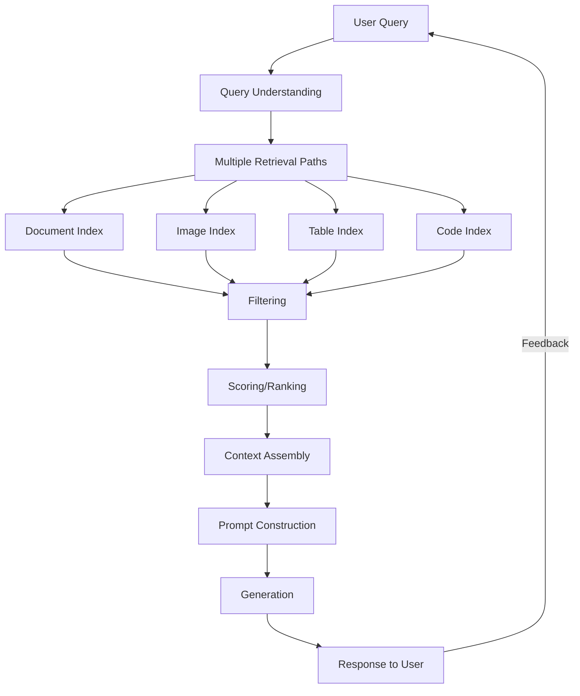
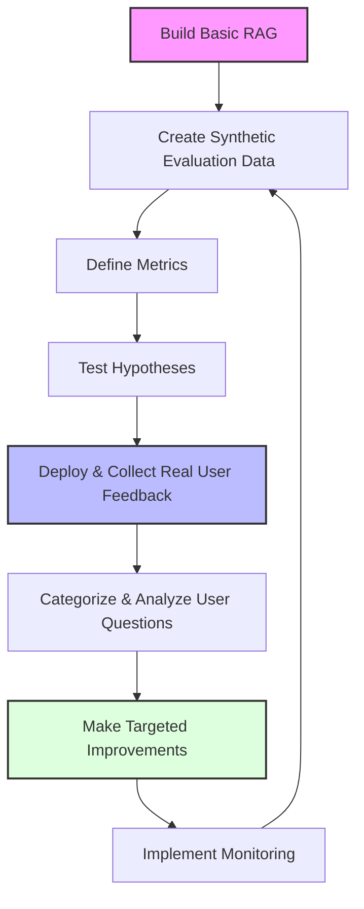
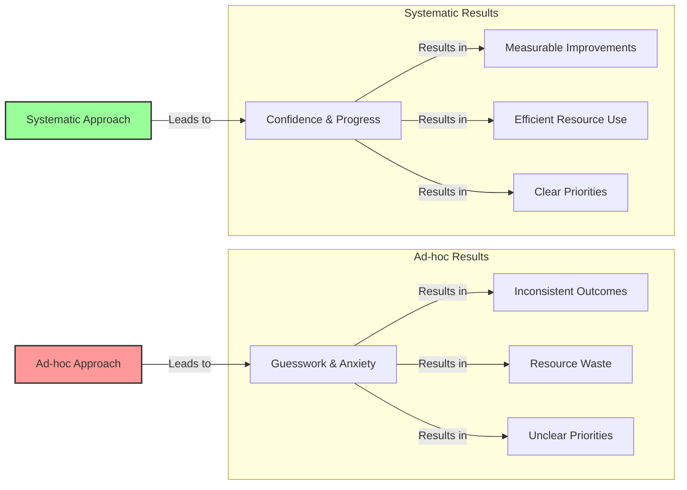

# Beyond Implementation to Improvement: A Product Mindset for RAG

### Key Insight

**Successful RAG systems aren't projects that ship once—they're products that improve continuously.** The difference between teams that succeed and those that fail isn't the embedding model or vector database they choose. It's whether they treat RAG as a living product that learns from every user interaction, or as a static implementation that slowly decays in production.

!!! info "Learn the Complete RAG Playbook"
    All of this content comes from my [Systematically Improving RAG Applications](https://maven.com/applied-llms/rag-playbook?promoCode=EBOOK) course. Readers get **20% off** with code EBOOK. Join 500+ engineers who've transformed their RAG systems from demos to production-ready applications.

Look, I've been building AI systems for over a decade, and I keep seeing the same mistake: teams ship a RAG system, pat themselves on the back, and then watch it slowly fail in production.

This chapter is about avoiding that trap. We're going to talk about why the most successful RAG systems aren't the ones with the fanciest embeddings or the biggest context windows—they're the ones that get better every week based on what users actually do with them.

Here's what we'll cover:

- Why thinking of RAG as a "project" instead of a "product" dooms most implementations
- How to steal ideas from recommendation systems (because that's really what RAG is)
- A practical framework for turning user frustration into system improvements
- Real examples from companies that got this right (and wrong)

## The Product Mindset: Why Most RAG Implementations Fail

When organizations implement RAG systems, they often approach it as a purely technical challenge. They focus on selecting the right embedding model, vector database, and LLM, then consider the project "complete" once these components are integrated and deployed.

This approach inevitably leads to disappointment. The system works well for demo queries and simple use cases, but struggles with the complexity and diversity of real-world questions. As users encounter these limitations, they lose trust in the system and engagement drops. Without clear metrics or improvement processes, teams resort to ad-hoc tweaking based on anecdotal feedback.

Here's the problem: they've built a technical implementation, not a product. And there's a huge difference.

I've built AI systems at Facebook, Stitch Fix, and worked with companies like HubSpot and Zapier. Whether it was recommendation systems that drove $50M in revenue or content safety systems processing millions of items, one pattern keeps showing up: **successful teams treat their AI systems as products that get better over time, not projects that ship and stop.**

Here's a quick way to tell which mindset a team has:

**Implementation Mindset:**

- "We need to implement RAG"
- Obsessing over embedding dimensions and context windows
- Success = it works in the demo
- Big upfront architecture decisions
- Focus on picking the "best" model

**Product Mindset:**

- "We need to help users find answers faster"
- Tracking answer relevance and task completion
- Success = users keep coming back
- Architecture that can evolve
- Focus on learning from user behavior

The product mindset recognizes that launching your RAG system is just the beginning. The real work—and the real value—comes from how you systematically improve it based on user interactions.

## RAG as a Recommendation Engine

Here's the mental shift that changed everything for me: stop thinking about RAG as a pipeline of retrieval → augmentation → generation. Start thinking about it as a **recommendation engine wrapped around language models**.

Once you make this shift, everything becomes clearer. You stop obsessing over prompt templates and start focusing on what actually matters: getting the right information in front of the LLM.

Think about what this means:

1. **Your generation is only as good as your retrieval.** You can have the world's best prompt, but if you're feeding it garbage context, you'll get garbage answers.

2. **Different questions need different search strategies.** Amazon doesn't recommend books the same way it recommends electronics. Why would your RAG system use the same approach for every query?

3. **You need to know what users actually do with your responses.** Do they copy the answer? Ask a follow-up? Close the tab in frustration? This data is gold.

4. **Cold start sucks.** Netflix doesn't know what to recommend when you first sign up. Your RAG system has the same problem—you need data to get good.

5. **The best systems adapt to their users.** Not just generic improvements, but actually learning what works for specific user groups.

This perspective also explains why many RAG implementations underperform—they're built like simple search engines rather than sophisticated recommendation systems with feedback loops and personalization.

## The Improvement Flywheel: How to Actually Get Better

Here's the framework I use with every team I work with. I call it the "improvement flywheel" because once it starts spinning, it builds its own momentum:

This flywheel solves real problems at each stage:

| Phase                  | Business Challenge                               | Technical Challenge                        | Flywheel Solution                                                                                                                   |
| ---------------------- | ------------------------------------------------ | ------------------------------------------ | ----------------------------------------------------------------------------------------------------------------------------------- |
| **Cold Start**         | No data to guide design decisions                | No examples to train or evaluate against   | Generate synthetic questions from content Establish baseline metrics Compare architectural approaches                         |
| **Initial Deployment** | Understanding what users actually need           | Learning what causes poor performance      | Instrument application for data collection Implement feedback mechanisms Capture query patterns and failure modes             |
| **Growth**             | Prioritizing improvements with limited resources | Addressing diverse query types effectively | Use topic modeling to segment questions Identify highest-impact opportunities Build specialized capabilities for key segments |
| **Optimization**       | Maintaining quality as usage scales              | Combining multiple specialized components  | Create unified routing architecture Implement monitoring and alerts Establish continuous improvement processes                |

What's great about this is that it compounds. More data leads to better insights, which lead to smarter improvements, which generate more engaged users who provide better data. It's a virtuous cycle.

### Optimizing Feedback Collection

**A quick story about feedback:** We spent weeks at one company getting almost no user feedback. Then we changed the prompt from "How did we do?" to "Did we answer your question?" Feedback rates went up 5x overnight.

Here's what actually works:

- ✅ "Did we answer your question?" (specific and clear)
- ✅ "Did we take the correct actions?" (for systems that do things)
- ❌ "Rate your experience" (too vague, people think you mean the UI)

Other tips that actually move the needle:

- Thumbs up/down beats 5-star ratings by 3x (people are lazy)
- In enterprise settings, pipe feedback to a Slack channel—transparency drives improvement
- Only ask for written feedback AFTER they click thumbs down

Remember: if you're not going to act on a metric, don't track it. You're just creating dashboard noise.

## Why You Need a System (Not Just Good Intentions)

A system is a structured approach to solving problems that guides how we think about and tackle challenges. For RAG applications, this includes:

- A framework for evaluating technologies
- A decision-making process for prioritizing development efforts
- A methodology for diagnosing and improving performance
- Standard metrics and benchmarks for measuring success

The contrast between systematic and ad-hoc approaches is stark:

### The Cost of Lacking a System

Without a systematic approach, teams face significant challenges:

Here's what happens in real meetings:

**"Make the AI better"**

- Without a system: Everyone looks nervous, suggests random ideas
- With a system: "Our top failure mode is date-related queries at 23% error rate. Here's our plan."

**"Where should we focus engineering time?"**

- Without a system: Whoever argues loudest wins
- With a system: "42% of failures are inventory problems. Let's start there."

**"Is this new embedding model worth it?"**

- Without a system: "The benchmarks look good?"
- With a system: "It improves our technical documentation queries by 15% but hurts on short questions. Not worth it."

The best part? Once you have a system, you stop wasting energy on debates and anxiety. You can focus on actually making things better.

## Making the Mental Shift

The shift from engineer to product thinker is subtle but powerful. Here's how your questions change:

**Old:** "Which embedding model has the best benchmark scores?"
**New:** "Which embedding approach helps our users find answers fastest?"

**Old:** "What's the optimal chunk size?"
**New:** "How do we know if our chunking is helping or hurting users?"

**Old:** "How do we eliminate hallucinations?"
**New:** "How do we build trust even when the system isn't perfect?"

**Old:** "Should we use GPT-4 or Claude?"
**New:** "Which model capabilities actually matter for our use case?"

This shift doesn't mean abandoning technical rigor. It means applying that rigor to problems that actually matter to your users, guided by data instead of assumptions.

**Quick story:** A restaurant chain spent months perfecting their voice AI's speech recognition. Then someone actually listened to the call recordings. Turns out 30% of callers were asking "What's good here?"

They added a simple feature: when someone asks that, the AI recommends the three most popular items. Revenue went up 9%. They didn't improve the AI at all—they just paid attention to what people actually wanted.

### A Real Example: Legal Tech RAG

Let me walk you through how this played out with a legal tech company I worked with:

**Starting point:** Basic RAG with standard embeddings. Lawyers complained it "never found the right cases."

**Step 1:** We generated 200 test queries from their actual case law. Baseline accuracy: 63%. Not great.

**Step 2:** Tested different approaches. Turns out legal jargon breaks standard chunking. Fixed that, got to 72%.

**Step 3:** Shipped it and watched what lawyers actually did. Added thumbs up/down buttons and tracked what they copied.

**Step 4:** After 2 months and 5,000 queries, patterns emerged. Three main query types:

- Case citations (worked great)
- Legal definitions (OK)
- Procedural questions (total failure)

**Step 5:** Built specialized handlers for each type. Overall accuracy hit 87%.

**Step 6:** Keep monitoring. Procedural questions growing 3x faster than others—that's where we focus next.

End result: lawyers actually started using the system. Research time dropped 40%. But more importantly, we had a system for making it better every month.

**Pro tip:** When something's not working, first ask: "Is this an inventory problem or a capabilities problem?"

**Inventory problem:** You don't have the answer in your knowledge base

- Missing documents
- Outdated info
- Gaps in coverage
- Fix: Add more/better content

**Capabilities problem:** You have the answer but can't find it

- Bad retrieval
- Wrong search strategy
- Can't understand the query
- Fix: Improve how you search

I've seen teams waste months improving retrieval when they simply didn't have the right documents. Don't be that team.

## Who This Is For

Based on who's shown up to my workshops, you're probably:

- A technical leader trying to figure out why your RAG system isn't getting better
- An engineer who built a RAG system and is now stuck maintaining it
- Part of a team (engineering, data science, product) trying to make AI actually useful

I've taught this to teams at tiny startups and big tech companies. The problems are surprisingly similar—everyone's trying to move from "we built RAG" to "our RAG system gets better every week."

## What's Coming Next

Each chapter builds on the last, taking you through the complete improvement flywheel. Everything includes code and examples you can steal for your own projects.

Here's what we'll cover in the upcoming chapters:

### [Chapter 1: Starting the Flywheel with Data](chapter1.md)

Learn how to overcome the cold-start problem through synthetic data generation, establish meaningful metrics that align with business goals, and create a foundation for data-driven improvement.

### [Chapter 2: From Evaluation to Product Enhancement](chapter2.md)

Discover how to transform evaluation insights into concrete product improvements through fine-tuning, re-ranking, and targeted capability development.

### [Chapter 3: The User Experience of AI](chapter3-1.md)

Explore how to design interfaces that both delight users and gather valuable feedback, creating the virtuous cycle at the heart of the improvement flywheel.

### [Chapter 4: Understanding Your Users](chapter4-1.md)

Learn techniques for segmenting users and queries to identify high-value opportunities and create prioritized improvement roadmaps.

### [Chapter 5: Building Specialized Capabilities](chapter5-1.md)

Develop purpose-built solutions for different user needs, spanning documents, images, tables, and structured data.

### [Chapter 6: Unified Product Architecture](chapter6-1.md)

Create a cohesive product experience that intelligently routes to specialized components while maintaining a seamless user experience.

## How You'll Know It's Working

Here's what changes when you get this right:

- When someone says "make the AI better," you don't panic—you pull up your dashboard
- You stop debating what might work and start testing what actually works
- Your team spends less time in meetings arguing and more time shipping improvements
- You can actually tell your boss/board/users what's getting better and why
- Users start saying "wow, this actually got better" instead of "why is this still broken?"

The difference is night and day. Teams without a system spin their wheels. Teams with a system ship improvements every week.

## Reflection Questions

As you prepare for the next chapter, consider these questions about your current approach to RAG:

1. Are you treating your RAG implementation as a completed project or an evolving product?
1. What mechanisms do you have in place to learn from user interactions?
1. How do you currently measure the success of your RAG application?
1. What processes do you have for prioritizing improvements?
1. How would your approach change if you viewed RAG as a recommendation engine rather than a pipeline?
1. How much time does your team currently spend debating what might work versus testing hypotheses?
1. Do you have a framework for allocating resources to different improvement opportunities?

The shift from implementation to product thinking isn't easy, but it's the difference between a RAG system that slowly dies and one that gets better every week.

Next up: we'll dive into the first step of the flywheel—creating synthetic data so you can start improving before you even have users.

---

_Note: I've used this approach with companies across legal, finance, healthcare, and e-commerce. The details change, but the core flywheel stays the same: focus on users, measure what matters, and improve based on data instead of hunches._

---

