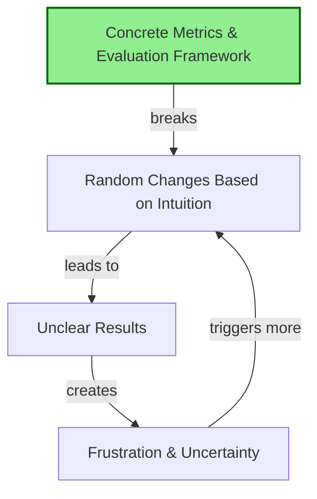
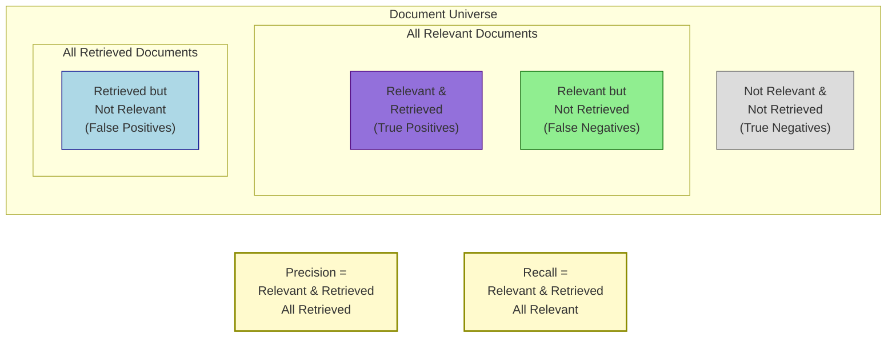
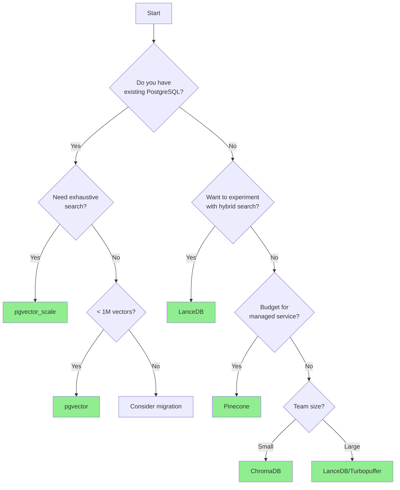
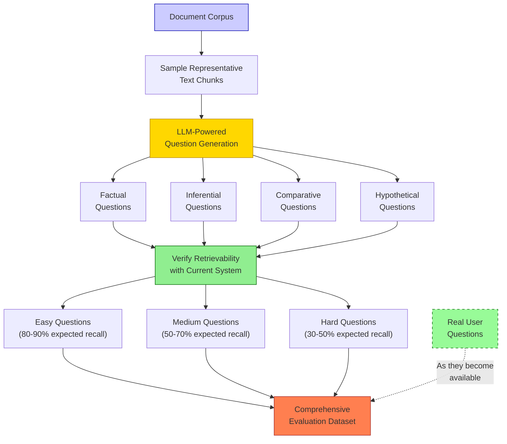

# Kickstarting the Data Flywheel with Synthetic Data

## Learning Objectives

By the end of this chapter, you will be able to:

1. **Understand common pitfalls that sabotage RAG applications** - Identify and avoid the reasoning fallacy, vague metrics problem, and generic solution trap that prevent meaningful improvement
2. **Distinguish between leading and lagging metrics** - Focus on actionable leading metrics like experiment velocity rather than outcome metrics you cannot directly control  
3. **Combat absence blindness and intervention bias** - Systematically address what you cannot see and avoid making changes without measuring impact
4. **Build comprehensive evaluation frameworks using synthetic data** - Create evaluation datasets before having real users to establish baselines and test improvements
5. **Implement retrieval-focused metrics first** - Prioritize precision and recall over generation quality because they are faster, cheaper, and more objective to measure
6. **Create systematic experimentation processes** - Establish the data flywheel that turns evaluation examples into training data for continuous improvement

These objectives establish the foundational measurement and improvement practices that enable all advanced techniques in subsequent chapters.

### Key Insight

**You can't improve what you can't measure—and you can measure before you have users.** Synthetic data isn't just a stopgap until real users arrive. It's a powerful tool for establishing baselines, testing edge cases, and building the evaluation infrastructure that will power continuous improvement. Start with retrieval metrics (precision and recall), not generation quality, because they're faster, cheaper, and more objective.

!!! info "Learn the Complete RAG Playbook"
    All of this content comes from my [Systematically Improving RAG Applications](https://maven.com/applied-llms/rag-playbook?promoCode=EBOOK) course. Readers get **20% off** with code EBOOK. 
    
    **Join 500+ engineers** who've transformed their RAG systems from demos to production-ready applications. Previous cohort participants work at companies like HubSpot, Zapier, and numerous AI startups - from seed stage to $100M+ valuations.

Alright, let's talk about making RAG applications actually work. Most teams I work with are stuck in this weird loop where they keep tweaking things randomly and hoping something sticks. Sound familiar?

Here's what we're going to cover: how to set up evaluations that actually tell you something useful, common ways teams shoot themselves in the foot (and how to avoid them), and how to use synthetic data to test your system before you even have users.

## Common Pitfalls in AI Development

After consulting with dozens of companies - from AI startups to $100M+ companies - I keep seeing the same patterns. I've seen companies hire ML engineers only to realize they weren't logging data, then wait 3-6 months to collect it. Let me walk you through these patterns so you don't make the same mistakes.

### The Reasoning Fallacy

I can't tell you how many times I hear "we need more complex reasoning" or "the model isn't smart enough." Nine times out of ten, that's not the problem. The real issue? You don't actually know what your users want.

Think about it - when was the last time you:

- Actually looked at data from customers?
- Read user feedback (not just the positive reviews)?
- Actively asked users what they're struggling with?

If you're like most teams, the answer is "uhh..." And that's the problem. You end up building these generic tools that don't solve any specific problem particularly well.

### The Vague Metrics Problem

Here's another one that drives me crazy. Teams will spend weeks changing things and then evaluate success by asking "does it look better?" or "does it feel right?"

**Real Example**: I've worked with companies valued at $100 million that had less than 30 evaluation examples total. When something broke or improved, they had no idea what actually changed or why.

Without concrete metrics, you get stuck in this loop:

1. Make random changes based on gut feeling
2. Get unclear results
3. Feel frustrated
4. Make more random changes

And round and round you go.



### Building Generic Solutions

This one's tough because it often comes from good intentions. You want to build something that helps everyone! But here's what actually happens: you build a generic tool that does everything poorly instead of one thing well.

I see this with teams that have 30-40% churn rates but are too scared to narrow their focus because they might miss out on some hypothetical use case.

My advice? Pick a narrow domain, become world-class at it, then expand. You'll learn way more from 100 happy users in one domain than 1,000 frustrated users across ten.

## Leading versus Lagging Metrics

This concept changed how I think about improving systems. I learned it at Facebook, and it's been invaluable for RAG applications.

### Lagging Metrics

Lagging metrics are the things you care about but can't directly control:

- Application quality
- User satisfaction
- Churn rates
- Revenue

They're like your body weight - easy to measure, hard to change directly.

### Leading Metrics

Leading metrics are things you can control that predict future performance:

- Number of experiments run per week
- Evaluation coverage of different question types
- Retrieval precision and recall
- User feedback collection rate

They're like calories consumed or workouts completed - you have direct control.

### The Calories In, Calories Out Analogy

Here's a simple analogy that really drives this home. If you want to lose weight (lagging metric), obsessing over the scale won't help much. What works? Tracking calories in and calories out (leading metrics).

It's not perfect, but it's actionable. You can't directly control your weight today, but you can control whether you eat 2,000 or 3,000 calories.

Same thing with RAG applications. You can't directly make users happy, but you can run more experiments, improve retrieval metrics, and collect more feedback.

### The #1 Leading Metric: Experiment Velocity

If I had to pick one metric for early-stage RAG applications, it's this: how many experiments are you running?

Instead of asking "did the last change improve things?" in standup, ask "how can we run twice as many experiments next week?" What infrastructure would help? What's blocking us from testing more ideas?

**Real Impact**: Teams that focus on experiment velocity often see 6-10% improvements in recall with just hundreds of dollars in API calls - work that previously required tens of thousands in data labeling costs.

This shift from outcomes to velocity changes everything.

## Absence Blindness and Intervention Bias

These two biases kill more RAG projects than anything else.

### Absence Blindness

You can't fix what you can't see. Sounds obvious, right? But I see teams obsess over generation quality while completely ignoring whether retrieval works at all.

I had a client spend three weeks fine-tuning prompts. When we finally checked, their retrieval system was returning completely irrelevant documents. No amount of prompt engineering can fix that.

Questions teams forget to ask:

- Is retrieval actually finding the right documents?
- Are our chunks the right size?
- Is our data extraction pipeline working?
- Do we have separate metrics for retrieval vs generation?

### Intervention Bias

This is our tendency to do _something_ just to feel like we're making progress. In RAG, it shows up as constantly switching models, tweaking prompts, or adding features without measuring impact.

"Should we use GPT-4 or Claude?"
"Will this new prompt technique help?"

My answer is always the same: depends on your data and evaluations. There's no universal answer.

The fix? Every change should target a specific metric and test a clear hypothesis. No more "let's try this and see what happens."

## The RAG Flywheel and Retrieval Evaluations

Here's the thing - everything we learned about search applies to retrieval. If you have a basic RAG setup, your next step is testing whether retrieval actually works.

### Why Prioritize Retrieval Evaluations

Teams without ML backgrounds often jump straight to generation evaluations. Bad idea. Here's why retrieval evaluations are better:

1. **Speed**: Milliseconds vs seconds
2. **Cost**: Way cheaper to run
3. **Objectivity**: Clear yes/no answers
4. **Scalability**: Run thousands of tests quickly

When you focus on generation too early, everything becomes subjective. Did the model hallucinate? Is this answer good enough? Who knows?

But with retrieval, it's simple: did you find the right document or not?

## Understanding Precision and Recall

Let's make these concepts concrete:

**Testing Different K Values:**

- Start with K=10
- Test K=3, 5, 10, 20 to understand tradeoffs
- Higher K improves recall but may hurt precision
- Advanced models (GPT-4, Claude) handle irrelevant docs better, so lean toward higher K

**Why Score Thresholds Are Dangerous:**

- Score distributions vary wildly by query type
- A threshold that works for one category fails for others
- Example: average ada-002 score is 0.7, but 0.5 for ada-003
- Better approach: Always return top K, let the LLM filter



**Recall**: What percentage of relevant documents did you find? If there are 10 correct documents and you found 4, that's 40% recall.

**Precision**: What percentage of your results were actually relevant? If you returned 10 results but only 2 were relevant, that's 20% precision.

With modern LLMs, prioritize recall. They're pretty good at ignoring irrelevant stuff. With simpler models, precision matters more because they get confused easily.

## Case Studies: Real-World Improvements

Let me share two examples that show how focusing on retrieval metrics leads to quick wins.

### Case Study 1: Report Generation from Expert Interviews

A client generates reports from user research interviews. Consultants do 15-30 interviews and want AI-generated summaries.

**Problem**: Reports were missing quotes. A consultant knew 6 experts said something similar, but the report only cited 3. That 50% recall rate killed trust.

**Solution**: We built manual evaluation sets from problematic examples. Turns out, better text chunking fixed most issues.

**Result**: Recall went from 50% to 90% in a few iterations - a 40 percentage point improvement that customers noticed immediately. This kind of measurable improvement builds trust and enables continued partnership.

**Lesson**: Pre-processing that matches how users query can dramatically improve retrieval.

### Case Study 2: Blueprint Search for Construction

Another client needed AI search for construction blueprints - workers asking questions about building plans.

**Problem**: Only 27% recall when finding the right blueprint for questions.

**Solution**: We used a vision model to create detailed captions for blueprints, including hypothetical questions users might ask.

**Result**: Four days later, recall jumped from 27% to 85% - a 58 percentage point improvement. Once live, we discovered 20% of queries involved counting objects, which justified investing in bounding box models for those specific use cases.

**Lesson**: Test subsystems independently for rapid improvements. Synthetic data for specific use cases works great.

**Chunk Size Best Practices:**

Start with 800 tokens and 50% overlap. This works for most use cases.

Why chunk optimization rarely gives big wins:

- Usually yields <10% improvements
- Better to focus on:
  - Query understanding and expansion
  - Metadata filtering
  - Contextual retrieval (adding document context to chunks)
  - Better embedding models

When to adjust:

- Legal/regulatory: Larger chunks (1500-2000 tokens) to preserve full clauses
- Technical docs: Smaller chunks (400-600 tokens) for precise retrieval
- Conversational: Page-level chunks to maintain context

## Practical Implementation: Building Your Evaluation Framework

Time to build something that actually works. Your framework should:

1. Run questions through retrieval
2. Compare results to ground truth
3. Calculate precision and recall
4. Track changes over time

This becomes your improvement flywheel. Every change gets evaluated against these metrics.

### Building a Practical Evaluation Pipeline

Here's a simple but effective evaluation pipeline:

```python
def evaluate_retrieval(evaluation_data, retriever_fn, k=10):
    """
    Evaluate retrieval performance on a dataset.

    Args:
        evaluation_data: List of dicts with 'question' and 'relevant_docs' keys
        retriever_fn: Function that takes question text and returns docs
        k: Number of top results to consider

    Returns:
        Dict containing evaluation metrics
    """
    results = []

    for item in evaluation_data:
        question = item['question']
        ground_truth = set(item['relevant_docs'])

        # Call retrieval system
        retrieved_docs = retriever_fn(question, top_k=k)
        retrieved_ids = [doc['id'] for doc in retrieved_docs]

        # Calculate metrics
        retrieved_relevant = set(retrieved_ids) & ground_truth
        precision = len(retrieved_relevant) / len(retrieved_ids) if retrieved_ids else 0
        recall = len(retrieved_relevant) / len(ground_truth) if ground_truth else 1.0

        # Store individual result
        results.append({
            'question_id': item.get('id', ''),
            'question': question,
            'precision': precision,
            'recall': recall,
            'retrieved_docs': retrieved_ids,
            'relevant_docs': list(ground_truth),
            'metadata': item.get('metadata', {})
        })

    # Aggregate metrics
    avg_precision = sum(r['precision'] for r in results) / len(results)
    avg_recall = sum(r['recall'] for r in results) / len(results)

    return {
        'avg_precision': avg_precision,
        'avg_recall': avg_recall,
        'detailed_results': results
    }
```

### Running Regular Evaluations

Make evaluation part of your routine:

1. **Continuous testing**: Run with every significant change
2. **Weekly benchmarks**: Comprehensive evaluations on schedule
3. **Version comparison**: Always compare new vs old
4. **Failure analysis**: Review 0% recall cases for patterns
5. **Difficulty progression**: Add harder tests as you improve

**Production Monitoring Tips:**

Track these over time:

- Average cosine distance between queries and retrieved docs
- Percentage of queries with no results above threshold
- Score distributions (watch for bimodal patterns)

Segment by user type:

- New vs returning users have different patterns
- Technical vs non-technical users need different strategies
- Time-based patterns (like during product launches)

Real example: A company's cosine distances spiked during their Super Bowl ad. New users asked different questions, revealing content gaps. They created onboarding content and improved retention 25%.

### Integrating with Development Workflow

To maximize value:

1. **Build a dashboard**: Simple interface showing trends
2. **Automate testing**: Part of CI/CD
3. **Set alerts**: Notify when metrics drop
4. **Document experiments**: Track changes and impact
5. **Connect to business**: Link retrieval metrics to outcomes

Your framework should evolve with your application. Start simple, add complexity as needed.

## Vector Database Selection Guide

"Which vector database should I use?" gets asked in every office hours. Here's my take based on real deployments.

### Understanding Your Requirements

First, figure out:

1. **Scale**: How many documents/chunks?
2. **Query patterns**: Need metadata filtering? SQL? Hybrid search?
3. **Performance**: Latency requirements?
4. **Infrastructure**: Existing database expertise?
5. **Budget**: Open source vs managed?

### Vector Database Comparison

| Database                     | Best For                        | Pros                                                                                                      | Cons                                                                                                                  | When to Use                                                                                |
| ---------------------------- | ------------------------------- | --------------------------------------------------------------------------------------------------------- | --------------------------------------------------------------------------------------------------------------------- | ------------------------------------------------------------------------------------------ |
| **PostgreSQL + pgvector**    | Teams with SQL expertise        | • Familiar SQL interface<br>• Metadata filtering<br>• ACID compliance<br>• Single database for everything | • Not optimized for vector operations<br>• Limited to ~1M vectors for good performance<br>• No built-in hybrid search | When you need to combine vector search with complex SQL queries and already use PostgreSQL |
| **LanceDB**                  | Experimentation & hybrid search | • One-line hybrid search<br>• Built-in re-ranking<br>• S3 storage support<br>• DuckDB for analytics       | • Newer, less battle-tested<br>• Smaller community                                                                    | When you want to quickly test lexical vs vector vs hybrid search approaches                |
| **Timescale pgvector_scale** | Large-scale exhaustive search   | • Exhaustive search capability<br>• Better scaling than pgvector<br>• Time-series support                 | • Requires Timescale<br>• More complex setup                                                                          | When you need guaranteed recall on large datasets with time-based queries                  |
| **ChromaDB**                 | Simple prototypes               | • Easy to get started<br>• Good Python API<br>• Local development friendly                                | • Performance issues at scale<br>• Limited production features                                                        | For POCs and demos under 100k documents                                                    |
| **Turbopuffer**              | High-performance search         | • Very fast<br>• Good scaling<br>• Simple API                                                             | • Newer entrant<br>• Limited ecosystem                                                                                | When raw performance is critical                                                           |
| **Pinecone**                 | Managed solution                | • Fully managed<br>• Good performance<br>• Reliable                                                       | • Expensive at scale<br>• Vendor lock-in                                                                              | When you want zero infrastructure management                                               |

### Decision Framework



### Implementation Example: LanceDB for Hybrid Search

We use LanceDB in this course because it makes comparing retrieval strategies trivial:

```python
import lancedb
from lancedb.embeddings import get_registry
from lancedb.pydantic import LanceModel, Vector
from lancedb.rerankers import CohereReranker

# Define your schema
class Document(LanceModel):
    text: str
    source: str
    metadata: dict
    vector: Vector(get_registry().get("openai").create())

# Create database
db = lancedb.connect("./my_rag_db")
table = db.create_table("documents", schema=Document)

# Add documents
table.add([
    Document(text="...", source="...", metadata={...})
    for doc in documents
])

# Compare retrieval strategies with one line changes
results_vector = table.search(query).limit(10).to_list()
results_lexical = table.search(query, query_type="fts").limit(10).to_list()
results_hybrid = table.search(query, query_type="hybrid").limit(10).to_list()

# Add re-ranking with one more line
reranker = CohereReranker()
results_reranked = table.search(query).limit(50).rerank(reranker).limit(10).to_list()
```

This flexibility lets you quickly test what works for your data without rewriting everything.

### Migration Considerations

If you're already using a vector database but having issues:

1. **Measure first**: Quantify current performance
2. **Test in parallel**: Run subset of queries against both
3. **Compare results**: Use evaluation metrics to ensure quality
4. **Plan migration**: Consider dual-writing during transition

Don't choose based on hype or benchmarks. Choose based on your team's expertise, query patterns, scaling needs, and budget.

From office hours: "We generally want to use SQL databases. If you use something like Timescale or PostgreSQL, there are many ways of doing time filtering... The general idea is to use structured extraction to identify start and end dates, prompt your language model with an understanding of what those dates are, and then use filtering."

## Creating Synthetic Data for Evaluation

No user data yet? No problem. Synthetic data gets you started. But it's not as simple as asking an LLM for "more data" - you need diverse, realistic datasets that reflect real usage.



### Basic Approach: Question Generation

Simple version:

1. Take random text chunk
2. Ask LLM to generate a question this chunk answers
3. Verify retrieval finds the original chunk

This creates a basic dataset testing whether your system finds the right info. Recall becomes binary: found it or didn't.

### Generating Diverse Synthetic Data

For truly valuable synthetic data, you need variety:

#### 1. Variation in Question Types

Test different retrieval capabilities:

- **Factual**: Direct questions with explicit answers
- **Inferential**: Connecting multiple pieces of info
- **Comparative**: Comparing entities or concepts
- **Hypothetical**: "What if" scenarios
- **Clarification**: Asking for elaboration

#### 2. Linguistic Diversity Techniques

Vary phrasing:

- **Paraphrasing**: Multiple ways to ask the same thing
- **Terminology**: Synonyms and domain language
- **Complexity**: Mix simple and compound queries
- **Length**: Short keywords to verbose questions
- **Format**: Questions, commands, implied questions

#### 3. Chain-of-Thought Generation

Use CoT for nuanced questions:

```
Given this text chunk:
[CHUNK]

First, identify 3-5 key facts or concepts in this text.
For each key concept:
1. Think about different ways someone might ask about it
2. Consider various levels of prior knowledge the asker might have
3. Imagine different contexts in which this information might be relevant

Now, generate 5 diverse questions about this text that:
- Vary in complexity and format
- Would be asked by users with different backgrounds
- Target different aspects of the information
- Require different types of retrieval capabilities to answer correctly

For each question, explain your reasoning about why this is a realistic user question.
```

#### 4. Few-Shot Prompting for Domain Specificity

If you have real user questions, use them:

```
I'm creating questions that users might ask about [DOMAIN].
Here are some examples of real questions:

1. [REAL QUESTION 1]
2. [REAL QUESTION 2]
3. [REAL QUESTION 3]

Here's a text passage:
[CHUNK]

Please generate 5 new questions similar in style and intent to the examples above,
that would be answered by this text passage.
```

#### 5. Adversarial Question Generation

Create deliberately challenging questions:

```
Given this text passage:
[CHUNK]

Generate 3 challenging questions that:
1. Use different terminology than what appears in the passage
2. Require understanding the implications of the content
3. Might confuse a basic keyword search system
4. Would still be reasonable questions a user might ask

For each question, explain why it's challenging and what makes it a good test case.
```

### Building Comprehensive Evaluation Sets

Structure your evaluation sets strategically:

1. **Coverage mapping**: Cover all document types and topics
2. **Difficulty distribution**: Easy (80-90% expected recall), medium (50-70%), hard (30-50%)
3. **Ground truth validation**: Have experts verify questions and docs
4. **Domain segmentation**: Separate sets for different use cases
5. **Synthetic/real blending**: Gradually mix in real data as you get it

### Using Synthetic Data Beyond Evaluation

Your synthetic data can do more:

1. **Retrieval benchmarking**: Measuring search quality
2. **Few-shot examples**: Enhancing LLM understanding
3. **Fine-tuning data**: Training specialized embeddings/rerankers
4. **User experience testing**: Simulating realistic sessions

Good synthetic data upfront accelerates everything else.

**Model Sensitivity Warning:**

Models are more sensitive to irrelevant info than you'd expect. Even GPT-4 and Claude get distracted by marginally relevant content.

This matters for:

- Multi-step reasoning
- Numerical calculations
- Finding specific facts in specific documents

Test by:

1. Creating test cases with varying irrelevant info
2. Measuring performance degradation
3. Using results to set precision/recall tradeoffs

Example: One team found 5 irrelevant documents (even marked as "potentially less relevant") reduced financial calculation accuracy by 30%. They adjusted retrieval to favor precision for numerical queries.

## Additional Resources

**Tools and Libraries for RAG Evaluation:**

- **[RAGAS](https://github.com/explodinggradients/ragas)**: Open-source framework for evaluating RAG applications
- **[LangChain Evaluation](https://python.langchain.com/docs/guides/evaluation/)**: Tools for evaluating retrieval and generation
- **[Prompttools](https://github.com/promptslab/prompttools)**: Toolkit for testing and evaluating LLM applications
- **[MLflow for Experiment Tracking](https://mlflow.org/)**: Open-source platform for managing ML lifecycle

## This Week's Action Items

Based on the content covered, here are your specific tasks:

### Immediate Actions (Start This Week)

1. **Audit Current State**
   - Count your existing evaluations (aim for 20+ minimum)
   - Identify your leading vs lagging metrics
   - Document your current experiment velocity (how many tests per week?)

2. **Create Your First Evaluation Set**
   - Build 10-20 query/expected-chunk pairs for your most common use cases
   - Test current retrieval performance to establish baseline
   - Include easy, medium, and hard difficulty levels

3. **Run Your First Experiment**
   - Change one variable (chunk size, embedding model, K value)
   - Measure before and after performance with concrete metrics
   - Document what you learned and plan next experiment

### Technical Implementation

4. **Build Evaluation Pipeline**
   - Implement the basic retrieval evaluation function from this chapter
   - Set up automated testing that runs with each significant change
   - Create a simple dashboard or tracking system for metrics

5. **Generate Synthetic Data**
   - Use the prompt templates provided to create diverse questions
   - Test different query types: factual, inferential, comparative
   - Validate that your system can retrieve the expected chunks

6. **Experiment with Retrieval Settings**
   - Test different K values (3, 5, 10, 20) and measure precision/recall tradeoffs
   - Try hybrid search if using LanceDB or similar systems
   - Compare different embedding models or reranking approaches

### Strategic Planning

7. **Focus on Leading Metrics**
   - Track experiment velocity as your primary success measure
   - Plan infrastructure investments that increase experiment speed
   - Shift standup discussions from outcomes to experiment planning

8. **Combat Biases**
   - Check retrieval quality before focusing on generation
   - Make specific, hypothesis-driven changes rather than random tweaks
   - Build systems to capture what you can't currently see

## Reflection Questions

Take a minute to think about:

1. What are your leading and lagging metrics? How do they connect?
2. How could you generate more diverse and challenging synthetic questions for your domain?
3. Where does your current evaluation framework fall short? What metrics would help?
4. What experiment could you run this week to test an improvement hypothesis?
5. How will you incorporate real user feedback as it comes in?

## Conclusion and Next Steps

We've covered the foundation for systematic RAG improvement through proper evaluation. No more subjective judgments or random changes - you now have tools to measure progress objectively and make data-driven decisions.

By focusing on retrieval metrics like precision and recall, you can run more experiments faster, cheaper, and with more confidence. This sets you up for incorporating user feedback and advanced techniques.

In [Chapter 2](chapter2.md), we'll explore converting evaluations into training data for fine-tuning, creating specialized models for your specific needs.

## Summary

Key principles to remember:

1. **Focus on leading metrics** - Especially experiment velocity, which you control
2. **Do the obvious thing repeatedly** - Success looks boring, like counting calories
3. **Combat absence blindness** - Check retrieval quality, not just generation
4. **Avoid intervention bias** - Make targeted changes based on hypotheses
5. **Embrace empiricism** - No universal answers, test everything

The goal isn't chasing the latest AI techniques. It's building a flywheel of continuous improvement driven by clear metrics aligned with user outcomes. Start with synthetic data, focus on retrieval before generation, and measure everything.

As one client told me: "We spent three months trying to improve through prompt engineering and model switching. In two weeks with proper evaluations, we made more progress than all that time combined."

---


