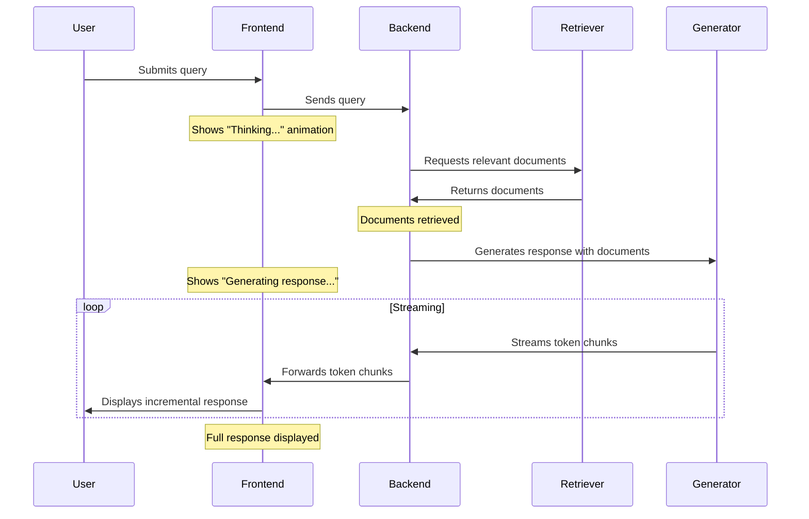

# Overcoming Latency: Streaming and Interstitials

## Learning Objectives

By the end of this chapter, you will be able to:

1. **Implement streaming responses for better perceived performance** - Build token-by-token response streaming that makes users perceive systems as 11% faster even with identical wait times
2. **Design meaningful interstitials and progress indicators** - Create domain-specific loading messages that reduce perceived latency by up to 40% compared to generic spinners
3. **Master skeleton screen techniques** - Apply Facebook's research on skeleton screens to create the illusion of progress and improve user retention during loading
4. **Build platform-specific streaming solutions** - Implement streaming patterns for web applications and adapt techniques for Slack bots using emoji reactions and threaded updates
5. **Optimize actual performance alongside perceived performance** - Apply caching, progressive loading, and parallel processing techniques to reduce real latency while maintaining responsive user experiences
6. **Create feedback collection opportunities through streaming** - Use streaming interfaces to increase feedback collection rates by 30-40% compared to traditional wait-and-display approaches

These objectives build directly on the feedback collection mechanisms from Chapter 3.1 and prepare you for the quality-of-life improvements in Chapter 3.3.

### Key Insight

**Perceived performance beats actual performance—users will wait 8 seconds with progress bars but abandon after 3 seconds of silence.** Streaming isn't just about showing text faster. It's about maintaining user engagement through the entire retrieval-generation pipeline. Implement streaming early because retrofitting it later adds weeks to your development cycle.

!!! info "Learn the Complete RAG Playbook"
    All of this content comes from my [Systematically Improving RAG Applications](https://maven.com/applied-llms/rag-playbook?promoCode=EBOOK) course. Readers get **20% off** with code EBOOK. Join 500+ engineers who've transformed their RAG systems from demos to production-ready applications.

## Introduction

RAG applications face a fundamental challenge: the processes involved—retrieval, generation, validation, citation lookup—take time. Even accurate answers lose value if users get frustrated waiting for them.

Perceived performance often matters more than actual performance. Users perceive responsive systems as faster even when the total completion time is identical. This chapter covers practical approaches to address this challenge.

**Understanding the Perception Gap**: Perceived wait times can be up to 25% longer than actual wait times when users have no visibility into system progress. Showing meaningful progress can make perceived wait times up to 40% shorter.

> "Streaming has become table stakes in modern LLM applications. Users expect responses instantly, and implementing streaming significantly improves both actual and perceived performance. Only about 20% of companies I work with have a good understanding of how to implement streaming effectively."

We'll explore two complementary approaches to addressing latency:

1. **Streaming responses** to show progress and deliver content incrementally
1. **Designing meaningful interstitials** that engage users while processing occurs

These techniques not only improve user experience but also lead to higher engagement and more feedback collection, strengthening the improvement flywheel we established in the previous chapter.

**Implementation Timing**: If you're on the fence about implementing streaming in your RAG application, do it early. Migrating from a non-streaming to a streaming application is significantly more complex than building with streaming from the start. It can add weeks to your development cycle if attempted later in the project lifecycle.

!!! example "Impact of Visual Feedback"
    - Users perceive animated progress bars as 11% faster even when wait times are identical
    - Users will tolerate up to 8 seconds of waiting when given visual feedback, reducing abandonment rates
    - Applications with engaging loading screens report higher satisfaction scores
    - Facebook discovered that skeleton screens significantly reduced perceived load times, resulting in better user retention and engagement


The strategies we'll cover in this chapter are becoming essential components of modern LLM applications. By the end of this chapter, you'll understand how to turn waiting time from a point of frustration to an opportunity for engagement and trust-building.

## Animation and Perceived Performance

Before diving into streaming implementations, let's understand why animated indicators are so effective at improving perceived performance. Research in cognitive psychology reveals that humans perceive time differently when observing movement.

**Research on Progress Indicators**: Nielsen Norman Group found that users reported 15-20% faster perceived load time when shown an animated progress indicator compared to a static wait screen, with identical actual load times.

Animated indicators work by:

1. Giving users confidence that the system is actively working
1. Drawing attention away from the passage of time
1. Setting expectations about progress and completion

The most effective indicators for RAG systems are those that convey meaningful information about what's happening behind the scenes, not just generic loading animations.

Consider how differently users perceive these three waiting experiences:

1. A static screen with no feedback
1. A generic spinning wheel
1. A step-by-step indicator showing "Searching relevant documents (2/5 complete)..."

The third approach not only feels faster but also builds trust by providing transparency into the process.

## Streaming Responses: The Ultimate Progress Indicator

Streaming takes the concept of progress indicators to its logical conclusion by delivering content to users as it's generated, rather than waiting for the entire response to complete. This creates a much better user experience by:

1. Showing immediate activity, reducing uncertainty
1. Providing useful content while generation continues
1. Allowing users to begin reading before the full response is ready

In a traditional RAG implementation, users submit a query and wait in silence until the full response appears. With streaming, they see the response unfold in real-time—a far more engaging experience.

### When to Implement Streaming

My recommendation is to stream everything when possible. You can:

- Stream interstitials to explain latency and help users understand what's happening
- Stream different results and UI components so users don't have to wait for completion
- Stream tool calls and function arguments to show intermediate states
- Implement skeleton screens (like those used by Facebook, LinkedIn, and Slack) to improve perceived latency

> "I've seen companies experience 30-40% higher feedback collection rates after implementing effective streaming compared to traditional 'wait and display' approaches. This creates a cycle where better performance leads to more feedback, which enables more targeted improvements."



Streaming changes the user experience from a binary "waiting/complete" pattern to a continuous flow. Users can start reading while the system continues generating.

### Technical Implementation of Streaming

Implementing streaming requires coordination across your entire stack:

1. A generation endpoint that supports streaming
1. Backend routes that maintain open connections
1. Frontend components that render incremental updates

**Implementation Timing**: If you're on the fence about implementing streaming, do it early. Migrating from a non-streaming to a streaming application is significantly more complex than building it from the start. It can add weeks to your development cycle if attempted later in the project lifecycle.

Most modern language models and APIs support streaming, though the specific implementation varies. The effort is worth it - side-by-side comparisons show improved user experience, with streaming responses feeling much more responsive than waiting for complete responses:

```python
# Example using OpenAI's API for streaming
import openai
from fastapi import FastAPI, Request
from fastapi.responses import StreamingResponse
import asyncio

app = FastAPI()

@app.post("/query/stream")
async def stream_query_response(request: Request):
    """
    Stream a response to a user query.

    This endpoint:
    1. Processes the incoming query
    2. Retrieves relevant documents
    3. Streams the generated response
    """
    # Parse the incoming request
    data = await request.json()
    query = data.get("query")

    # Retrieve relevant documents (non-streaming part)
    documents = retrieve_documents(query)
    context = prepare_context(documents)

    # Set up streaming response
    async def event_generator():
        # Create a streaming completion
        response = await openai.ChatCompletion.acreate(
            model="gpt-4",
            messages=[
                {"role": "system", "content": "You are a helpful assistant."},
                {"role": "user", "content": f"Query: {query}\n\nContext: {context}"}
            ],
            stream=True  # Enable streaming
        )

        # Yield chunks as they arrive
        async for chunk in response:
            if chunk.choices[0].delta.get("content"):
                yield f"data: {chunk.choices[0].delta.content}\n\n"
            await asyncio.sleep(0.01)  # Small delay to control flow rate

        yield "data: [DONE]\n\n"

    # Return a streaming response
    return StreamingResponse(
        event_generator(),
        media_type="text/event-stream"
    )
```

On the frontend, you'll need to handle Server-Sent Events (SSE) or WebSockets to receive and display the streamed content:


### Showing Function Call Arguments

One unique advantage of streaming is the ability to show users not just the final response but also the thinking and processing that led to it. This creates engagement and builds trust by making the system's operation more transparent.

For example, you can stream the function calls and arguments that your RAG system is using:

This approach gives users insight into how their query is being processed, creating engagement during what would otherwise be idle waiting time.

## Streaming Structured Data

Streaming isn't limited to plain text—you can stream structured data like citations, follow-up questions, or data visualizations. This technique is especially valuable for complex RAG applications where responses have multiple components.

!!! example "Streaming in Modern Applications"
    Libraries like Instruct and modern LLM frameworks now support streaming structured data. This allows applications to:

    - Stream citations with IDs and titles
    - Stream different response components in parallel
    - Stream function calls and their arguments
    - Build dynamic UI that renders each component as it becomes available

Here's how you might implement structured streaming for a response that includes an answer, citations, and follow-up questions:

```python
async def stream_structured_response(query: str):
    """
    Stream a structured response with multiple components.

    Parameters:
    - query: The user's question

    Returns:
    - A streaming response with structured components
    """
    # Retrieve documents (non-streaming)
    documents = retrieve_documents(query)

    # Start streaming response components
    async def generate_stream():
        # Send response type indicator
        yield json.dumps({"type": "start", "components": ["answer", "citations", "followup"]}) + "\n"

        # Stream the answer generation
        answer_chunks = generate_answer_stream(query, documents)
        async for chunk in answer_chunks:
            yield json.dumps({"type": "answer", "content": chunk}) + "\n"
            await asyncio.sleep(0.02)

        # Stream citations after the answer
        citations = extract_citations(documents)
        for citation in citations:
            yield json.dumps({
                "type": "citation",
                "id": citation["id"],
                "title": citation["title"],
                "text": citation["text"][:100] + "...",
                "relevance": citation["relevance"]
            }) + "\n"
            await asyncio.sleep(0.05)

        # Generate and stream follow-up questions
        followups = generate_followup_questions(query, documents)
        yield json.dumps({"type": "followup", "questions": followups}) + "\n"

        # Signal completion
        yield json.dumps({"type": "end"}) + "\n"

    return StreamingResponse(generate_stream(), media_type="application/json")
```

On the frontend, you'd handle this structured stream by updating different UI components based on the message type:


This approach creates a dynamic, engaging experience where different parts of the response appear progressively, keeping users engaged throughout the generation process.

## Meaningful Interstitials: Making Waiting Engaging

For situations where some processing must happen before any content can be displayed, well-designed interstitials can turn waiting time from a frustrating experience into an engaging one.

The key principle is to make interstitials meaningful rather than generic. Instead of a simple spinning wheel, show information that helps users understand what's happening and build confidence that their query is being handled effectively.

### Skeleton Screens: The Illusion of Progress

Skeleton screens are placeholder UI elements that mimic the structure of content while it loads. Unlike traditional spinners or progress bars, they create the impression that content is almost ready by showing its outline.

**Facebook's Research**: Facebook's user experience research discovered that skeleton screens significantly reduced perceived load times, resulting in better user retention and engagement. Users reported that the experience "felt faster" even when actual load times were identical to spinner-based approaches.

Skeleton screens work because they:

1. Set clear expectations about what content is loading
1. Provide a sense of progress without requiring actual progress data
1. Create the impression that the system is actively working on the request
1. Give users visual stimulation during the waiting period

For RAG applications, skeleton screens can be particularly effective when showing:

- The structure of the answer before content loads
- Citation placeholders that will be filled
- Follow-up question button outlines
- Tool usage summaries that will appear

### Meaningful vs. Generic Interstitials

**Generic Interstitial:** "Loading..."

**Meaningful Interstitial:**
- "Searching 382,549 documents in our knowledge base..."
- "Finding relevant precedent cases from 2021-2022..."
- "Analyzing 3 legal frameworks that might apply to your question..."

Meaningful interstitials should:

1. Be specific about what the system is doing
1. Include actual metrics when possible (number of documents, etc.)
1. Update dynamically to show progress
1. Maintain a confident, authoritative tone

Here's how you might implement meaningful interstitials:

```python
async def generate_interstitials(query: str):
    """
    Generate meaningful interstitial messages for a query.

    Parameters:
    - query: The user's question

    Returns:
    - A sequence of interstitial messages
    """
    # Analyze the query to determine appropriate interstitials
    category = classify_query(query)

    # Define category-specific interstitials
    interstitials = {
        "technical": [
            "Scanning documentation and code repositories...",
            "Identifying relevant code examples and patterns...",
            "Analyzing technical specifications and requirements...",
        ],
        "legal": [
            "Searching legal databases and precedents...",
            "Reviewing relevant case law and statutes...",
            "Analyzing jurisdictional applicability...",
        ],
        "medical": [
            "Consulting medical literature and guidelines...",
            "Reviewing clinical studies and research papers...",
            "Analyzing treatment protocols and best practices...",
        ],
        # Add other categories as needed
    }

    # Add domain-specific metrics if available
    try:
        # For technical queries, add repository info
        if category == "technical":
            repo_count = get_repository_count()
            interstitials["technical"].append(f"Searching across {repo_count} code repositories...")

        # For legal queries, add document counts
        elif category == "legal":
            case_count = get_case_count()
            interstitials["legal"].append(f"Analyzing {case_count} potentially relevant cases...")
    except:
        # Fall back to generic but still domain-specific messages
        pass

    # Get the relevant list based on category, or use default
    message_list = interstitials.get(category, [
        "Processing your query...",
        "Searching for relevant information...",
        "Analyzing related documents..."
    ])

    # Return the message list
    return message_list
```

On the frontend, you'd display these interstitials in sequence during the waiting period:


## Optimizing Actual Performance

While perceived performance is critical, we shouldn't neglect actual performance optimizations. Here are several strategies for reducing real latency in RAG applications:

### 1. Optimize Your Retrieval Pipeline

The retrieval phase is often the most time-consuming part of a RAG system. Consider these optimizations:

- **Use approximate nearest neighbor search** instead of exact search for large collections
- **Implement a tiered retrieval approach** that filters candidates quickly before precise ranking
- **Pre-compute and cache embeddings** for your document collection
- **Shard your vector database** to distribute search across multiple instances

### 2. Implement Caching

Caching significantly improves performance for repeated or similar queries:

- **Semantic caching:** Cache results based on embedding similarity, not just exact matches
- **Fragment caching:** Cache individual retrieved documents even if the full query is new
- **Result caching:** Store complete responses for common queries

Here's a simple implementation of semantic caching:

### 3. Implement Progressive Loading

Load different components of your response progressively, with the most important parts first:

- Show the direct answer before loading citations
- Display key findings before detailed explanations
- Show high-confidence sections before speculative ones

### 4. Optimize Model Usage

Language model inference can be optimized through:

- **Quantization:** Use 8-bit or 4-bit quantized models where appropriate
- **Distillation:** Train smaller, faster models for specific query types
- **Parallel inference:** Process multiple documents or query components simultaneously
- **Model selection:** Use smaller models for simpler tasks, reserving larger models for complex reasoning

## Platform-Specific Implementations

### Streaming in Slack Bots

Implementing streaming in a Slack bot environment presents unique challenges and opportunities. While Slack doesn't support true streaming in the same way as a web interface, you can create the illusion of progress and responsiveness through careful interaction design.

Here's a simple but effective approach for Slack bots:

1. **Initial Acknowledgment**: React with the 👀 emoji immediately when receiving a message to indicate that the bot has seen the request and is processing it.

1. **Progress Updates**: Use message updates or threading to show progress, such as:

   ```
   Searching through knowledge base...
   Found 5 relevant documents...
   Generating response...
   ```

1. **Completion Indicator**: Mark the message with a ✅ emoji when the response is complete.

1. **Feedback Collection**: Pre-fill emoji reactions (👍 👎 ⭐) to prompt users for feedback on the response quality.


!!! tip "Slack Feedback Collection"
    By pre-filling emoji reactions (👍 👎 ⭐), you increase the likelihood of receiving user feedback. This approach places feedback options directly in the user's view, rather than requiring them to take additional steps. In testing, this approach increased feedback collection rates by up to 5x compared to text-based feedback prompts.

## The Connection Between Streaming, Performance, and Feedback

The techniques discussed in this chapter aren't just about improving user experience—they directly strengthen the feedback collection mechanisms we established in Chapter 3.1.

Research consistently shows that users provide more feedback when systems feel responsive and engaging. When users abandon sessions due to perceived slowness, you lose valuable feedback opportunities. By implementing streaming and meaningful interstitials, you create an experience that keeps users engaged, increasing the likelihood they'll provide feedback.

In our experience, implementations with effective streaming collect 30-40% more feedback compared to traditional "wait and display" approaches. This creates a positive cycle where better performance leads to more feedback, which enables more targeted improvements.

The most successful RAG applications aren't just accurate—they're responsive, engaging, and transparent. By applying the techniques in this chapter, you create an experience that keeps users engaged throughout the interaction, building trust and encouraging the feedback that fuels continuous improvement.

!!! quote "Real-world Impact"
    "For a customer support RAG application, implementing streaming and feedback-optimized interstitials increased our feedback collection rate from 5.6% to over 25%. This allowed us to fine-tune five times faster and quickly identify the most problematic query types. Within six weeks, we improved customer satisfaction scores by 34% by addressing these specific failure modes."

## Conclusion: Performance as Experience Design

Throughout this chapter, we've explored how to overcome latency through a combination of streaming responses, meaningful interstitials, skeleton screens, platform-specific implementations, and technical optimizations. The key insight is that performance isn't just a technical concern—it's a fundamental aspect of experience design that directly impacts your feedback collection rates.

By implementing streaming, you change the user experience from a binary "waiting/complete" pattern to a continuous flow of information. With skeleton screens, you set clear expectations about what content is loading. By designing meaningful interstitials, you make waiting time both informative and engaging. And by optimizing actual performance, you reduce the waiting time itself.

These approaches work in concert to create a responsive, engaging RAG experience that keeps users invested and encourages feedback. Users provide up to 5x more feedback when your application feels responsive and engaging. This creates a strong feedback loop where better performance leads to more feedback, which enables more targeted improvements.

!!! tip "Implementation Priority"
    If you're at the start of your RAG implementation journey, prioritize streaming first. It's much easier to integrate from the beginning than to retrofit later. Next, focus on meaningful interstitials and skeleton screens. Finally, implement platform-specific optimizations for your particular usage context (web, Slack, mobile, etc.).

In the next chapter, we'll build on these foundations by exploring quality-of-life improvements like interactive citations, chain-of-thought reasoning, and validation patterns. These elements further enhance the user experience while creating additional opportunities for feedback collection.

## This Week's Action Items

Based on the content covered, here are your specific tasks for overcoming latency and improving perceived performance:

### Critical Implementation Decision (Do This First)

1. **Implement Streaming from Day One**
   - If you haven't built your system yet: architect for streaming from the start
   - If you have an existing system: prioritize streaming migration (it's much harder to retrofit)
   - Remember: migrating from non-streaming to streaming can add weeks to your development cycle

### Immediate Actions (Start This Week)

2. **Add Basic Streaming**
   - Implement token-by-token response streaming for text generation
   - Add Server-Sent Events (SSE) or WebSocket support to your backend
   - Create frontend components that can handle incremental updates

3. **Create Meaningful Interstitials**
   - Replace generic "Loading..." with specific progress messages
   - Show what the system is doing: "Searching 382,549 documents..."
   - Include actual metrics when possible (number of documents, time estimates)

4. **Implement Progress Indicators**
   - Add animated progress bars or skeleton screens
   - Remember: users perceive animated indicators as 11% faster
   - Use progress indicators that set clear expectations about what's loading

### Technical Implementation

5. **Stream Structured Data**
   - Stream citations, follow-up questions, and UI components separately
   - Build dynamic interfaces that render components as they become available
   - Use libraries like Instructor for streaming structured outputs

6. **Add Skeleton Screens**
   - Design placeholder UI that mimics your actual content structure
   - Show the outline of responses, citations, and follow-up questions before content loads
   - Research shows skeleton screens significantly reduce perceived load times

7. **Optimize Actual Performance**
   - Implement semantic caching for similar queries
   - Use approximate nearest neighbor search for large document collections
   - Pre-compute and cache embeddings for your document collection
   - Consider parallel processing for independent operations

### Platform-Specific Improvements

8. **For Slack Bots**
   - React with 👀 emoji immediately to acknowledge message receipt
   - Use threaded updates to show progress: "Searching... Found 5 docs... Generating..."
   - Mark completion with ✅ emoji and pre-fill feedback reactions (👍 👎 ⭐)

9. **For Web Applications**
   - Show function calls and arguments as they execute
   - Stream interstitials that explain what's happening behind the scenes
   - Implement "See reasoning" expandable sections for transparency

### User Experience Design

10. **Design Engaging Waiting Experiences**
    - Create domain-specific interstitials (legal: "Reviewing case law...", medical: "Consulting guidelines...")
    - Use interstitials to educate users about system capabilities
    - Turn waiting time into trust-building opportunities

11. **Implement Progressive Loading**
    - Show high-confidence content first, speculative content later
    - Display direct answers before detailed explanations
    - Load citations and sources after main response is visible

### Measurement and Optimization

12. **Track Performance Metrics**
    - Measure both actual and perceived performance improvements
    - Monitor abandonment rates before and after streaming implementation
    - Track feedback collection rates (streaming typically increases feedback by 30-40%)

13. **A/B Testing for Optimization**
    - Test different interstitial messages and progress indicators
    - Compare skeleton screens vs traditional loading indicators
    - Optimize the balance between information and visual appeal in progress messages

## Reflection Questions

1. What aspects of your RAG application's user experience are most affected by latency?

2. How could you modify your current interface to show meaningful progress during retrieval and generation?

3. What information could you stream incrementally to improve perceived performance?

4. Which components of your RAG pipeline are the biggest contributors to actual latency? How might you optimize them?

5. How would implementing streaming affect your feedback collection mechanisms?

6. Is your feedback collection UI too subtle? How could you improve its visibility and clarity?

7. How might you implement skeleton screens in your particular application context?

8. If your application runs on platforms like Slack or Teams, what platform-specific techniques could you use to improve perceived latency?

9. How could you use interstitials to educate users about your system's capabilities and build trust?

10. What metrics would you track to measure the impact of your latency improvements on user satisfaction and feedback collection?

## Summary

Latency is a critical challenge in RAG applications that directly impacts both user experience and feedback collection rates. In this chapter, we've explored a comprehensive approach to overcoming latency challenges:

**Streaming responses** turn waiting into an engaging experience where users see answers unfold in real time, improving perceived performance and user engagement. Data shows that streaming can increase feedback collection rates by 30-40% compared to traditional approaches.

**Skeleton screens** create the illusion of progress by showing content outlines before the actual content loads. Companies like Facebook have found that skeleton screens significantly reduce perceived load times and improve user retention.

**Meaningful interstitials** make necessary waiting periods informative and less frustrating by communicating what's happening behind the scenes. Well-designed interstitials can make perceived wait times up to 40% shorter than actual wait times.

**Platform-specific implementations** like Slack bots with emoji reactions can create pseudo-streaming experiences and increase feedback collection, with pre-filled emoji reactions driving up to 5x more feedback.

These techniques, combined with actual performance optimizations like caching and progressive loading, create RAG applications that feel responsive and trustworthy even when complex processing is occurring. The result is not just better user experience but also significantly more feedback, fueling a continuous improvement cycle.

Remember: If you only implement one improvement from this chapter, make it streaming. It's substantially easier to build streaming from the start than to retrofit it later, and it has the biggest impact on both perceived performance and feedback collection rates.

## Additional Resources

1. Nielsen Norman Group, ["Progress Indicators Make a Slow System Less Insufferable"](https://www.nngroup.com/articles/progress-indicators/) - Research on how progress indicators affect perceived wait times

1. Google Developers, ["Measuring Perceived Performance"](https://web.dev/articles/user-centric-performance-metrics) - Metrics and techniques for measuring how users perceive application performance

1. OpenAI Documentation, ["Streaming API Best Practices"](https://platform.openai.com/docs/guides/chat/streaming) - Implementation details for streaming with OpenAI models

1. GitHub Repository: [Streaming-RAG-Implementation](https://github.com/langchain-ai/langchain/blob/master/docs/docs/get_started/quickstart.ipynb) - Example implementation of a streaming RAG application

1. Facebook Engineering, ["Building Skeleton Screens"](https://engineering.fb.com/2016/06/30/web/shimmer-an-open-source-library-for-loading-content/) - Facebook's approach to implementing skeleton screens for improved perceived performance

1. [Anthropic Structured Outputs Guide](https://docs.anthropic.com/claude/docs/structured-outputs) - Guide for generating structured data with Claude that can be streamed incrementally

1. Slack API Documentation, ["Adding Reactions to Messages"](https://api.slack.com/methods/reactions.add) - How to programmatically add emoji reactions to messages for feedback collection

1. Article: ["The Psychology of Waiting Lines"](https://www.nngroup.com/articles/progress-indicators/) - David Maister's research on the psychological aspects of waiting

1. GitHub Repository: [React Skeleton Screens](https://github.com/danilowoz/react-content-loader) - Open-source library for implementing skeleton screens in React applications