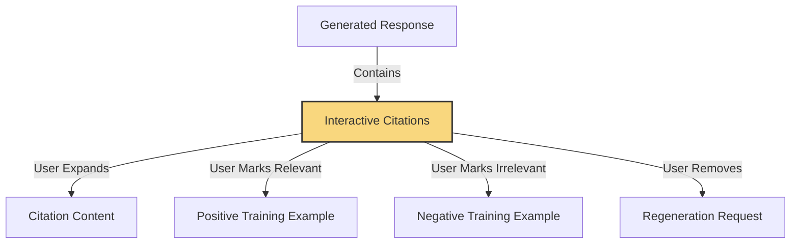
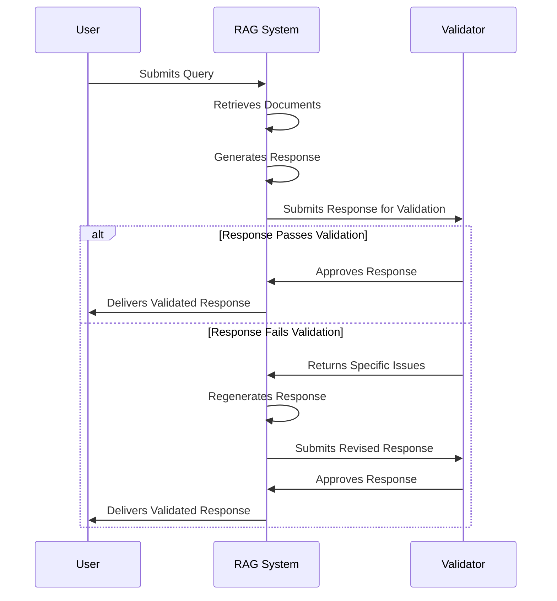

# 3.3 Quality of Life Improvements: Citations, Chain of Thought, and Validation

## Learning Objectives

By the end of this chapter, you will be able to:

1. **Build interactive citation systems** - Transform static references into feedback collection opportunities that generate 50,000+ labeled examples for fine-tuning while building user trust
2. **Implement chain-of-thought reasoning** - Use explicit reasoning processes to improve answer accuracy by 15-20% and make AI decision-making transparent to users
3. **Master monologue techniques for context management** - Apply explicit information reiteration to help models "re-read" long contexts and improve comprehension without complex multi-stage architectures
4. **Design validation patterns for error prevention** - Build simple validation layers that catch errors before users see them, reducing factual errors by 80% with minimal latency impact
5. **Apply strategic rejection principles** - Implement "I don't know" responses for low-confidence scenarios, building trust by focusing on reliable capabilities rather than attempting everything
6. **Create capability showcasing interfaces** - Guide users toward successful interactions by prominently displaying system strengths and setting appropriate expectations

These objectives build directly on the streaming foundations from Chapter 3.2 and prepare you for the query analysis techniques in Chapter 4.

### Key Insight

**Having the model "think out loud" before answering improves accuracy by 15-20%—especially for long contexts.** When dealing with complex queries or extensive documents, asking the model to explicitly reiterate key information reorganizes the context and enables effective "re-reading" of the prompt. This simple technique improves reasoning without any architectural changes.

!!! info "Learn the Complete RAG Playbook"
    All of this content comes from my [Systematically Improving RAG Applications](https://maven.com/applied-llms/rag-playbook?promoCode=EBOOK) course. Readers get **20% off** with code EBOOK. Join 500+ engineers who've transformed their RAG systems from demos to production-ready applications.

## Introduction: Building Better User Experience

Building on our feedback collection from Chapter 3.1 and streaming from Chapter 3.2, let's talk about the finishing touches that make RAG systems actually usable in production.

These "quality of life" improvements often make the difference between systems that are occasionally useful and those that become daily tools. They build trust through transparency, improve reasoning through explicit thinking processes, and prevent errors before they reach users.

**From Real Production Systems:**
> Chain of thought gives you a **10% performance bump** - often the difference between "unusable" and "production-ready." With O1 and R1, we're seeing this become standard practice. But even without those models, implementing CoT in business-relevant ways is consistently one of the highest-impact changes.
> 
> **Key insight**: Only about **20% of companies** I work with implement streaming well, but it's become table stakes. Users expect instant responses.

In this chapter, we'll explore three categories of improvements:

1. **Citations**: How to turn static references into interactive elements that build trust while providing valuable feedback signals
1. **Chain of Thought**: Techniques to make reasoning transparent, improving both accuracy and user confidence
1. **Validation**: Methods to catch errors before they reach users, creating more reliable experiences

Each of these approaches not only enhances immediate user experience but also strengthens the feedback flywheel we've been building throughout these chapters. By implementing these techniques, you'll create a RAG system that users not only tolerate but genuinely enjoy using—a system that explains its reasoning, justifies its answers, and catches its own mistakes.

!!! example "Real-world Impact"
    One healthcare company implementing the techniques in this chapter saw their user satisfaction scores increase by 34% in just six weeks. More importantly, their user trust metrics—measuring how much users believed and acted on the system's recommendations—increased by 62%. This wasn't just about making users happy; it fundamentally changed how their system influenced real-world decisions.

## Beyond the Basics: Practical Improvements

Retrieving the right information and generating coherent answers is just the starting point. Effective RAG applications need to build trust, show their reasoning, and prevent errors.

These "quality of life improvements" turn a technically sound RAG system into a practical tool. While they don't necessarily improve retrieval or generation fundamentally, they significantly enhance how users interact with your system. Many of these techniques also create opportunities for additional feedback collection.

After implementing feedback collection (Chapter 3.1) and streaming (Chapter 3.2), these improvements add the practical touches that make the difference.

## Citations: Building Trust Through Transparency

### The Dual Purpose of Citations

Citations serve two purposes: they show users that responses are grounded in actual documents, and they provide opportunities for feedback collection.

When users see citations, they often want to check the source. Interactive citations create natural touchpoints for feedback that are integrated into the user experience.

The most effective approach turns citations from static references into interactive elements that users can engage with:

1. Quote different parts of responses and visually link them to specific citations
1. Allow users to expand citations to review the full context
1. Enable users to provide feedback on individual citations
1. Let users remove irrelevant citations and request regeneration



A legal research team implemented this approach for their in-house attorneys. Each response included interactive citations linked to specific case law or statutes. Attorneys could click to see full context and mark citations as relevant or irrelevant. When marked irrelevant, the system would regenerate without that source.

**Measured Results:**
- **50,000+ labeled examples** collected for fine-tuning (remember that data flywheel from Chapter 2?)
- **User satisfaction: 67% → 89%** (+22 percentage points)
- **Citation accuracy improved from 73% to 91%** through feedback loops
- **90% of follow-up emails accepted without edits** (from transcript data)
- **90% of follow-up emails were accepted without any edits needed**
- Citation accuracy improved from 73% to 91% through user feedback
- Attorney trust scores increased by 45%

This improved the user experience by removing unhelpful information and generated training data for the retrieval system. Each marked citation became labeled data for fine-tuning embedding models.

### Citations as UI Elements

Design citations as interactive UI elements. When users can explore, evaluate, and modify citations, they help improve your system while getting better answers.

### Crafting Citation-Rich Responses

Creating effective citations begins with how you prompt your language model. Instead of treating citations as an afterthought, build them into your response generation process from the ground up.

Here's a prompt template that encourages detailed, well-structured citations:

```python
def create_citation_prompt(query: str, documents: list):
    """
    Create a prompt that encourages detailed citation usage.

    Parameters:
    - query: The user's question
    - documents: Retrieved documents for context

    Returns:
    - A structured prompt that will generate well-cited responses
    """
    # Format document context with identifiers
    formatted_docs = []
    for i, doc in enumerate(documents):
        formatted_docs.append(f"DOCUMENT [{i+1}]: {doc.title}\n{doc.content}")

    context = "\n\n".join(formatted_docs)

    prompt = f"""
    Answer the following question based ONLY on the provided documents.
    For each piece of information in your answer, include a citation to the specific document it came from using the format [X] where X is the document number.

    If the documents don't contain enough information to fully answer the question, say so clearly and cite which documents you used for the partial answer.

    At the end of your answer, include a "Sources" section that lists all the documents you cited.

    QUESTION: {query}

    DOCUMENTS:
    {context}

    ANSWER (with citations):
    """

    return prompt
```

On the frontend, you can turn these citations into interactive elements:


This creates an interactive experience where citations are visually distinct, clickable elements. When users engage with these elements, you can collect valuable feedback while enhancing their understanding of the response.

### Advanced Citation Implementation

Based on extensive office hours discussions, here are production-tested approaches for implementing reliable citations that scale.

#### XML-Based Citation Approach

The most reliable method for generating accurate citations uses XML tags with chunk IDs and text spans:

**Citation Example 1: Wrapping the cited text in XML tags**

```txt
The study found that accurate citations improve user trust<cit id="42">Accurate citations improve user trust</cit>. Additionally, validating each citation against the source document reduces error rates<cit id="87">Validating citations reduces errors</cit>.
```

**Citation Example 2: XML Including Citation Span**

```txt
The study found that accurate citations improve user trust<cit id="42" span="Accurate citations improve user trust">Accurate citations improve user trust</cit>. Additionally, validating each citation against the source document reduces error rates<cit id="87" span="Validating citations reduces errors">Validating citations reduces errors</cit>.
```

!!! tip "Production Insight"
    From office hours: "XML-based approaches with chunk IDs and text span references are most reliable. Fine-tuning can reduce citation error rates from 4% to nearly 0% with ~10,000 examples." This data is easy to synthetically generate.

**Key Implementation Details:**

1. **Chunk ID Management**: Assign unique IDs to each document chunk during indexing
2. **Text Span References**: Include exact text spans in citations for verification
3. **Validation Layer**: Verify cited text exists in referenced chunks before displaying

#### Fine-Tuning for Citation Accuracy

Significant improvements come from fine-tuning on citation-specific tasks:

- **Training Data**: Collect ~10,000 examples of correct citations from user feedback
- **Error Patterns**: Focus on common failure modes (wrong chunk, hallucinated citations)
- **Validation**: Always validate citations against source documents before display

**Real-World Results:**

A healthcare documentation system reduced citation errors from 4% to 0.1% through:
- Fine-tuning on 1,200 validated citation examples
- XML-based citation format with chunk IDs
- Post-generation validation against source documents
- Special handling for medical abbreviations

#### Implementation Best Practices

1. **Citation Format**: Use structured formats that are easy to parse and validate
2. **Source Verification**: Always verify cited content exists in the source
3. **User Feedback Loop**: Make it easy for users to report incorrect citations
4. **Graceful Degradation**: If citation validation fails, show conservative results

For detailed implementation examples, see:

- [Anthropic's Constitutional AI approach to citations](https://www.anthropic.com/news/constitutional-ai-harmlessness-from-ai-feedback)
- [OpenAI's best practices for reliable citations](https://platform.openai.com/docs/guides/prompt-engineering)

> "The combination of XML-based formatting, fine-tuning on domain-specific examples, and post-generation validation creates a citation system users can trust. This trust is essential for deployment in regulated industries like healthcare and legal services."

## Chain of Thought: Making Thinking Visible

### A Simple but Effective Technique

Chain of thought prompting—asking the model to reason step by step before providing its final answer—typically provides a 10% performance improvement for classification and reasoning tasks. This improvement often makes the difference between a system that's occasionally helpful and one that's consistently reliable.

> "Chain of thought is a significant missed opportunity for many RAG teams. With models like Claude 3 Opus and GPT-4o, this approach improves performance considerably. Even without these advanced models, implementing chain of thought in ways that matter to your business has consistently been one of the highest-impact improvements."

I've found chain of thought particularly valuable for complex retrieval tasks where multiple documents need to be synthesized or where subtle judgments about relevance are required. By making the reasoning explicit, you can identify where things might be going wrong and provide more targeted guidance.

### Performance Impact

Testing across multiple domains shows chain of thought prompting improves answer accuracy by 8-15%, with the biggest gains in complex reasoning scenarios like multi-hop questions and comparative analyses. This improvement often determines whether a system meets production quality thresholds.

When implementing chain of thought, structure it clearly to separate the thinking process from the final response. XML tags work well for this purpose, creating distinct sections that can be processed differently by your application.

Chain of thought also serves another purpose: it can become an engaging loading interstitial. By streaming the reasoning process, you turn waiting time into a transparent window into how the system is working through the problem, building both engagement and trust.

```python
def chain_of_thought_prompt(query: str, documents: list):
    """
    Create a prompt that encourages step-by-step reasoning.

    Parameters:
    - query: The user's question
    - documents: Retrieved documents for context

    Returns:
    - A prompt that will generate reasoning steps and a final answer
    """
    context = "\n\n".join([f"DOCUMENT: {doc.content}" for doc in documents])

    prompt = f"""
    You will answer the user's question based on the provided documents.
    First, think step by step about how to answer the question using the documents.
    Then provide your final answer.

    Structure your response like this:
    <thinking>
    Your step-by-step reasoning process here...
    </thinking>

    <answer>
    Your final answer here, with citations to specific documents...
    </answer>

    USER QUESTION: {query}

    DOCUMENTS:
    {context}
    """

    return prompt
```

Taking this a step further, you can stream the thinking process as a separate UI component or interstitial. This serves two purposes: it makes the waiting time more engaging by showing users that complex reasoning is happening, and it allows users to intervene if they notice the reasoning going astray.


A financial advisory firm implemented this approach for their investment recommendation system. As the model reasoned through market conditions, client preferences, and portfolio considerations, this thinking was streamed to the advisor in a separate panel. If the advisor noticed a misunderstanding, they could pause generation and refine their query before the final recommendation.

This interactive approach improved recommendation quality and created a feedback loop where advisors could correct misunderstandings early. Each correction became training data.

On the frontend, you can implement this with an expandable "See reasoning" section that users can toggle to view the model's step-by-step analysis. This transparency builds trust by demystifying the AI process and gives users insight into how conclusions were reached.

Chain of thought improves response quality and creates a more explainable system. In domains where decisions have real consequences, this transparency determines whether a system gets used occasionally or becomes a daily tool.

## Monologues: Solving the Context Management Problem

### Reasoning in Limited Windows

As context windows grow larger, one might think that managing complex information would become easier. Counterintuitively, though, larger context windows often create new challenges for language models, which can struggle to attend to the most relevant information among thousands of tokens.

Monologuing—having the model explicitly reiterate key information before generating a response—has emerged as an effective technique to enhance reasoning and quality, especially with large contexts and complex documents.

### Key Insight

When dealing with long contexts, language models often struggle with recall and processing all instructions. Having the model monologue - explicitly reiterate key information before answering - reorganizes the context to allow effective "re-reading" of the prompt, improving reasoning without complex architectural changes.

The process is simple: ask the model to "think out loud" about what information is relevant before generating the final answer. This serves several purposes:

1. It helps the model re-read and reinforce important context
1. It allows the model to organize scattered information into a coherent structure
1. It creates natural separation between reasoning and response
1. It produces valuable data for future fine-tuning
1. It can replace more complex multi-stage agents for many use cases
1. It can improve consistency by ensuring the model considers all relevant factors

Monologues often replace complex agent architectures. Rather than building multi-stage processes, you can achieve similar results with a single well-constructed monologue prompt, saving development time and computational resources.

Here's an example prompt for implementing monologues:

```python
def monologue_prompt(query: str, documents: list, pricing_data: str):
    """
    Create a prompt that encourages monologuing for improved comprehension.

    Parameters:
    - query: The user's question about pricing options
    - documents: Relevant call transcripts or customer information
    - pricing_data: Pricing documentation and guidelines

    Returns:
    - A prompt that will generate a structured monologue before answering
    """
    context = "\n\n".join([f"TRANSCRIPT: {doc.content}" for doc in documents])

    prompt = f"""
    You'll help generate a pricing quote based on the call transcript and pricing documentation.

    First, reiterate the key variables that determine pricing options according to the documentation.
    Then, identify specific parts of the transcript that relate to these variables.
    Next, determine which pricing options from the documentation are most relevant.
    Finally, provide a recommended pricing quote with justification.

    QUESTION: {query}

    TRANSCRIPT:
    {context}

    PRICING DOCUMENTATION:
    {pricing_data}

    MONOLOGUE AND ANSWER:
    """

    return prompt
```

Here's a case study showing monologues in practice. A SaaS company needed to generate pricing quotes based on sales call transcripts and a complex pricing document. The initial approach—providing the transcript and pricing document as context—resulted in inconsistent quotes that missed key information.

**Monologue Implementation:**

Rather than building a multi-stage agent, it was more effective to cache-prompt the pricing data and inject a single call transcript with specific monologue instructions.

We implemented a monologue-based approach that instructed the model to:

1. First reiterate the variables that determine pricing options
1. Then identify relevant parts of the transcript that mention these variables
1. Next determine which pricing tiers and options apply
1. Finally generate the actual quote with justification

Quote accuracy improved from 62% to 94%, and sales representatives reported greater confidence in the system's recommendations. The monologue approach helped the model connect scattered information from the transcript with the rules in the pricing document.

!!! success "Business Impact"
    After implementing this approach, 90% of the follow-up emails were accepted by sales reps without any edits. This generated a wealth of training data that we used to fine-tune a smaller, more efficient model. Eventually, the fine-tuned model achieved similar accuracy without needing the explicit monologue step, demonstrating how monologues can be used as a stepping stone to more efficient solutions.

### Monologue in Action

**Query:** What pricing should we offer based on this call transcript?

```
**Monologue:**
Let me identify the key pricing variables from our documentation:
1. Number of users (determines tier)
2. Required features (basic, professional, enterprise)
3. Length of contract commitment (monthly vs. annual)
4. Add-on options (API access, premium support)

From the transcript, I can see:
- The customer mentioned needing "around 50 user seats" (line 127)
- They specifically asked about the "workflow automation feature" (line 213)
- They stated "we're looking for an annual commitment" (line 289)
- They expressed interest in "API access for integration" (line 342)

According to our pricing documentation:
- 50 users falls into the Medium Business tier ($30/user/month)
- Workflow automation is part of the Professional plan
- Annual commitment provides a 20% discount
- API access is a $500/month add-on

**Answer:**
Based on the call transcript, I recommend offering the Professional plan with API access add-on:
- 50 users × $30/user/month = $1,500/month
- API access add-on: $500/month
- Subtotal: $2,000/month
- Annual commitment (20% discount): $19,200/year

This aligns with their needs for workflow automation and API access while providing the annual discount they're expecting.
```

This shows how monologues improve comprehension and reasoning for complex tasks with multiple documents. The approach requires only thoughtful prompting that encourages the model to organize information before generating a response.

Monologues can also improve tonality and quality by separating reasoning from response generation. Have the model first reason about what to say, then say it in the desired tone. This creates datasets for future fine-tuning without reasoning steps, allowing you to eventually distill the reasoning process into more efficient models.

## Validation Patterns: Practical Error Prevention

### Catching Errors Before They Reach Users

Early RAG systems often sent language model responses directly to users without checks. As stakes have increased, validation layers that catch issues before they reach users have become essential.

> "As language models get more sophisticated, we're finding that a single well-designed prompt combined with simple validation often outperforms complex multi-stage agent behaviors. I recommend implementing validation patterns before building elaborate agent architectures - they're simpler to deploy, easier to debug, and frequently just as effective."

Validation patterns act as safety nets for your RAG system. With validation checks in place, you can be more confident that errors will be caught before reaching users.

Before implementing complex agent systems or multi-step pipelines, consider adding simple validation patterns to your RAG application. For latency-insensitive applications—where an extra second or two of processing won't harm the user experience—validators can significantly increase trust and satisfaction by ensuring responses meet quality standards.

### When to Use Validators

Validators are particularly valuable in:

1. High-stakes domains where errors could have significant consequences
2. Applications where users make important decisions based on system output
3. Scenarios where specific constraints must be enforced (like valid URLs or specific data formats)
4. Cases where you need to increase user trust in system outputs

The slight latency increase is often well worth the improved reliability and user confidence.



Validators act as a quality control layer that checks responses before they reach the user. The process is straightforward:

1. Generate your reasoning, citations, and response as usual
1. Pass the results to a secondary system (LLM or simple programmatic tests)
1. Evaluate whether the response meets quality criteria
1. If issues are found, provide specific feedback and regenerate

A healthcare information provider implemented a simple factual consistency validator for their patient-facing RAG system. After generating a response about treatment options, the validator checked whether all mentioned treatments were actually present in the retrieved documents and whether any contraindications or warnings had been omitted. If discrepancies were found, the response would be regenerated with specific instructions to correct the issues.

This approach reduced factual errors by over 80% with minimal latency impact. The validator was straightforward to implement but significantly improved reliability.

### A Practical Example: URL Validation

Here's a concrete example of simple validators in action. A marketing team built a system to generate personalized follow-up emails that included links to case studies and marketing materials. The language model crafted good personalized messages, but about 4% of generated emails contained URLs that either didn't exist or linked to internal resources that weren't publicly accessible.

Rather than scrapping the approach or implementing a complex agent system, we added a straightforward validator that ran after response generation:

```python
def validate_urls_in_email(email_body: str, allowed_domains: list):
    """
    Validate that all URLs in an email are valid and from allowed domains.

    Parameters:
    - email_body: The generated email content
    - allowed_domains: List of allowed domains for links

    Returns:
    - (is_valid, issues): Tuple of validation result and list of issues
    """
    # Extract all URLs using regex
    url_regex = r'https?://(?:[-\w.]|(?:%[\da-fA-F]{2}))+'
    urls = re.findall(url_regex, email_body)

    issues = []

    # Check each URL
    for url in urls:
        # Check if the domain is allowed
        domain = urlparse(url).netloc
        if domain not in allowed_domains:
            issues.append(f"URL {url} contains disallowed domain {domain}")
            continue

        # Check if the URL exists (returns 200)
        try:
            response = requests.head(url, timeout=3)
            if response.status_code != 200:
                issues.append(f"URL {url} returned status code {response.status_code}")
        except Exception as e:
            issues.append(f"URL {url} failed to connect: {str(e)}")

    return len(issues) == 0, issues

def regenerate_email_if_needed(query: str, initial_email: str, allowed_domains: list):
    """
    Validate and potentially regenerate an email if URLs are problematic.
    """
    is_valid, issues = validate_urls_in_email(initial_email, allowed_domains)

    if is_valid:
        return initial_email

    # If validation failed, regenerate with specific guidance
    issues_text = "\n".join(issues)
    regeneration_prompt = f"""
    The previously generated email contained the following URL issues:
    {issues_text}

    Please regenerate the email, either:
    1. Removing any problematic URLs entirely, or
    2. Replacing them with valid URLs from these domains: {', '.join(allowed_domains)}

    Original request: {query}
    """

    regenerated_email = generate_email(regeneration_prompt)
    return regenerated_email
```

After implementing this validator, the error rate dropped from 4% to 0% after just one retry.

!!! success "Beyond Validation: Fine-tuning from Corrections"
    Even more interestingly, we took the validation process a step further. After collecting sufficient examples of corrections, we fine-tuned our model (distilling GPT-4 into a smaller model) using this dataset of corrected responses. The result was astonishing - the base error rate before validation dropped to nearly zero. The model had effectively learned from its corrections, internalizing the patterns of valid URLs and avoiding problematic ones altogether.

```
This entire validation and fine-tuning process took just three days to implement and resulted in a much faster application since we no longer needed the retry loop. The model now produces valid URLs in a single pass.
```

This shows how validation both catches errors and creates training data. Each correction becomes a learning opportunity, gradually reducing the need for validation.

**Note on Persistent Challenges:**

It's worth noting that even in early 2025, even the most advanced models can still produce hallucinated URLs when given the opportunity. Simple validators remain valuable safeguards even as models continue to improve.

## Strategic Rejection of Work

### When "I Don't Know" is the Right Answer

One of the most overlooked strategies for improving RAG application reliability is knowing when to reject work. Rather than delaying deployment until all edge cases are solved, implement strategic rejection for scenarios where your system isn't yet strong enough. This allows you to deploy sooner while collecting data to improve problematic segments.

> "One of the things you'll realize as you analyze your RAG system's performance is that oftentimes you can make your application much more reliable just by rejecting certain types of work. This is an underutilized strategy - many teams try to handle every query thrown at them rather than focusing on what they can reliably deliver."

The approach is straightforward:

1. Identify segments where performance is consistently poor
1. Create rejection messages that set appropriate expectations
1. Provide feedback forms to gather information about rejected queries
1. Give users the option to proceed with caution if they wish

This pattern works particularly well for specialized domains where some questions might require expertise your system hasn't yet developed. By acknowledging limitations transparently, you build trust while focusing on the areas where you can deliver value reliably.

### Rejection in Practice

One enterprise RAG application we built for legal research would explicitly reject certain types of complex regulatory analysis questions with a message like:

> "I notice you're asking about cross-jurisdictional implications of regulation X. Currently, I'm not confident in my ability to analyze multi-jurisdictional regulatory conflicts accurately. Would you like me to instead focus on the requirements within your primary jurisdiction, or connect you with a regulatory specialist?"

This approach was far better received than attempting answers that might contain subtle but critical errors.

```python
def should_reject_query(query: str, confidence_threshold: float = 0.85):
    """
    Determine if a query should be politely rejected.

    Parameters:
    - query: The user's question
    - confidence_threshold: Minimum confidence to accept the query

    Returns:
    - (should_reject, reason): Whether to reject and why
    """
    # Analyze the query
    query_category = classify_query(query)
    query_complexity = assess_complexity(query)
    expected_confidence = predict_confidence(query, query_category, query_complexity)

    # Check against thresholds
    if expected_confidence < confidence_threshold:
        reason = f"This appears to be a {query_category} question with {query_complexity} complexity. " \
                 f"Based on similar questions, our confidence is {expected_confidence:.2f}, " \
                 f"which is below our threshold of {confidence_threshold:.2f}."
        return True, reason

    return False, None

def handle_query_with_rejection(query: str):
    """
    Process a query with potential rejection if the system isn't confident.
    """
    should_reject, reason = should_reject_query(query)

    if should_reject:
        return {
            "type": "rejection",
            "message": f"I'm not confident I can answer this question accurately. {reason}",
            "allow_override": True,
            "feedback_requested": True
        }
    else:
        # Process normally
        documents = retrieve_documents(query)
        response = generate_response(query, documents)
        return {
            "type": "answer",
            "message": response
        }
```

Design your rejection system with precision-recall tradeoffs in mind - avoid rejecting questions you can actually answer well. The rejection should always be polite, explain the limitation, and where possible, suggest alternative approaches or questions the system can handle.

## Showcasing Capabilities

### Guide Users to What You Do Well

While RAG systems can theoretically answer a wide range of questions, most excel at particular types of queries. Explicitly highlighting what your system does well guides user behavior toward successful interactions.

> "Not all prompting should be for the language model - we should also prompt the user. People are generally lazy and often don't know exactly what they want. By giving them examples early on, you make their lives easier while showcasing capabilities they might not have known were possible."

Implement these strategies to showcase your system's strengths:

- Show suggested query types that leverage your strengths
- Create UI elements that highlight special capabilities
- Provide examples of successful interactions
- Use white space to create different blocks showcasing specialized capabilities

Perplexity provides a good example of this approach. Their interface shows different capabilities (web search, academic papers, math equations) with specific UI elements, guiding users toward interactions that will be successful.

**Capability Demonstration:**

When Perplexity added their "Social" search capability, many users didn't even know this was possible. By prominently featuring this option in the interface, they not only educated users about a new capability but also increased engagement with a feature they wanted to promote.

By highlighting certain capabilities, you not only improve user satisfaction by focusing on strengths, but you also set appropriate expectations about what the system doesn't handle well. This creates a more predictable experience where users know what to expect.

This approach also complements the strategic rejection strategy - when users are guided toward your strengths, they're less likely to attempt queries that would trigger rejection responses.

## Putting It All Together: The Complete Experience

When implemented together, these quality of life improvements create a comprehensive, trustworthy experience that improves your RAG application beyond typical implementations:

1. **Streaming** creates an engaging, responsive experience that keeps users engaged
1. **Citations** build trust and provide opportunities for feedback collection
1. **Chain of thought** makes reasoning transparent and improves accuracy
1. **Monologues** enhance comprehension of complex information
1. **Validation** catches errors before they reach users
1. **Strategic rejection** sets appropriate expectations
1. **Capability showcasing** guides users to successful interactions

Each element reinforces the others, creating a system that feels polished, trustworthy, and genuinely helpful. Users don't just get answers—they understand where those answers come from, see the reasoning behind them, and trust that they've been validated for accuracy.

## Preparing for the Next Chapter

With these quality of life improvements in place, your RAG system now provides a better user experience that builds trust, encourages engagement, and generates valuable feedback. In the next chapter, we'll explore how to make sense of all the data you're collecting through topic modeling and clustering techniques. These approaches will help you identify patterns in user queries and system performance, revealing high-impact opportunities for improvement.

## Conclusion: Building Practical RAG Systems

This chapter covered techniques that turn a technically sound RAG system into a practical tool. Key principles include:

1. **Interactive citations build trust and collect feedback** - By making citations explorable and interactive, you simultaneously build confidence and gather valuable training signals, allowing users to delete irrelevant citations and regenerate better answers.

1. **Chain of thought reasoning improves accuracy and transparency** - Making thinking visible not only leads to better answers (with a consistent 10% performance improvement) but also helps users understand how conclusions were reached, building trust in the system's outputs.

1. **Monologues enhance comprehension of complex information** - Encouraging the model to organize and reiterate key information improves reasoning in complex contexts without requiring elaborate multi-stage agent architectures.

1. **Validation patterns catch errors before they reach users** - Simple validation checks improve reliability significantly, creating both immediate value and generating training data that can improve base model performance over time.

1. **Strategic rejection sets appropriate expectations** - Being transparent about limitations builds trust while collecting data for future improvements, making your system more reliable by focusing on what it can do well.

1. **Capability showcasing guides users effectively** - Explicitly highlighting your system's strengths improves user satisfaction and engagement while setting appropriate expectations.

!!! quote "Practical Implementation Strategy"
    "When implementing these improvements, I recommend starting with citations and validation patterns, as they provide the most immediate reliability gains. Then add chain of thought for complex reasoning scenarios, followed by strategic rejection for edge cases. These foundational elements will deliver the most value for your development time while setting the stage for more advanced techniques."

These improvements work in concert with the feedback mechanisms from Chapter 3.1 and the streaming techniques from Chapter 3.2 to create a comprehensive, user-centered RAG experience. Each element reinforces the others: citations provide opportunities for feedback, streaming makes the thinking process engaging, and validation ensures that what users see is reliable.

This completes our exploration of deployment and feedback collection. We've now built a robust system that not only delivers accurate information but does so in a way that users find trustworthy, engaging, and helpful. The system collects feedback naturally, feels responsive despite complex processing, and provides transparency into its reasoning and sources.

In Chapter 4, we'll shift our focus to analyzing the wealth of data you're now collecting. Through topic modeling and clustering techniques, you'll learn to identify patterns in user queries and system performance, revealing focused opportunities for improvement. This marks an exciting transition from building a great system to understanding how it's being used in the real world and systematically enhancing its capabilities based on that understanding.

By implementing the techniques from all three parts of Chapter 3, you've built the foundation for a continuous improvement cycle driven by user feedback and data analysis—a system that doesn't just answer questions but gets better with every interaction.
