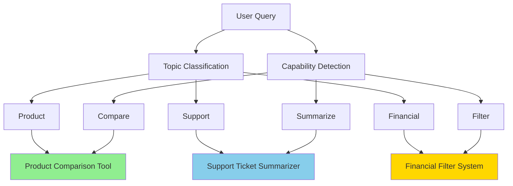
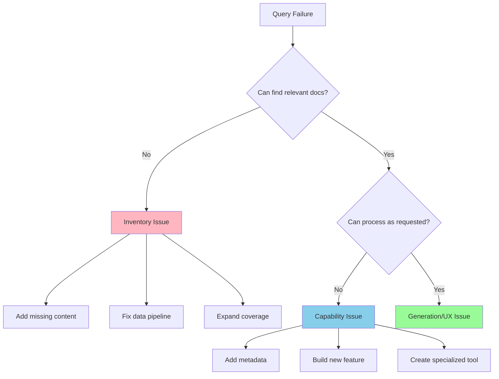
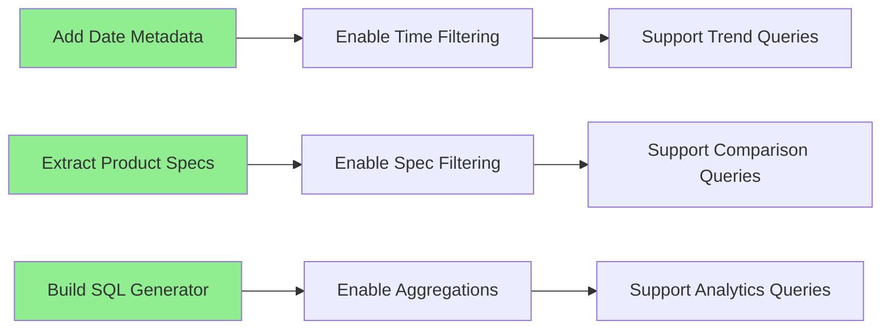

# Prioritization and Roadmapping: From Insights to Action

## Learning Objectives

By the end of this chapter, you will be able to:

1. **Distinguish inventory from capability issues** - Identify whether retrieval failures stem from missing data (inventory) or inability to process requests correctly (capability), saving months of misdirected effort
2. **Master the priority formula** - Apply (Impact × Volume %) / (Effort × Risk) to transform vague requests like "make the AI better" into specific, measurable improvement projects
3. **Build systematic improvement roadmaps** - Create data-driven 4-week improvement cycles that progress from analysis to quick wins to strategic capabilities
4. **Apply the two-dimensional analysis framework** - Separately analyze query topics (what users ask about) and capabilities (what they want the system to do) for more effective solutions
5. **Implement portfolio-balanced development** - Structure roadmaps with 30% quick wins, 40% strategic bets, 20% maintenance, and 10% experiments for sustainable progress
6. **Avoid common prioritization pitfalls** - Prevent analysis paralysis, recognize user adaptation patterns, and focus on simplest solutions that work rather than over-engineering

These objectives build directly on the segmentation analysis from Chapter 4.1 and prepare you for building specialized retrievers in Chapter 5.

### Key Insight

**Inventory issues need data, capability issues need features—knowing the difference saves months.** When retrieval fails, ask: is the information missing (inventory) or can't we process it correctly (capability)? Use the priority formula: (Impact × Volume %) / (Effort × Risk). This transforms "make the AI better" into "fix scheduling queries affecting 20% of users."

!!! info "Learn the Complete RAG Playbook"
    All of this content comes from my [Systematically Improving RAG Applications](https://maven.com/applied-llms/rag-playbook?promoCode=EBOOK) course. Readers get **20% off** with code EBOOK. Join 500+ engineers who've transformed their RAG systems from demos to production-ready applications.

## Introduction

In Part 1, you learned to segment queries and identify patterns. Now we turn those insights into action. This chapter shows you how to prioritize which segments to fix first and build a systematic roadmap.

As I've mentioned in previous chapters, RAG is really just a recommendation system squeezed between two LLMs. And like any recommendation system, different users need different retrievers. There's no global scoring function that works for everyone.

Once you accept this, the path forward becomes clear: identify what's broken, decide if it's worth fixing, and systematically improve the segments that matter most.

## Topics vs Capabilities: Two Fundamental Dimensions

You need to understand the difference between topics and capabilities before you can prioritize anything. Most teams mix these up and end up wasting time.

**Topics** = What users ask about (account management, pricing, technical specs)

**Capabilities** = What they want the system to do (summarize, compare, explain step-by-step)

Most teams only look at topics. That's a mistake. You need both dimensions to understand what's actually broken.

### The Healthcare Example

A healthcare company I worked with was categorizing everything by medical condition. Seemed logical, right? But when we added capability analysis, we found:

- **Common conditions** (diabetes, hypertension): Users mostly wanted comparisons between treatments
- **Rare conditions**: Users needed comprehensive summaries of all options
- **Emergency conditions**: Users needed step-by-step immediate actions

Same topic dimension, completely different capability needs. This changed everything about what we built next.

### Mapping Topics to Capabilities

Here's what this looks like in practice:

Real examples of topic vs capability mapping:
- "How do I reset my password?" → Topic: Account security, Capability: Step-by-step instructions
- "Compare the Pro and Basic plans" → Topic: Pricing, Capability: Comparison
- "Summarize the latest release notes" → Topic: Product updates, Capability: Summarization
- "What's the difference between 2022 and 2023 budgets?" → Topic: Financial data, Capability: Comparison + Temporal filtering

See how the same capability (like comparison) can apply to different topics? And the same topic can need different capabilities? That's why you need both.

## Inventory vs Capability Issues: The Critical Distinction

This distinction fundamentally changes how you approach improvements. Let me explain with concrete examples.

### Inventory Issues: When You're Missing Data

Think of inventory like a library. If someone asks for a book you don't have, that's an inventory problem. No amount of organization or search improvements will help—you need the book.

**Characteristics of Inventory Issues:**
- Low cosine similarity scores (< 0.5)
- Lexical search returns zero results
- LLM says "I cannot answer based on available information"
- Few or no sources cited in responses
- Users asking about topics not in your corpus

**Real Examples:**

| Query | Issue | Solution |
|-------|-------|----------|
| "Spanish TV shows on Netflix" | No Spanish content indexed | Add Spanish content metadata |
| "Greek restaurants near me" | No Greek restaurants in database | Onboard Greek restaurants |
| "Q3 2024 financial results" | Data stops at Q2 2024 | Update data pipeline |
| "Battery specifications for Model X" | Product not in catalog | Add product documentation |

**Detecting Inventory Issues Programmatically:**

**Detecting Inventory Issues:**

Look for these indicators:
- Max cosine similarity below 0.5
- Zero lexical search matches
- No sources cited in response
- LLM says "no information available"
- Retrieval confidence below 0.3

If you see 3+ of these indicators, it's likely an inventory problem. The solution is usually straightforward: add the missing data.

### Capability Issues: When You're Missing Features

Capability issues are like having all the books but no way to find them by publication date, or no ability to compare two books side-by-side.

**Characteristics of Capability Issues:**
- Data exists but can't be filtered correctly
- Unable to perform requested operations (compare, aggregate)
- Missing metadata for filtering
- Can't handle temporal queries
- Can't process specific document types

**Real Examples:**

| Query | Issue | Solution |
|-------|-------|----------|
| "Affordable shoes under 3-inch heels" | No heel height metadata | Extract & index heel heights |
| "Compare 2022 vs 2023 revenue" | No comparison capability | Build comparison function |
| "Documents modified yesterday" | No timestamp filtering | Add datetime metadata |
| "Total spend by department" | No aggregation capability | Build SQL generation |

**Common Capability Gaps and Solutions:**

**Common Capability Gaps and Solutions:**

**Datetime Filtering**
- Detection: Words like "yesterday", "last week", "recent", "latest"
- Solution: Add timestamp metadata and range queries
- Implementation: Use PostgreSQL with datetime indexes or LanceDB with between clauses

**Comparison**
- Detection: "versus", "compare", "difference between"
- Solution: Parallel retrieval + comparison prompt
- Real Example: Financial teams often search for "2023 budget" but documents use fiscal years. The mismatch between calendar year (what users search) and fiscal year (how data is stored) is a classic capability gap.

**Aggregation**
- Detection: "total", "sum", "average", "count"
- Solution: SQL generation or structured extraction
- Implementation: Text-to-SQL with validation

**Filtering**
- Detection: "only", "filter by", "where", "that have"
- Solution: Metadata extraction + structured queries
- Implementation: Hybrid search with filters

### The Decision Tree

Here's how to systematically determine which type of issue you're facing:

## Building Your Prioritization Framework

Now that you understand the types of issues, let's build a framework for prioritizing fixes.

### The Impact-Effort-Risk Matrix

Every potential improvement should be evaluated on three dimensions:

### The Impact-Effort-Risk Matrix

Every potential improvement should be evaluated using this formula:

**Priority Score = (Impact × Volume %) / (Effort × Risk)**

Where:
- **Impact**: Business value on 1-10 scale (revenue, retention, strategic value)
- **Volume %**: Percentage of total queries in this segment
- **Effort**: Implementation difficulty on 1-10 scale
- **Risk**: Chance of breaking something on 1-5 scale

Inventory issues typically have lower effort (3-4) since you're just adding data. Capability issues have higher effort (6-9) since you're building features.

This formula makes decisions objective. A segment affecting 40% of queries with low effort beats a perfect solution for 5% of queries.

### Real-World Prioritization Example

Let's walk through an actual prioritization exercise from an e-commerce client:

| Segment | Type | Volume | Current Success | Potential Success | Effort | Priority |
|---------|------|--------|-----------------|-------------------|---------|----------|
| Product search by SKU | Capability | 35% | 95% | 99% | Low | Monitor |
| "Gifts under $50" | Capability | 20% | 30% | 85% | Medium | **HIGH** |
| Size/fit questions | Inventory | 15% | 40% | 80% | Low | **HIGH** |
| Comparison shopping | Capability | 12% | 45% | 90% | High | Medium |
| Trending products | Inventory | 8% | 20% | 70% | Low | Medium |
| Technical specs | Inventory | 10% | 60% | 95% | Low | Medium |

**The Decision:** Focus on "Gifts under $50" and size/fit questions first. Why?
- High volume segments with poor performance
- Relatively low effort to implement
- Clear path to improvement

### The Roadmap Template

Transform your prioritization into an actionable roadmap:

### The Roadmap Template

Transform your prioritization into phases:

**Sprint 1 (Week 1)**: Quick wins
- Priority score > 80 AND effort < 3
- Usually inventory fixes
- Immediate impact

**Sprint 2 (Week 2-3)**: Medium effort
- Priority score > 60
- Mix of inventory and simple capabilities
- Building momentum

**Quarter 1 (Month 1-3)**: Strategic initiatives
- Priority score > 40
- Complex capabilities
- Long-term value

**Backlog**: Future considerations
- Everything else
- Revisit quarterly

## From Analysis to Implementation

### Phase 1: Quick Inventory Wins (Week 1-2)

Start with inventory issues—they're usually easier to fix and show immediate impact.

**Checklist for Inventory Improvements:**

- [ ] Identify top 5 missing content areas
- [ ] Set up data pipeline for regular updates
- [ ] Add missing documents/data
- [ ] Verify retrieval improvements
- [ ] Monitor new coverage metrics

**Example Implementation:**

**Example Implementation Strategy:**

For each inventory gap:
1. **Missing topics**: Add new documents from identified sources
2. **Outdated content**: Update existing documents with latest versions
3. **Incomplete coverage**: Fill gaps with supplemental content
4. **Validate**: Ensure retrieval improves for test queries

Always validate that adding inventory actually improves retrieval. Sometimes the problem isn't missing data but how it's indexed.

### Phase 2: Capability Building (Week 3-6)

Next, tackle capability issues. These require more engineering but unlock entire query categories.

**Common Capability Implementations:**

#### 1. Datetime Filtering

Steps to enable datetime filtering:
1. Extract dates from all documents (creation, modification, mentioned dates)
2. Add datetime metadata to your index
3. Enable range queries in your database
4. Update query processor to detect and apply temporal filters
5. Test with queries like "documents from last week" or "Q3 2023 reports"

#### 2. Comparison Capability

Steps to enable comparisons:
1. Identify comparison targets in the query
2. Run parallel retrieval for each entity
3. Structure results for comparison
4. Use a comparison-specific prompt
5. Present results in a clear format (table, bullets, etc.)

#### 3. Aggregation Capability

Steps to enable aggregations:
1. Detect aggregation type (sum, average, count)
2. Extract filter criteria from the query
3. If you have structured data: Generate and execute SQL
4. If unstructured: Retrieve filtered docs and use LLM to aggregate
5. Validate results for accuracy

### Phase 3: Monitoring and Iteration (Ongoing)

Set up monitoring to track the impact of your improvements:

Set up monitoring to track impact:

1. **Baseline metrics** before any changes
2. **Track improvements** per segment after implementation
3. **Calculate lift** in satisfaction, volume, and business metrics
4. **Alert on regressions** if performance drops
5. **Generate reports** showing ROI of improvements

Example report format:
- Segment: Billing questions
- Satisfaction: 45% → 82% (+37%)
- Volume: 20% of total queries
- Business Impact: -28% support tickets

## Advanced Roadmapping Strategies

### The Portfolio Approach

Don't put all your eggs in one basket. Balance your roadmap across:

Balance your roadmap portfolio:
- **30% Quick wins**: Low effort, immediate impact
- **40% Strategic bets**: High effort, high impact
- **20% Maintenance**: Keep existing features working
- **10% Experiments**: Try new approaches

This balance prevents both stagnation (all maintenance) and chaos (all experiments).

### Dealing with Dependencies

Some improvements unlock others. Map these dependencies:

### The Capability Maturity Model

Track your progress through capability levels:

| Level | Description | Example Capabilities |
|-------|-------------|---------------------|
| **Level 1: Basic** | Simple keyword search | Lexical matching, basic retrieval |
| **Level 2: Semantic** | Understanding meaning | Semantic search, synonyms |
| **Level 3: Filtered** | Structured queries | Metadata filtering, categories |
| **Level 4: Analytical** | Complex operations | Comparisons, aggregations |
| **Level 5: Intelligent** | Adaptive system | Auto-routing, self-improvement |

Most teams start at Level 2 and should aim for Level 4 within 6 months.

## Case Study: Complete Prioritization Process

Let me walk you through a real prioritization exercise for a customer support RAG system.

### Initial Analysis

Query distribution after clustering:
- Password reset: 25% volume, 85% satisfaction (capability issue)
- Billing questions: 20% volume, 45% satisfaction (inventory issue)
- Feature requests: 15% volume, 30% satisfaction (capability issue)
- Bug reports: 15% volume, 70% satisfaction (inventory issue)
- How-to guides: 10% volume, 60% satisfaction (inventory issue)
- Account deletion: 5% volume, 90% satisfaction (capability issue)
- Integration help: 10% volume, 35% satisfaction (both issues)

### Prioritization Matrix

Using our framework:

Using our prioritization formula:

1. **Billing questions** (score: 85)
   - High volume (20%) + Low satisfaction (45%) + Low effort (inventory) = TOP PRIORITY

2. **Integration help** (score: 72)
   - Medium volume (10%) + Very low satisfaction (35%) + Mixed issues = HIGH PRIORITY

3. **Feature requests** (score: 58)
   - Medium volume (15%) + Very low satisfaction (30%) + High effort (capability) = MEDIUM PRIORITY

### The Roadmap

**Sprint 1 (Week 1-2): Quick Wins**
- Add missing billing documentation (inventory)
- Update integration guides with latest API changes (inventory)
- Expected impact: +20% satisfaction for 30% of queries

**Sprint 2 (Week 3-4): Capability Building**
- Build feature request tracker/searcher (capability)
- Add status filtering for bug reports (capability)
- Expected impact: +30% satisfaction for 30% of queries

**Quarter Goals (Month 2-3): Strategic Improvements**
- Implement intelligent routing between documentation and support tickets
- Build comparison tool for plan features
- Add temporal filtering for "recent" queries

### Results After Implementation

Results after 3 months:
- Billing questions: 45% → 82% satisfaction (+37%)
- Integration help: 35% → 78% satisfaction (+43%)
- Feature requests: 30% → 71% satisfaction (+41%)
- Overall satisfaction: 58% → 76% (+18%)
- Support ticket volume: -28% (fewer escalations)
- Time to resolution: -45% (faster resolution)

ROI: The improvements paid for themselves in reduced support costs within 6 weeks.

## Common Pitfalls and How to Avoid Them

### Pitfall 1: Analysis Paralysis

**Problem**: Spending months analyzing without implementing anything.

**Solution**: Set a time box. After 2 weeks of analysis, ship something.

Set hard deadlines:
- Week 1-2: Analysis phase
- Week 3-4: Implementation of top 3 segments
- Week 5: Measure and iterate

After 2 weeks, stop analyzing and start building. Perfect analysis paralysis kills more projects than imperfect action.

### Pitfall 2: Ignoring User Adaptation

**Problem**: Users change behavior based on what works. Your analysis becomes stale.

**Solution**: Re-analyze monthly and track behavior changes.

Track behavior changes monthly:
1. Compare query distributions between months
2. Look for drift > 20% in any segment
3. Check if users are adapting to failures
4. Re-analyze if patterns shift significantly

Users are smart—they'll work around your limitations. Regular re-analysis catches these adaptations.

### Pitfall 3: Over-Engineering Solutions

**Problem**: Building complex systems for simple problems.

**Solution**: Start with the simplest solution that could work.

Start with the simplest solution:
1. Can better prompts fix this?
2. Can metadata filtering help?
3. Do we need a specialized index?
4. Do we need a custom model?
5. Do we need a complete rebuild?

Always start at level 1. Most problems are solved by level 2-3. If you're at level 5, reconsider your approach.

### Pitfall 4: Not Measuring Impact

**Problem**: Implementing improvements without tracking results.

**Solution**: Define success metrics before implementation.

Define success before starting:
- **Primary metric**: User satisfaction
- **Secondary metrics**: Query success rate, time to answer
- **Business metric**: Support ticket reduction
- **Success threshold**: 15% improvement minimum

If you can't measure it, you can't improve it. Define metrics before implementation, not after.

## Real-World Examples: When Smart Beats Perfect

### Customer Support Query Analysis

We analyzed support queries and found clear patterns:

**Queries that work well:**
- "Show me last 10 support tickets"
- "First 10 tickets about battery complaints"
- "Jason's support tickets"

These are simple filters and limits—basic capabilities we already have.

**Queries that fail:**
- "Is Jason a good customer support rep?"
- "Who is going to churn and why?"
- "What do people complain about most?"

These require completely different capabilities: reputation scoring, churn prediction, and summarization. You can't solve these with simple RAG—you need specialized systems.

### Using O1 Pro for Analysis

Here's a practical tip: Take your clusters with 10-20 example queries each, pass them to O1 Pro, and ask it to identify capability requirements. It's remarkably good at spotting patterns humans miss.

O1 Pro can help identify:
- Common capability gaps across clusters
- Potential solutions for each gap
- Implementation complexity estimates
- Dependencies between capabilities

### The "Make AI Better" Reframing

Here's what I want to stick in your mind: Next time someone says "make the AI better," don't accept that framing. Instead, reframe it:

- Which specific segment of queries needs improvement?
- By how much do we need to improve it? (target metrics)
- What experiments will achieve this improvement?
- What's the expected ROI of this work?

For example, instead of "make the AI better," you might discover: "Scheduling queries (8% of volume, 25% satisfaction) need improvement. We'll add datetime filtering to reach 70% satisfaction, reducing support tickets by 15%."

This transforms vague requests into actionable projects with measurable outcomes. Your manager can't argue with data showing which specific improvements will drive business value.

## Integration with the Broader System

Your prioritization feeds into:

- **[Chapter 5](chapter5-1.md)**: Building specialized retrievers for high-priority segments
- **[Chapter 6](chapter6-1.md)**: Routing strategies for different capability types
- **[Chapter 3](chapter3-2.md)**: Updating feedback collection based on learnings

## Practical Exercises

### Exercise 1: Classify Your Issues

Take your top 10 underperforming segments and classify them:

For each underperforming segment:
1. Sample 20 queries
2. Check inventory indicators (low similarity, no results)
3. Check capability indicators (can't filter, can't compare)
4. Classify as inventory, capability, or both
5. Use classification to guide solution approach

### Exercise 2: Build Your First Roadmap

Create a 4-week improvement plan:

**Your First 4-Week Roadmap:**

**Week 1: Analysis**
- Cluster queries into segments
- Analyze satisfaction by segment
- Classify issues (inventory vs capability)
- Identify quick wins

**Week 2: Quick Wins**
- Add missing documentation
- Update outdated content
- Fix broken data pipelines
- Measure impact

**Week 3-4: First Capability**
- Choose highest-impact capability
- Design solution
- Implement and test
- Deploy and monitor

This gets you from analysis to impact in one month.

## Key Takeaways

1. **Distinguish inventory from capability issues** - They require different solutions
2. **Use the Expected Value formula** - Impact × Volume × Success guides prioritization
3. **Balance your portfolio** - Mix quick wins with strategic improvements
4. **Track user adaptation** - Behavior changes as you improve
5. **Start simple** - The easiest solution that works is usually best
6. **Measure everything** - Define success metrics before implementing

## Next Steps

With your prioritized roadmap in hand, you're ready to build specialized solutions. [Chapter 5](chapter5-1.md) shows how to create targeted retrievers for your high-priority segments, while [Chapter 6](chapter6-1.md) explains how to route queries to the right solution.

Remember: The goal isn't to fix everything at once. It's to systematically improve the segments that matter most to your users and your business.

---

