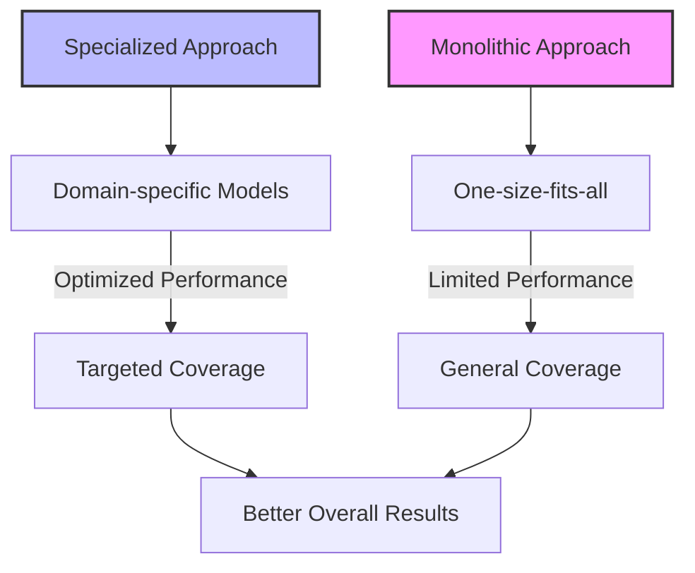

# Understanding Specialized Retrieval: Beyond Basic RAG

### Key Insight

**Different queries need different retrievers—one-size-fits-all is why most RAG systems underperform.** A search for "SKU-12345" needs exact matching, "compare pricing plans" needs structured comparison, and "how do I reset my password" needs procedural knowledge. Build specialized indices for each pattern and let a router decide. This is how Google evolved: Maps for location, Images for visual, YouTube for video.

!!! info "Learn the Complete RAG Playbook"
    All of this content comes from my [Systematically Improving RAG Applications](https://maven.com/applied-llms/rag-playbook?promoCode=EBOOK) course. Readers get **20% off** with code EBOOK. Join 500+ engineers who've transformed their RAG systems from demos to production-ready applications.

## Learning Objectives

By the end of this chapter, you will be able to:

1. **Understand why specialized retrieval beats monolithic approaches** - Learn why different query types need fundamentally different search strategies and how this mirrors Google's evolution from one search to specialized tools
2. **Master the two core improvement strategies** - Distinguish between extracting structured metadata and generating synthetic text, understanding when to use each approach
3. **Implement RAPTOR for long documents** - Apply hierarchical summarization techniques for documents with 1,500+ pages where related information spans multiple sections
4. **Design measurement frameworks** - Use the two-level performance equation P(finding data) = P(selecting retriever) × P(finding data | retriever) to debug system bottlenecks
5. **Apply the materialized views concept** - Think systematically about specialized indices as AI-processed views of existing data

These objectives build directly on the roadmapping foundations from Chapter 4 and prepare you for the multimodal implementation techniques in Chapter 5.2.

## Introduction

We've covered the basics: the RAG playbook, synthetic data generation, fine-tuning, user feedback collection, and segmentation. Now let's talk about something that actually makes a big difference in production systems—building specialized search indices for different types of content.

### Building on the Foundation

- **[Chapter 1](chapter1.md)**: Evaluation metrics for each specialized retriever
- **[Chapter 2](chapter2.md)**: Fine-tuning embeddings for specific domains
- **[Chapter 3](chapter3-1.md)**: Collecting feedback on retrieval quality
- **[Chapter 4](chapter4-2.md)**: Identifying which capabilities need specialization

The basic idea is straightforward: different types of queries need different retrieval approaches. A search for a specific product number works differently than a search for "durable power tools" or "items under 50 pounds". Once you accept this, the path forward becomes clearer.

## Why Specialization Works

### Beyond the Monolithic Approach

Most RAG systems start with one big index that tries to handle everything. This works until it doesn't—usually when you realize your users are asking wildly different types of questions that need different handling.

**Example: Diverse Query Needs**

### The Hardware Store Walkthrough

Let's walk through a concrete example with a hardware store's knowledge base to understand how different query types need different retrieval approaches:

**Query Type 1: Exact Product Lookup**
- *User asks*: "Do you have DeWalt DCD771C2 in stock?"
- *Best approach*: **Lexical search** - exact string matching on product codes
- *Why*: Product numbers, SKUs, and model numbers need precise matching, not semantic understanding

**Query Type 2: Conceptual Search** 
- *User asks*: "What's the most durable power drill for heavy construction work?"
- *Best approach*: **Semantic search** - understanding concepts like "durable," "heavy-duty," "construction"
- *Why*: This requires understanding relationships between concepts, not exact matches

**Query Type 3: Attribute Filtering**
- *User asks*: "Show me all drills under 5 pounds with at least 18V battery"
- *Best approach*: **Structured query** - filtering on weight and voltage attributes
- *Why*: This needs precise numerical filtering and structured data operations

Each of these queries hits the same hardware store database, but they need fundamentally different search approaches. A single "one-size-fits-all" system would handle all three poorly.

### Learning from Google's Search Evolution

The best way to understand this is to look at Google's evolution. Originally, Google was just web search—one massive index trying to handle everything. But over time, they recognized that different content types needed fundamentally different approaches:

- **Google Maps** = Specialized for locations, routes, and geographical queries
- **Google Images** = Optimized for visual content with computer vision
- **YouTube** = Built for video with engagement signals and temporal understanding  
- **Google Shopping** = Designed for products with pricing, availability, and commerce
- **Google Scholar** = Tailored for academic papers with citation networks

Each system isn't just "Google search filtered by type"—they use completely different algorithms, ranking signals, and user interfaces optimized for their specific content.

**The crucial insight**: Google didn't abandon general web search. They built specialized tools and then developed routing logic to automatically send queries to the right system. Search "pizza near me" and you get Maps. Search "how to make pizza" and you might get YouTube videos.

The real breakthrough came when they figured out how to automatically route queries to the right specialized tool. We can apply this exact same pattern to RAG systems.

> "I've been building separate indices for years without realizing that's what I was doing. This framework just helps me do it more systematically."
> 
> — Previous Cohort Participant

### The Mathematics of Specialization

The math backs this up: when you have distinct query types, specialized models beat general-purpose ones. You see this pattern everywhere in ML—mixture of experts, task decomposition, modular systems. It's not just theory; it's how things actually work better.



Specialized indices also make your life easier organizationally:

- Teams can work on specific problems without breaking everything else
- You can add new capabilities without rebuilding the whole system
- Different teams can optimize their piece without coordination overhead

> "Building specialized indices isn't just about performance—it's about creating a sustainable path for continuous improvement."
> 
> — Industry Perspective

## Two Paths to Better Retrieval

When improving retrieval capabilities for RAG applications, two complementary strategies emerge. Think of them as opposite sides of the same coin—one extracting structure from the unstructured, the other creating retrieval-optimized representations of structured data.

Here's the core idea: both strategies create AI-processed views of your data—either by extracting structure from text or by rewriting structured data as searchable text.

### The "Materialized View" Concept

Think of specialized indices as **materialized views** of your existing data, but processed by AI rather than traditional SQL operations. Just like database materialized views precompute complex queries for faster access, specialized AI indices preprocess your data into forms optimized for specific types of retrieval.

**Traditional Materialized View:**
- SQL precomputes complex joins and aggregations
- Trades storage space for query speed
- Updates when source data changes

**AI Materialized View:**
- AI precomputes structured extractions or synthetic representations  
- Trades processing time and storage for retrieval accuracy
- Updates when source documents change or AI models improve

This framing is powerful because it helps you think systematically about what views to create and maintain. You wouldn't create a database materialized view without understanding what queries it optimizes for—the same logic applies to specialized AI indices.

### Strategy 1: Extracting Metadata

First approach: pull structured data out of your text. Instead of treating everything as a blob of text, identify the structured information hiding in there that would make search work better.

**Metadata Extraction Examples:**

- In finance applications, distinguishing between fiscal years and calendar years
- For legal document systems, classifying contracts as signed or unsigned and extracting payment dates and terms
- When processing call transcripts, categorizing them by type (job interviews, stand-ups, design reviews)
- For product documentation, identifying specifications, compatibility information, and warranty details

Ask yourself: what structured data is buried in this text that users actually want to filter by? Once you extract it, you can use regular databases for filtering—way more powerful than vector search alone.

**Practical Application:** When consulting with financial clients, we discovered that simply being able to distinguish between fiscal years and calendar years dramatically improved search accuracy for financial metrics. Similarly, for legal teams, identifying whether a contract was signed or unsigned allowed for immediate filtering that saved hours of manual review.

!!! example "Financial Metadata Model"

````
```python
from pydantic import BaseModel
from datetime import date
from typing import Optional, List

class FinancialStatement(BaseModel):
    """Structured representation of a financial statement document."""
    company: str
    period_ending: date
    revenue: float
    net_income: float
    earnings_per_share: float
    fiscal_year: bool = True  # Is this fiscal year (vs calendar year)?
    # Additional fields that might be valuable:
    sector: Optional[str] = None
    currency: str = "USD"
    restated: bool = False  # Has this statement been restated?

def extract_financial_data(document_text: str) -> FinancialStatement:
    """
    Extract structured financial data from document text using LLM.

    Args:
        document_text: Raw text from financial document

    Returns:
        Structured FinancialStatement object with extracted data
    """
    # Define a structured extraction prompt
    system_prompt = """
    Extract the following financial information from the document:
    - Company name
    - Period end date
    - Whether this is a fiscal year report (vs calendar year)
    - Revenue amount (with currency)
    - Net income amount
    - Earnings per share
    - Business sector
    - Whether this statement has been restated

    Format your response as a JSON object with these fields.
    """

    # Use LLM to extract the structured information
    # Implementation depends on your LLM framework
    extracted_json = call_llm(system_prompt, document_text)

    # Parse the extracted JSON into our Pydantic model
    return FinancialStatement.parse_raw(extracted_json)
```
````

By extracting these structured elements from quarterly reports, organizations can enable precise filtering and comparison that would have been impossible with text-only search. For instance, you can easily query "Show me all companies in the tech sector with revenue growth over 10% in fiscal year 2024" or "Find all restated financial statements from the last quarter."

### Strategy 2: Building Synthetic Text Chunks

Second approach: take your data (structured or not) and generate text chunks specifically designed to match how people search. These synthetic chunks act as better search targets that point back to your original content.

**Synthetic Text Applications:**

- For image collections: Generate detailed descriptions capturing searchable aspects
- For research interviews: Extract common questions and answers to form an easily searchable FAQ
- For numerical data: Create natural language descriptions of key trends and outliers
- For product documentation: Generate comprehensive feature summaries that anticipate user queries
- For customer service transcripts: Create problem-solution pairs that capture resolution patterns

The synthetic chunks work as a bridge—they're easier to search than your original content but point back to the source when you need the full details. Done right, you get better search without losing information.

### Strategy 3: RAPTOR for Long Documents

When dealing with extremely long documents (1,500-2,000+ pages), traditional chunking strategies often fail to capture information that spans multiple sections. The RAPTOR (Recursive Abstractive Processing for Tree-Organized Retrieval) approach offers a sophisticated solution.

**Production Insight:** From office hours: "For documents with 1,500-2,000 pages, the RAPTOR approach with clustering and summarization shows significant promise. After chunking documents, recluster the chunks to identify concepts that span multiple pages, then summarize those clusters for retrieval."

#### The RAPTOR Process

1. **Initial Chunking**: Start with page-level or section-level chunks
2. **Embedding & Clustering**: Embed chunks and cluster semantically similar content
3. **Hierarchical Summarization**: Create summaries at multiple levels of abstraction
4. **Tree Structure**: Build a retrieval tree from detailed chunks to high-level summaries

!!! example "Legal Document Processing"
    A tax law firm implemented RAPTOR for their regulatory documents:
    
    - Laws on pages 1-30, exemptions scattered throughout pages 50-200
    - Clustering identified related exemptions across different sections
    - Summaries linked laws with all relevant exemptions
    - One-time processing cost: $10 in LLM calls per document
    - Result: 85% improvement in finding complete legal information

#### Implementation Considerations

**When to Use RAPTOR:**

- Documents where related information is scattered across many pages
- Content with hierarchical structure (laws/exemptions, rules/exceptions)
- Long-form documents that don't change frequently (worth the preprocessing cost)
- Cases where missing related information has high consequences

**Cost-Benefit Analysis:**

- **Upfront Cost**: $5-20 in LLM calls per document for clustering and summarization
- **Processing Time**: 10-30 minutes per document depending on length
- **Benefit**: Dramatically improved recall for cross-document concepts
- **ROI**: Justified for documents accessed frequently or with high-value queries

### Implementation Tips

1. Test on a subset first to validate clustering quality
2. Store cluster relationships for explainability
3. Consider incremental updates for living documents
4. Monitor which summary levels get used most

#### Practical Example

For a construction company's specification documents:

```
Original Structure:
- General requirements (pages 1-50)
- Specific materials (pages 51-300)
- Installation procedures (pages 301-500)
- Exceptions and special cases (scattered throughout)

After RAPTOR Processing:
- Clustered related materials with their installation procedures
- Linked all exceptions to their base requirements
- Created summaries at project, section, and detail levels
- Reduced average retrieval attempts from 5.2 to 1.3 per query
```

RAPTOR basically turns long document search into a hierarchy problem. Yes, it costs more upfront to process documents this way, but for complex queries that span multiple sections, the improvement in retrieval accuracy is worth it.

For implementation details, see:

- [Original RAPTOR paper](https://arxiv.org/abs/2401.18059)
- [LlamaIndex RAPTOR implementation](https://docs.llamaindex.ai/en/stable/examples/retrievers/raptor.html)

## Measuring What Matters

With specialized indices, you need to measure two things:

### Two-Level Measurement Framework

```
1. Are we selecting the right retrieval method for each query?
2. Is each retrieval method finding the right information?
```

Your overall success rate is just multiplication:

**Performance Formula:**

P(finding correct data) = P(selecting correct retriever) × P(finding correct data | correct retriever)

This formula is incredibly powerful for systematic debugging and optimization. When your overall performance is low, the multiplication helps you diagnose exactly where the problem lies:

**Debugging Scenarios:**

- **High routing accuracy (90%) × Low retrieval accuracy (40%) = 36% overall**
  - *Problem*: The router works well, but individual retrievers need improvement
  - *Solution*: Focus on fine-tuning embeddings, improving chunks, or expanding training data for specific retrievers

- **Low routing accuracy (50%) × High retrieval accuracy (90%) = 45% overall**  
  - *Problem*: Retrievers work when called, but the router makes poor choices
  - *Solution*: Improve router training, add more few-shot examples, or clarify tool descriptions

- **Medium performance on both (70% × 70%) = 49% overall**
  - *Problem*: System-wide issues affecting both components
  - *Solution*: May need fundamental architecture changes or better query understanding

The key insight is that these problems require completely different solutions. Without this breakdown, you'd waste time optimizing the wrong component.

!!! tip "Diagnostic Example"
If you find that your system correctly routes 95% of queries to the appropriate retriever, but those retrievers only find relevant information 60% of the time, your priority should be improving retrieval quality rather than router accuracy.

Measuring both levels tells you where to focus your efforts.

## This Week's Action Items

### Immediate Tasks (Week 1)
1. **Audit Your Current System**
   - [ ] Analyze your query logs to identify at least 3 distinct query patterns that need different retrieval approaches
   - [ ] Document the specific failure cases where your current monolithic system performs poorly
   - [ ] Calculate your current overall retrieval accuracy as a baseline

2. **Choose Your Strategy**
   - [ ] For each query pattern, decide between Strategy 1 (structured extraction) or Strategy 2 (synthetic text generation)
   - [ ] Prioritize the pattern with highest impact × volume × probability of success
   - [ ] Create a simple test set of 20-30 queries for your chosen pattern

3. **Implement Your First Specialized Index**
   - [ ] Build either a metadata extraction pipeline OR synthetic text generation system
   - [ ] Test on your query set and measure recall improvement over baseline
   - [ ] Document what specific capabilities this index enables

### Advanced Implementation (Week 2-3)
4. **Expand Your Specialized Capabilities**
   - [ ] Implement the second improvement strategy for a different query pattern
   - [ ] For documents >1,500 pages, test RAPTOR clustering and summarization
   - [ ] Create performance dashboards showing P(retriever success | correct selection)

5. **Measurement and Analysis**
   - [ ] Implement the two-level measurement framework
   - [ ] Break down failures: routing vs retrieval issues
   - [ ] Use the multiplication formula to identify your limiting factor

### Production Preparation (Week 3-4)
6. **Scale and Optimize**
   - [ ] Consider incremental update strategies for living documents
   - [ ] Implement caching for expensive AI processing steps
   - [ ] Plan team organization around specialized capabilities
   - [ ] Prepare for Chapter 6 routing implementation

### Success Metrics
- **Target**: 25-40% improvement in retrieval accuracy for your specialized capability
- **Business Impact**: Reduced time-to-answer for users in your target segment
- **System Health**: Clear separation between routing accuracy and individual retriever performance

!!! tip "Next Steps"
    In [Chapter 6](chapter6-1.md), we'll explore how to bring these specialized components together through intelligent routing, creating a unified system that seamlessly directs queries to the appropriate retrievers.
