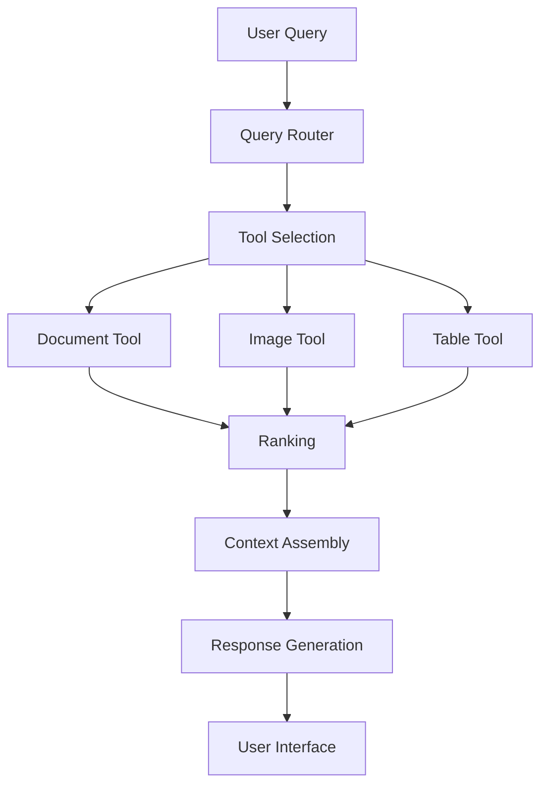

# Query Routing Foundations: Building a Cohesive RAG System

## Learning Objectives

By the end of this chapter, you will be able to:

1. **Understand the query routing problem** - Recognize why even excellent specialized retrievers become useless without proper routing and how to design systems where P(success) = P(right retriever) × P(finding data | right retriever)
2. **Master the tools-as-APIs pattern** - Design clean interfaces between routing logic, tool implementations, and team boundaries that enable parallel development
3. **Organize teams for scalable development** - Structure Interface, Implementation, Router, and Evaluation teams with clear ownership and coordination through well-defined APIs
4. **Design migration strategies** - Move systematically from monolithic to modular RAG systems with clear recognition, separation, interface, and orchestration phases
5. **Apply microservice principles** - Build RAG systems that feel like distributed microservices where specialized services handle specific information retrieval tasks
6. **Implement two-level performance measurement** - Track both routing accuracy and individual retriever performance to identify bottlenecks systematically

These objectives build directly on the specialized retrieval capabilities from Chapter 5 and prepare you for the concrete implementation techniques in Chapter 6.2.

### Key Insight

**The best retriever is multiple retrievers—success = P(selecting right retriever) × P(retriever finding data).** Query routing isn't about choosing one perfect system. It's about building a portfolio of specialized tools and letting a smart router decide. Start simple with few-shot classification, then evolve to fine-tuned models as you collect routing decisions.

!!! info "Learn the Complete RAG Playbook"
    All of this content comes from my [Systematically Improving RAG Applications](https://maven.com/applied-llms/rag-playbook?promoCode=EBOOK) course. Readers get **20% off** with code EBOOK. Join 500+ engineers who've transformed their RAG systems from demos to production-ready applications.

## Learning Objectives

By the end of this chapter, you will:

1. **Understand the query routing problem** - Recognize why even excellent specialized retrievers become useless without proper routing and how to design systems where P(success) = P(right retriever) × P(finding data | right retriever)
2. **Master the tools-as-APIs pattern** - Design clean interfaces between routing logic, tool implementations, and team boundaries that enable parallel development
3. **Organize teams for scalable development** - Structure Interface, Implementation, Router, and Evaluation teams with clear ownership and coordination through well-defined APIs
4. **Design migration strategies** - Move systematically from monolithic to modular RAG systems with clear recognition, separation, interface, and orchestration phases
5. **Apply microservice principles** - Build RAG systems that feel like distributed microservices where specialized services handle specific information retrieval tasks

## Introduction

## What This Chapter Covers

- Building unified RAG architectures with query routing
- Designing tool interfaces for specialized retrievers
- Implementing effective routing between components
- Measuring system-level performance

## Building on Previous Chapters

**Connecting the RAG Improvement Journey:**

- **[Chapter 1](chapter1.md)**: Use evaluation metrics from the RAG playbook to test router accuracy and tool selection performance
- **[Chapter 2](chapter2.md)**: Apply fine-tuning techniques to improve individual tool performance once routing is working
- **[Chapter 3](chapter3-1.md)**: Leverage user feedback collection methods to improve both routing decisions and tool effectiveness
- **[Chapter 4](chapter4-1.md)**: Use query segmentation analysis to identify which specialized tools are needed
- **[Chapter 5](chapter5-1.md)**: Convert specialized retrievers built in Chapter 5 into the tool interfaces we'll route between

**How This Chapter Fits:**

This chapter bridges the specialized capabilities you built in Chapter 5 with the performance measurement and continuous improvement you'll implement in Chapter 6-3. The tools-as-APIs pattern provides the architectural foundation that makes everything else possible.

## The Query Routing Problem

In Chapter 5, we built specialized retrievers for different content types. Now we need to decide when to use each one.

**Query routing** means directing user queries to the right retrieval components. Without it, even excellent specialized retrievers become useless if they're never called for the right queries.

The architecture we'll build:

1. Uses specialized retrievers built from user segmentation data
2. Routes queries to appropriate components
3. Provides clear interfaces for both models and users
4. Collects feedback to improve routing accuracy

## Tools as APIs Pattern

Treat each specialized retriever as an API that language models can call. This creates separation between:

1. **Tool Interfaces**: Definitions of what each tool does and its parameters
2. **Tool Implementations**: The actual retrieval code
3. **Routing Logic**: Code that selects which tools to call

This is similar to building microservices, except the primary client is a language model rather than another service. The pattern evolved from simple function calling in LLM APIs to more sophisticated tool selection frameworks.

### Benefits of the API Approach

- **Clear Boundaries**: Teams work independently on different tools
- **Testability**: Components can be tested in isolation
- **Reusability**: Tools work for both LLMs and direct API calls
- **Scalability**: Add new capabilities without changing existing code
- **Performance**: Enable parallel execution
- **Team Structure**: Different teams own different components

### Team Organization for Scalable Development

When building these systems at scale, team organization becomes critical. From my experience developing multiple microservices for retrieval at different companies, successful teams organize around these boundaries:

!!! example "Organizational Structure"
    **Interface Team** (Product/API Design)
    - Designs tool specifications based on user research
    - Defines the contracts between components  
    - Decides what capabilities to expose
    - Manages the user experience across tools

    **Implementation Teams** (Engineering)
    - **Search Team**: Builds document and text retrievers
    - **Vision Team**: Handles blueprint and image search
    - **Structured Data Team**: Manages schedule and metadata search
    - Each team optimizes their specific retriever type

    **Router Team** (ML Engineering)  
    - Builds and optimizes the query routing system
    - Manages few-shot examples and prompt engineering
    - Handles tool selection accuracy measurement

    **Evaluation Team** (Data Science)
    - Tests end-to-end system performance
    - Identifies bottlenecks between routing and retrieval
    - Runs A/B tests and measures user satisfaction

### Why This Structure Works

This separation allows teams to work independently while maintaining system coherence:

- **Clear ownership**: Each team owns specific metrics and outcomes
- **Parallel development**: Teams can optimize their components simultaneously  
- **Scalable expertise**: Teams develop deep knowledge in their domain
- **Clean interfaces**: Teams coordinate through well-defined APIs

**You're effectively becoming a framework developer for language models.** Moving forward, building RAG systems will feel a lot like building distributed microservices, where each service specializes in a particular type of information retrieval.

This architecture resembles modern microservice patterns where specialized services handle specific tasks. The difference is that the "client" making API calls is often a language model rather than another service.

### Moving from Monolithic to Modular

Most RAG systems start monolithic: one vector database, one chunking strategy, one retrieval method. This breaks down as content types diversify.

Typical migration path:

1. **Recognition**: Different queries need different retrieval
2. **Separation**: Break into specialized components
3. **Interface**: Define clear contracts between components
4. **Orchestration**: Build routing layer

**Example**: A financial services client migrated from a single vector database to specialized components:

- Development velocity: 40% faster feature delivery
- Retrieval quality: 25-35% improvement by query type
- Team coordination: Fewer cross-team dependencies
- Scaling: New content types added without disrupting existing features

The key was treating each retriever as a service with a clear API contract.

## This Week's Action Items

### System Architecture Planning (Week 1)
1. **Assess Your Current Architecture**
   - [ ] Map your existing RAG system to the monolithic → modular migration phases
   - [ ] Identify which phase you're in: Recognition, Separation, Interface, or Orchestration
   - [ ] Document the specific content types that need different retrieval approaches
   - [ ] Calculate your current system's success rate as P(finding data) baseline

2. **Design Team Organization**
   - [ ] Define roles for Interface, Implementation, Router, and Evaluation teams
   - [ ] Identify which team members have expertise in each specialized domain
   - [ ] Plan coordination mechanisms between teams (APIs, shared evaluation metrics, common tooling)
   - [ ] Establish clear ownership boundaries and success metrics for each team

### Tool Interface Design (Week 1-2)
3. **Implement Tools-as-APIs Pattern**
   - [ ] Design clean API contracts for each specialized retriever from Chapter 5
   - [ ] Separate tool interfaces from implementations to enable parallel development  
   - [ ] Create clear parameter specifications that both LLMs and humans can use
   - [ ] Document expected inputs, outputs, and error conditions for each tool

4. **Build Microservice Architecture**
   - [ ] Treat each retriever as an independent service with well-defined boundaries
   - [ ] Design for parallel execution and independent scaling
   - [ ] Implement clear separation between routing logic and retrieval implementations
   - [ ] Plan for testability - each component should be testable in isolation

### Migration Strategy (Week 2-3)  
5. **Execute Systematic Migration**
   - [ ] Phase 1 (Recognition): Document query types that need different approaches
   - [ ] Phase 2 (Separation): Break monolithic retriever into specialized components
   - [ ] Phase 3 (Interface): Define clean contracts between all components
   - [ ] Phase 4 (Orchestration): Build routing layer to coordinate specialized tools

6. **Measure Two-Level Performance**
   - [ ] Implement tracking for P(selecting right retriever) - routing accuracy
   - [ ] Implement tracking for P(finding data | right retriever) - individual tool performance
   - [ ] Create dashboards showing both metrics to identify limiting factors
   - [ ] Use performance multiplication to prioritize improvement efforts

### Production Readiness (Week 3-4)
7. **Scale Team Development**
   - [ ] Enable teams to work independently on their specialized components
   - [ ] Implement shared evaluation frameworks across all teams
   - [ ] Create common tooling and standards for interface design
   - [ ] Plan regular coordination meetings focused on API contracts and performance

8. **Prepare for Integration**
   - [ ] Document all tool interfaces in preparation for Chapter 6-2 implementation
   - [ ] Create comprehensive test suites for each specialized component
   - [ ] Plan routing strategies and few-shot example management
   - [ ] Prepare user interface considerations for both AI and direct tool access

### Success Metrics
- **Architecture**: Clear separation of concerns with testable, independent components
- **Team Velocity**: 40% faster feature delivery through parallel development
- **System Performance**: 25-35% improvement in retrieval quality by specialized query type
- **Scalability**: New content types can be added without disrupting existing features
- **Performance Clarity**: Can identify whether bottlenecks are routing or retrieval issues

!!! tip "Next Steps"
	In [Chapter 6-2](chapter6-2.md), we'll implement the specific tool interfaces and routing logic that bring this architectural vision to life.
