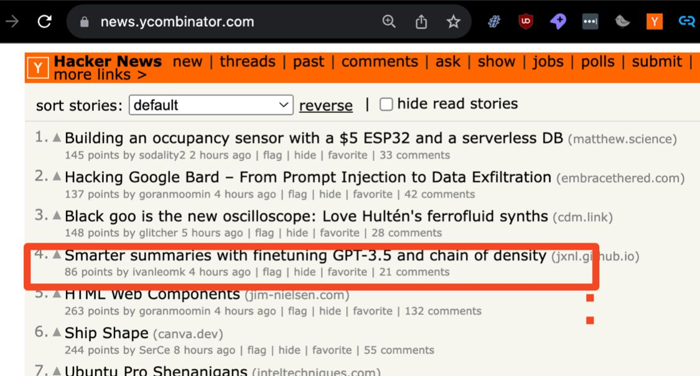

Here are some writing samples of work that we’ve done for a few different clients across the year

1. [Beating Proprietary Models With A Quick Fine Tune](https://modal.com/blog/fine-tuning-embeddings) : We highlighted how you could use Modal to run grid search in parallel across more than 50 GPUs to find the best hyper-parameters to fine-tune an embedding model to beat OpenAI’s text-embedding-3-small model
2. [Embedding English Wikipedia in under 15 minutes](https://modal.com/blog/embedding-wikipedia) : We leveraged’s Modal’s cloud GPUs to embed the entirety of english wikipedia, showing how the platform was able to scale to arbitrarily high workloads with only a few lines of code  
3. [RAG is more than Vector Search](https://www.timescale.com/blog/rag-is-more-than-just-vector-search/) : We highlighted some of the key advantages of using Timescale’s platform to build out RAG applications - demonstrating how Raw SQL was a good fit for building out complex metadata filters that could combine lexical and vector search 
4. [Enhancing Text-to-SQL with Synthetic Summaries](https://www.notion.so/Enhancing-Text-to-SQL-with-Synthetic-Summaries-A-Few-Shot-Learning-Approach-492ec163cdff4082b90ec8f05e6ffe12?pvs=21) : This article reframed text-to-sql as a retrieval task and we showed through a series of experiments using synthetic questions the benefit of using summaries against raw snippets. All of the code was done using Timescale to highlight how the platform was able to support these complex benchmarks with relative ease.

Here are some writing samples from the instructor blog which we’ve done

1. [Smarter Summaries w Finetuning GPT-3.5 and Chain Of Density](https://python.useinstructor.com/blog/2023/11/05/chain-of-density/) - We were one of the first to show how fine-tuning GPT-3.5 could result in massive performance boosts for specific tasks. This post went viral and charted at #3 on Hackernews when we published it.

2. [Bad Schemas Could break Your LLM Structured Outputs](https://python.useinstructor.com/blog/2024/09/26/bad-schemas-could-break-your-llm-structured-outputs/) - This was a research style article where we highlighted the dangers of using JSON mode versus structured outputs through a series of benchmarks that we performed on GPT-4o and Claude models against the GSM8k

3. [RAG Is More Than Embeddings Search](https://python.useinstructor.com/blog/2023/09/17/rag-is-more-than-just-embedding-search/) - This was an article we put out last year talking about the limitations of embedding search and why scaling beyond a simple demo requires careful and thoughtful consideration to metadata filters and query understanding. 