# How Do Slash Commands and Subagents Keep AI Tools Focused?

**The main idea:** When AI tools do messy tasks, they can either stay focused or get confused by too much information.

_This is part of the [Context Engineering Series](./context-engineering-index.md) that shows how to build better AI tools based on what I've learned from coding assistants and business systems._

<!-- more -->

**Key Terms:**

- **Context Engineering:** Building dynamic systems to provide the right information and tools in the right format so agents can accomplish tasks reliably
- **Context Pollution:** When valuable reasoning context gets flooded with irrelevant but computationally cheap information (logs, error traces, diagnostic output)
- **Context Rot:** The degradation of AI performance as input length increases, where models process context less reliably in longer conversations
- **Subagents:** Specialized AI workers that handle messy, token-intensive tasks in isolation and return only distilled insights to the main reasoning thread

Through my [consulting work](https://jxnl.co/consulting/), I help companies build better AI systems. AI tools often waste huge amounts of processing power on messy information. Their main thinking gets clouded. **Most of what they process is junk** like test results, error logs, and long outputs that make it hard for the AI to think clearly.

The choice isn't about what the AI can do. It's about what it can do given the information it has and how focused it can stay on one task. When your AI tool needs to run tests, check logs, or do heavy work, you have two options: dump all that messy stuff into the main chat (slash commands), or create a separate helper to handle it cleanly (subagents).

I'll show you the exact difference using Claude Code as an example. **Same ability to find problems. Same results. But one way uses 169,000 processing units with 91% junk. The other uses only 21,000 units with 76% useful information—8 times cleaner.**

By the end of this post, you'll understand:

- **Why too much messy information hurts AI performance** (and how to measure it)
- **When to use slash commands vs subagents** (how to decide for users and builders)
- **How real systems work** (Claude Code's actual setup)
- **How to audit your own workflows** (identify subagent candidates in your current systems)

Any AI tool that handles messy data faces this choice. This includes tools that read logs, process data, check security, or help customers. **Good information management is how you build AI tools that work at scale.**

**Want to test this yourself?** The [rapid prototyping methodology](./context-engineering-agent-prototyping.md) I've developed lets you experiment with both slash commands and subagent patterns using Claude Code as a harness. You can implement the same diagnostic capability both ways and measure the context pollution differences directly—without building production infrastructure first.

Here's the uncomfortable truth: **bad context is cheap but toxic.** Loading 100,000 lines of test logs costs almost nothing computationally, but it easily pollutes valuable context. A well-crafted 3,000-token feature spec gets destroyed when you dump Python outputs and error traces on top of it.

Coding agents like Claude Code are at the forefront of solving this problem. The patterns emerging here will make it to other domains—customer support, financial analysis, medical diagnosis—within months. Understanding these architectural choices now prepares you for what's coming.

<!-- more -->

## What Happens on the Slash Command Path?

Take a simple example: you're building a feature, you touch a few files, and now you need to run tests.

You tell your agent:

```bash
/run-tests
```

Which triggers a prompt with a fairly long description.

```text
Run the tests in verbose mode and read the outputs carefully. Then inspect any of the files that have changed that might be causing issues. If you need to explore and read files to figure out what might be going on, we are also able to use Git to identify when these issues may have arisen.

For each failing test:
1. Extract the stack trace and identify the exact line causing the failure
2. Use git blame on that line to see who last modified it and when
3. Check git log for recent commits touching those files
4. Look at related test files that might share similar patterns
5. If it's an import/dependency error, check package.json or requirements.txt changes
6. Summarize findings in a structured format: test name, root cause hypothesis, suspect commits, and recommended fix
```

Great. The AI tool puts the test results right into the same conversation. But now your clean 5,000-word plan gets flooded with 150,000 words of test logs. Your AI's memory is suddenly 95% junk. It's full of error messages, long outputs, thousands of "expected this but got that" failures, timestamps, and system dumps.

```mermaid
gantt
    title Token Usage
    dateFormat X
    axisFormat %s

    section User Request
    System Message          :done, system, 0, 5000
    User Request            :milestone, request, 5000, 5000

    section Reading
    Read      :done, 5000, 7000
    Read      :done, 7000, 8000
    Read      :done, 8000, 9000
    Read      :done, 9000, 10000
    Edit      :done, 10000, 11000
    Edit      :done, 11000, 12000
    Edit      :done, 12000, 13000
    Edit      :done, 13000, 14000
    Edit      :done, 14000, 15000
    Edit      :done, 15000, 16000

    section Running Tests (150,000 tokens)
    Run Tests     :milestone, run, 16000, 16000
    Read Test Outputs     :active, outputs, 16000, 49000
    Read Log Files  :active, logs, 49000, 149000
    Explore Git History :active, git, 149000, 166000

    section Continuing the thread (Polluted)
    User Request          :done, 166000, 167000
    Read Files            :done, 167000, 168000
    Edit Files            :done, 168000, 169000
```



This diagram shows how tokens accumulate when you use slash commands. You start with clean, focused work (16,000 tokens). Then `/run-tests` dumps 150,000 tokens of diagnostic noise into your main thread. By the time you want to continue your original feature work, your AI is drowning in random bits of raw logs, error traces, and debug info. This is exactly the kind of mess that makes [traditional search systems fail](./rag.md). When useful information gets buried under junk, even the best AI struggles to stay focused. The output looks like this:

!!! example Context pollution from test failures and logs (click to expand)

    ````text
    FAILED tests/test_refund.py::test_refund_with_none_guard - AssertionError: assert None is not None
    FAILED tests/test_payment.py::test_process_payment_with_refunds - IndexError: list index out of range
    FAILED tests/test_validation.py::test_validate_order_items - AttributeError: 'NoneType' object has no attribute 'items'

    =================================== FAILURES ===================================
    ______________________________ test_refund_with_none_guard ______________________________

        def test_refund_with_none_guard(self):
            refund = RefundService.create_partial_refund(order_id=123, line_items=None)
    >       assert refund.events is not None
    E       AssertionError: assert None is not None
    E       +  where None = RefundResult(success=False, events=None, error='NoneType object is not iterable').events

    tests/test_refund.py:45: AssertionError
    ----------------------------- Captured stdout call -----------------------------
    2025-08-29 10:15:23,456 DEBUG [RefundService] Starting refund processing for order 123
    2025-08-29 10:15:23,457 INFO [Database] Connecting to postgres://prod-db:5432/payments
    2025-08-29 10:15:23,459 DEBUG [RefundService] Processing line_items: None
    2025-08-29 10:15:23,459 DEBUG [RefundService] Validating refund parameters...
    2025-08-29 10:15:23,460 DEBUG [RefundService] Iterating through line_items...
    Traceback (most recent call last):
      File "/usr/local/lib/python3.9/site-packages/sqlalchemy/engine/base.py", line 1900, in _execute_context
        self.dialect.do_execute(
      File "/usr/local/lib/python3.9/site-packages/sqlalchemy/engine/default.py", line 736, in do_execute
        cursor.execute(statement, parameters)
    psycopg2.errors.InvalidTextRepresentation: invalid input syntax for type uuid: "None"

    During handling of the above exception, another exception occurred:

    Traceback (most recent call last):
      File "/app/payments/refund.py", line 118, in process_line_items
        for item in line_items:
    TypeError: 'NoneType' object is not iterable
    2025-08-29 10:15:23,461 ERROR [RefundService] Refund failed due to invalid line_items
    2025-08-29 10:15:23,462 INFO [Database] Connection closed

    ________________________ test_process_payment_with_refunds ________________________

        def test_process_payment_with_refunds(self):
            payment = Payment.objects.create(amount=100.00, status='completed')
            refunds = payment.get_refunds()
    >       assert refunds[0].amount == 25.00
    E       IndexError: list index out of range

    tests/test_payment.py:78: IndexError
    ----------------------------- Captured stderr call -----------------------------
    django.db.utils.IntegrityError: FOREIGN KEY constraint failed

    git log --oneline -10 payments/refund.py
    a1b2c3d Remove redundant None checks in refund processing
    854cc73 Add validation for refund amounts
    b764ad9 Fix refund event creation timing
    89f0ac7 Update refund processing to handle edge cases
    853ea43 Optimize database queries in refund flow
    ...

    git blame payments/refund.py | grep -A5 -B5 "for item in line_items"
    115:     @staticmethod
    116:     def process_line_items(line_items):
    117: a1b2c3d (dev-team 2025-08-28 14:23:15 -0700) +        # Upstream should validate line_items
    118: a1b2c3d (dev-team 2025-08-28 14:23:15 -0700) +
    119: 9a7f614  (alice    2025-08-15 09:45:32 -0700)          processed = []
    120: a1b2c3d (dev-team 2025-08-28 14:23:15 -0700) +        for item in line_items:
    ...

    commit a1b2c3d4e5f6789 (HEAD -> feature/refund-fix, origin/feature/refund-fix)
    Author: dev-team <team@company.com>
    Date:   Wed Aug 28 14:23:15 2025 -0700

        Remove redundant None checks in refund processing

        - Cleaned up defensive programming patterns
        - Simplified line_items processing logic
        - Assumes upstream validation handles None cases
        - Part of tech debt cleanup initiative

     payments/refund.py     | 3 +--
     tests/test_refund.py   | 2 +-
     docs/refund_api.md     | 1 +
     3 files changed, 3 insertions(+), 3 deletions(-)

    diff --git a/payments/refund.py b/payments/refund.py
    index 1234567..abcdefg 100644
    --- a/payments/refund.py
    +++ b/payments/refund.py
    @@ -115,8 +115,7 @@ class RefundService:

         @staticmethod
         def process_line_items(line_items):
    -        if line_items is None:
    -            return []
    +        # Upstream should validate line_items

             processed = []
             for item in line_items:

    stdout from application logs:
    2025-08-29 10:15:20.123 [main] INFO  o.s.b.w.e.tomcat.TomcatWebServer - Tomcat started on port(s): 8080 (http)
    2025-08-29 10:15:20.127 [main] INFO  com.company.PaymentsApplication - Started PaymentsApplication in 2.456 seconds
    2025-08-29 10:15:23.445 [http-nio-8080-exec-1] INFO  c.c.p.controller.RefundController - POST /api/refunds
    2025-08-29 10:15:23.446 [http-nio-8080-exec-1] DEBUG c.c.p.service.RefundService - Processing refund request: {"order_id": 123, "line_items": null}
    2025-08-29 10:15:23.447 [http-nio-8080-exec-1] WARN  c.c.p.service.ValidationService - Received null line_items, proceeding anyway
    2025-08-29 10:15:23.461 [http-nio-8080-exec-1] ERROR c.c.p.service.RefundService - NoneType iteration error in process_line_items
    2025-08-29 10:15:23.462 [http-nio-8080-exec-1] ERROR c.c.p.controller.RefundController - HTTP 500: Internal server error during refund processing
    ```

This is context rot in action—the well-documented phenomenon where [AI performance degrades as input length increases](https://www.anthropic.com/research/measuring-model-capabilities). Recent research by [Chroma on context rot](https://research.trychroma.com/context-rot) demonstrates how performance degradation occurs in large context windows. As the conversation grows, it's hard to figure out what the main goal is. The more irrelevant stuff you add, the worse the AI performs. Your first 5000 words were focused on adding a new feature to the refunds system. Now 95% of your AI's memory looks like diagnostic junk. It's like the reverse of finding a needle in a haystack. You had the needle and then buried it under a pile of hay. How could you possibly go back to working on the feature without strange behavior?

This problem happens in more than just coding tools. As I wrote about in [RAG Low-Hanging Fruit](./rag-low-hanging-fruit.md), keeping clean information is key to system performance. This matters whether you're fixing code or answering customer questions. Maybe you clear everything and start over. But there must be some way to keep your original work. Maybe you try to compress things and hope the AI can figure out what's important.

!!! warning "Slash Command Token Economics"
**Main thread total:** 169,000 tokens (16k clean + 150k test noise + 3k continuing)
**Context pollution:** 91% noise
**Problem:** Test diagnostics flood your reasoning thread with massive logs

## What Is the Subagent Path?

Now instead of using a slash command, you create a Test Runner helper.

Claude Code makes this easy. Subagents are separate AI helpers with their own instructions, tools, and memory. They're like having a team of workers. Each worker does a messy job, then comes back with just the important results.

This approach addresses a core challenge in multi-agent systems: maintaining context coherence while enabling specialization. The key insight is that subagents should operate in isolation on well-defined tasks, then return distilled results rather than trying to collaborate continuously. This aligns with [Cognition's insights on why multi-agent systems are problematic](./talks/devin-cognition-multi-agents.md) for coding tasks—the "telephone game" effect between agents creates more problems than benefits.

Your test runner subagent can:

- Run all tests in ultra-verbose mode with full stack traces
- Use `awk` and `grep` and `python` to parse gigabytes of application logs, database logs, and system logs
- Use Git to check when failing files last changed, including full commit diffs
- Correlate failures with PRs and read entire code review threads
- Read all the files at fault, their imports, and related modules to hypothesize root causes
- Analyze performance metrics and memory dumps

It might use 180,000 tokens in the process. It reads huge log files, parses long error traces, and checks hundreds of code files. But what comes back to your main AI is a short, clear 5,000-word report:

```text
Tests A, B, C are failing
Root cause is in refund.py, introduced by PR #123
Suggested fix: restore the None guard
```

Now your main context is still tight and focused. It's 21,000 tokens total: clean plan + distilled results.

**The mess stayed with the sidecar. Only the useful stuff came back.**

!!! success "Subagent Token Economics"
**Main thread total:** 21,000 tokens (16k clean + 2k summary + 3k continuing)
**Subagent burned:** 150,000 tokens (off-thread)
**Context quality:** 76% signal
**Result:** 8x cleaner main thread, same diagnostic capability

```mermaid
gantt
    title Subagent Context Management
    dateFormat X
    axisFormat %s

    section Main Thread (Clean)
    System Message          :done, system, 0, 5000
    User Request            :milestone, request, 5000, 5000
    Initial Work            :done, work, 5000, 16000
    Spawn Test Subagent     :milestone, spawn, 16000, 16000
    Receive Summary         :crit, done, summary, 166000, 168000
    User Request            :done, 168000, 169000
    Read Files              :done, 169000, 170000
    Edit Files              :done, 170000, 171000

    section Test Subagent (150,000 tokens)
    Run Tests               :milestone, run, 16000, 16000
    Read Test Outputs       :active, outputs, 16000, 49000
    Read Log Files          :active, logs, 49000, 149000
    Explore Git History     :active, git, 149000, 166000
```



I've watched a test runner subagent identify failing tests, run git bisect, and trace the regression back to the PR that introduced it. It took ~7 minutes and burned ~180,000 tokens — but the main agent only saw the conclusion.

A friend built a performance optimization subagent. Their main agent was busy implementing a UX feature, while the subagent ran scripts, parsed logs, did data analysis, and reported: "These three functions cause 70% of latency." The core stayed focused on the feature; the sidecar did the heavy lifting.

# How Does This Work in Claude Code?

I've been diving into how Claude Code implements this stuff, and it's pretty clever.

**Slash commands are just prompt injection.** When you type `/run-tests`, Claude Code literally injects that long-ass prompt I showed you earlier into your main thread. Everything happens in the same context window. The test outputs, the git blame, the stack traces — all of it floods your main reasoning space.

**Subagents are separate workers.** Claude Code has pre-configured subagents like `test-diagnostician` and `general-purpose` that spawn with their own context windows, their own tool access, everything. They're literally like shadow clones — they go off, do the work, burn 150k tokens parsing logs, and come back with just the insights.

The brilliance is in what gets isolated vs what gets shared.

**Read operations can be massively parallel.** You can have multiple subagents reading files, running git operations, parsing logs — all simultaneously. They don't step on each other because they're just consuming information. This aligns with [Anthropic's multi-agent research approach](https://www.anthropic.com/research/many-shot-jailbreaking), where parallel subagents explore different aspects of complex problems simultaneously.

**Write operations need to be single-threaded.** Here's the thing I've learned: if you have multiple agents trying to edit the same files, you get merge conflicts and broken state. So Claude Code keeps all the actual code implementation in the main thread.

**Slash commands can orchestrate subagents.** You might have `/commands` that trigger different kinds of subagents to coordinate complex tasks. The slash command is for the orchestrator, and the subagents are how you delegate. A `/analyze-performance` command might spawn multiple subagents: one parsing application logs, another analyzing database queries, a third reviewing recent code changes. Each burns massive token budgets in parallel, but your main thread only sees the coordinated summary.

This creates a really elegant pattern:

1. **Main agent**: "I need to implement authentication"
2. **Research subagent**: Goes deep on existing auth patterns (burns 80k tokens)
3. **Security subagent**: Analyzes requirements and best practices (burns 60k tokens)
4. **Main agent**: Gets two clean summaries, then implements single-threaded

The research happens in parallel, the implementation happens coordinated. The noise stays in the sidecars, the signal comes to main.

I've watched this in action. A friend had a performance optimization subagent that would run scripts, parse gigabytes of logs, and do data analysis while the main agent kept working on UX features. The subagent burned ~180k tokens and came back with: "These three functions are causing 70% of your latency."

That's exactly the kind of insight you need, without any of the noise.

## How Does Context Engineering Apply Beyond Code?

This pattern applies far beyond coding assistants. The key insight is **read-only research models** that burn tokens exploring messy data while keeping your main reasoning thread clean.

**Comparing data rooms:** Instead of dumping both data rooms into your main agent, spin up an agent per data room. Each agent is aware of the final report you want to generate, explores its data room independently, then feeds clean insights back to the main orchestrator.

**Financial due diligence:** Let subagents parse thousands of documents—regulatory filings, transaction records, legal contracts—while your main thread focuses on the strategic analysis and decision-making.

**Research synthesis:** Multiple agents can explore different domains or time periods in parallel, each burning massive token budgets on deep research, while your main agent receives only the distilled findings.

The critical distinction: this works because these are **read-only operations**. As [research warns](https://cognition.ai/blog/dont-build-multi-agents), multi-agent systems become fragile when agents start making conflicting decisions without full context. But for pure research and data exploration, [Anthropic's approach](https://www.anthropic.com/engineering/multi-agent-research-system) shows that parallel subagents excel—they consume information simultaneously without stepping on each other's work.

The pattern is universal: **burn tokens in specialized workers, preserve focus in the main thread.**

But recognize these systems are complicated. If you're building a product, you have to decide whether you want to manually orchestrate these workflows and educate users, or build for expert users who understand the complexity.

## What Comes Next?

This architectural choice will define how agent systems scale. Teams building production agents today are implementing these patterns now, while the tooling ecosystem catches up.

**Why this matters now:** It's about ergonomics and economics. With 1M+ context windows, we have bigger ambitions for what agents can do—and they're working. But long context makes it hard for users to track what's happening and burns serious money. Bad context is cheap but toxic: loading 100k lines of logs costs almost nothing computationally, but easily pollutes valuable context. A well-crafted 3,000-token Linear spec gets destroyed when you dump Jupyter notebooks and Python logs on top of it.

**The immediate action:** Audit your current agent workflows. Which operations generate massive, noisy outputs? Most teams can identify subagent candidates in an afternoon and implement basic context isolation within a week.

The teams that recognize this early will build agents that scale. The teams that ignore it will build agents that plateau under their own noise.

---

_This post is part of the [Context Engineering Series](./context-engineering-index.md). For foundational concepts, start with [Beyond Chunks: Context Engineering Tool Response](./context-engineering-tool-response.md). Next up: exploring how enterprise teams are applying these patterns to business-critical agent systems._
