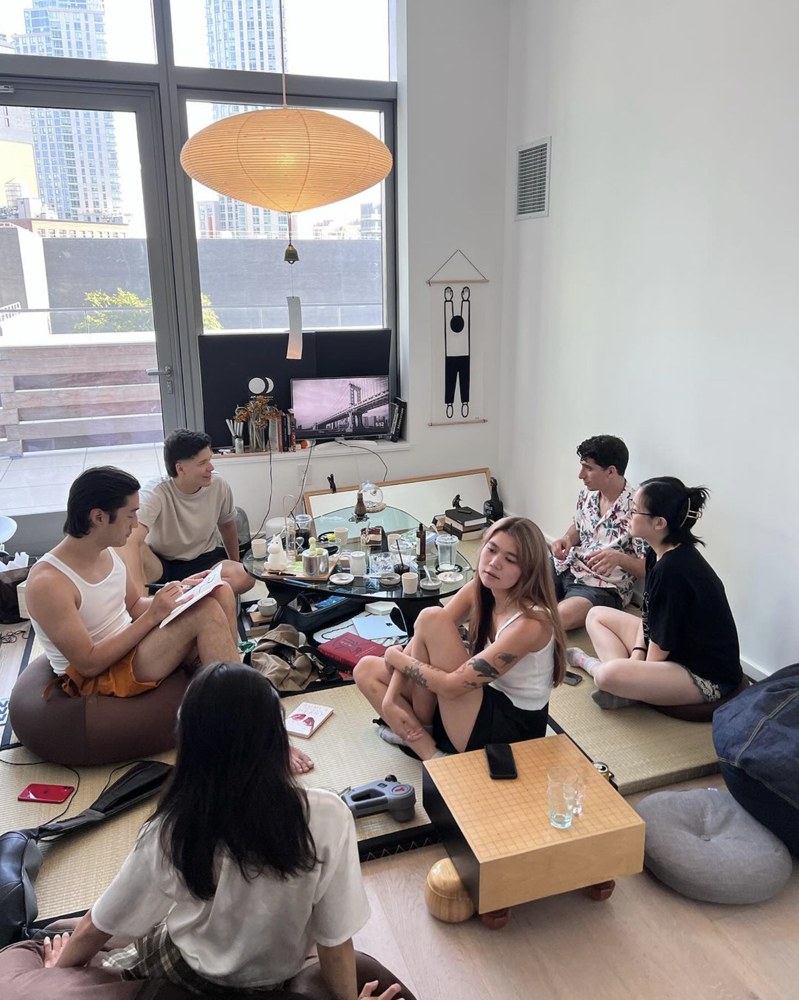

# A Critique on Couches

I've been contemplating this issue for seven years: my disdain for couches. Ever since I left home and started living in my own spaces, the idea of a couch has always felt oppressive to me.

In this piece, I will outline the reasons why I believe couches can be seen as an oppressive force. I will approach this topic from various perspectives, presenting fragmented thoughts. Feel free to read these paragraphs in any order that interests you.

<!-- more -->

The couch, often positioned facing a television, symbolizes the societal imposition of a predetermined essence onto our living spaces. This arrangement, reminiscent of Sartre's concept of bad faith, dictates the room's function and restricts its potential. It mirrors the limitations we place upon ourselves when we conform to societal expectations, disregarding our authentic selves.

## Directing the Gaze

I have always regarded chairs and benches in parks or near windows as a way to frame the world we observe. By looking out the window, we can catch a glimpse of the moon or watch the shadows of leaves dancing into our rooms. A place to sit becomes a means to direct our gaze. We may sip our coffees while gazing at the streets or sit on a park bench, appreciating the world before us.

Now, let's consider the couch in a "living room." In such a room, a couch hardly serves the purpose of living. It is not a piece of furniture that allows us to point our attention towards the window, the backyard, or a lake. In most American homes, the couch directs our gaze towards a wall or a television. It dictates that the room's purpose is solely for sitting and consuming. Countless times, I have found myself uncomfortably contorting my body while sitting at opposite ends of a couch, trying to engage in conversation with someone.

Sartre's concept of "the Look" is crucial in understanding self-awareness and otherness. The typical living room setup, where seating faces away from each other, avoids direct engagement of the gaze, fostering a detached form of social interaction. This arrangement promotes a superficial existence, allowing us to evade the existential anxiety of being an object in someone else's world.

## House parties are in the kitchen

For a living room with a couch, it's a perfect place to go and watch a movie or a sports game: consumption. But if you were to maximize the number of human connections, it's no wonder that so many people end up just standing because nobody wants to sit down on this sacred space with room for three. It ends up just being a glorified coat rack. To actually sit on the couch is to almost choose to exclude yourself from the conversation of 'standing people.'

## Sacred Space

One issue with the couch is that it imposes rules and constraints on how closely people sit to each other, creating strange distance expectations. If everyone were on the floor, there would be no predetermined distance. Whether I was a foot or a meter away from you wouldn't matter. The entire surface is available for anyone to occupy.

So when sitting on a couch with limited space, it makes sense to sit on the ends. Segmenting the space enforces a minimum distance, making it strange and unexpected to sit closer to someone. However, when more than two people are present, the dynamics of conversation become awkward. One person can speak over another while someone is stuck in the middle. With four people, the situation is equally silly. The individuals on the ends must turn their heads towards the middle to speak to the other two. It's a peculiar dynamic that I've never quite understood.

## Limited Transcendence

The counter is a large and immobile piece of furniture that restricts the living room's potential for multiple uses. It symbolizes the denial of other possibilities within the room. With unlimited space, a large couch dictates the only acceptable place to "be". However, in an open space, the possibilities are endless. We could sit in a circle and share stories, lay down mats for yoga, host a dance party, or even transform it into a restaurant. The potential is far greater.

This approach fosters intimacy and interaction by encouraging people to engage closely and directly with each other. It challenges the conventional notion of a living room as a space primarily for passive consumption, typically centered around a television.

## Sitting is Just Bad

Some people criticize my thoughts, arguing that it's important to have a comfortable place to sit for three hours. However, I'm not convinced that this is a desirable feature. I don't believe we should be seated for such extended periods. When I sit on the floor or on a bean bag that can be placed anywhere in my house, it's still easy to sit for a long time. Sitting on the floor introduces a level of discomfort that prompts me to shift my weight and adjust myself, encouraging movement. I believe this is a positive aspect.

There is ample research showing that prolonged sitting is detrimental to our hips and hip flexors. We become so lazy and relaxed that we lose the ability to strengthen our spines.

A study conducted by Columbia University Irving Medical Center found that taking a five-minute stroll every half hour can counteract the harmful effects of prolonged sitting. This simple activity can significantly improve cardiometabolic risk factors.

## The Benefits of Rising from the Floor

The research linking the ability to rise from the floor to mortality risk was published in the "European Journal of Cardiovascular Prevention" by Claudio Gil Araújo and colleagues. The study introduced the 'sitting-rising test' (SRT), assessing the ease of getting up from and down to the floor. It found a significant correlation between SRT scores and mortality risk, suggesting that lower scores were associated with higher mortality risk. This was due to SRT's ability to measure muscular strength, flexibility, and balance, key indicators of general health and longevity.

If that's not actually the case, why don't we just sit on the floor to begin with and develop these motor skills as we age? I bet there are so many Americans who would struggle to just go from seated to standing. People who can't put weight on their hands or are too immobile.

## Well, I Want to Lie Down

I'm not suggesting you sit on, like, cold marble. Having a combination of a rug or a mat with some bean bags means that not only can you lie down. Since the floor is not this sacred space where we put our dirty shoes, we should be able to lie down in any orientation and in any direction.

There's literally more space.

## Consider the Tatami Room

Consider the tatami room. A room that is designed to be a multi-purpose space. A room that can be used for tea ceremonies, for sleeping, for eating, for socializing. We can have very modular lightweight furniture be moved in to eat on a table. Arrange mats to sit in a circle for us to all be able to talk to each other.

We can roll up futons and put them in the closet. And when we're ready, we can also go to bed and sleep.

