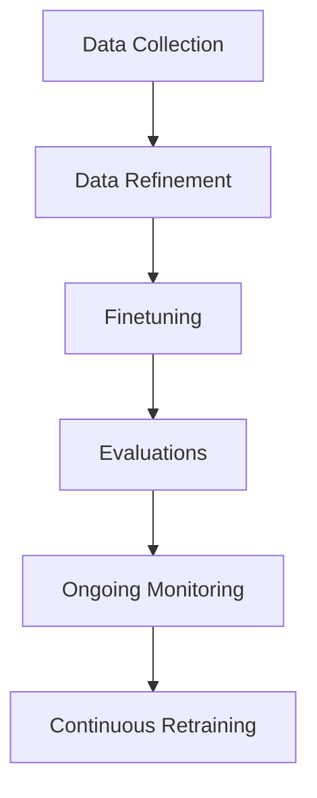

---
authors:
  - jxnl
categories:
  - Applied AI
comments: true
date: 2024-03-28
description: Explore how data flywheels leverage user feedback to enhance product
  development and achieve business success with AI.
draft: false
slug: data-flywheel
tags:
  - data flywheel
  - AI
  - user feedback
  - product development
  - machine learning
---

# Data Flywheel Go Brrr: Using Your Users to Build Better Products

You need to be taking advantage of your users wherever possible. It’s become a bit of a cliche that customers are your most important stakeholders. In the past, this meant that customers bought the product that the company sold and thus kept it solvent. However, as AI seemingly conquers everything, businesses must find replicable processes to create products that meet their users’ needs and are flexible enough to be continually improved and updated over time. This means your users are your most important asset in improving your product. Take advantage of that and use your users to build a better product!

<!-- more -->

Prior to the advent of AI, companies would need to build an initial product to bootstrap data before they could do any kind of modeling. Nowadays, companies have gotten the model and must remember that they still need to collect data to improve it, which is how companies have ended up like Blockbuster instead of Netflix. To avoid this, one of the most effective ways to leverage the near-infinite insight your customers can provide you. When considering machine learning, this looks like the concept of a data flywheel. If businesses implement their flywheel correctly, they can build AI products that leverage every user interaction to iterate and improve their products continually, thus gaining a competitive edge.

## What is a Data Flywheel? How Should I Use a Data Flywheel?

A data flywheel is a self-reinforcing system that takes input in the form of data from each step of the flywheel and uses it to improve itself over time. As a user engages with the product, the flywheel works by taking the data the user produces feeds it back into the system, which trains the underlying model and finetunes it, allowing it to deliver better results and, in turn, attract more users by being a better product. This process creates what is called a Virtuous Cycle where more users result in more data, which means a better product and increased user engagement.

OpenPipe wrote a wonderful article that I highly recommend checking out if you’re looking for a specific platform to help you with your own Data Flywheel. However, the real value of this article is how they’ve outlined the parts of the flywheel in an easily digestible format. They also outline the value of building and owning your own processes. It can be daunting to dive into the world of machine learning, but their model is easy to understand and follow. It looks like this:

## How Network Effects Enhance Your System

As the flywheel helps to improve the product and attracts more new users, Network Effects starts to amplify the effectiveness of the data flywheel. A network effect is a phenomenon where a product becomes more valuable as more people use it. As the system generates more data, your data flywheel, assuming it was calibrated correctly, will be able to intake this data and result in an increasingly well-trained model that is specific to your users. Not only does this mean you have a hyperfocused and specific tool suited to your audience's exact needs, which is extremely valuable, but it also allows for rapid growth and market dominance if executed correctly.

Let's take a look at two massively successful examples of data flywheels.

Netflix's Data Flywheel:
Users watch content on Netflix. This generates data about their viewing preferences, watch history, and ratings.
Netflix collects and analyzes this data to better understand user preferences and behavior.
Based on their analysis, Netflix recommends personalized content for each user. In turn, this increases user engagement and satisfaction.
Netflix also uses this data to decide which original content to produce or license, ensuring that it caters to the interests of its user base.
As the content becomes uniquely tailored to Netflix’s audience, more users are attracted to the platform, and existing users spend more time on it, generating even more data.
The cycle repeats, with Netflix continuously improving its recommendations and content offerings based on the growing user data volume.

Spotify's Data Flywheel:
Users listen to music on Spotify, which generates data about their listening preferences, playlists, skips, and repeats.
Spotify collects and analyzes this data to understand users' musical tastes and listening habits.
Spotify uses this information to create personalized playlists, such as Discover Weekly and Daily Mix, which introduce users to new music tailored to their preferences.
Users consume their personalized recommendations and spend more time on the platform, which generates more data about their listening behavior.
Spotify also uses its user’s data to inform its music curation, licensing decisions, and collaborations with artists, ensuring that it offers content that aligns with user interests.
The improved user experience and content offerings attract more users to the platform, and existing users become more engaged, generating even more data.
The cycle continues, with Spotify refining its recommendations and music offerings based on the ever-growing volume of user data.

Both of these cases follow the basic framework we looked at with OpenPipe. This data flywheel also enables Netflix and Spotify to continuously improve their product offering by leveraging their most valuable asset: their users.

## Designing Products with Data Flywheels in Mind

It’s one thing to build a data flywheel and another to build an effective one. A user-centric approach is necessary to build effective data flywheels. Collecting user data feedback via seamless and engaging mechanisms that provide your system with meaningful input is crucial. In my experience, this comes down to striking the balance between simplicity and granularity of the data. If your business can successfully implement an intuitive feedback system that encourages high-quality user feedback, it can then be leveraged to power your data flywheel.

> Keeping it as simple as possible is always the name of the game. Regarding UI considerations, presenting a user with a binary option like thumbs up/thumb down instead of asking for a numerical rating tends to provide better data.

## Aligning Data Flywheels with Business Objectives

However, it’s not enough to simply have a flywheel. As mentioned earlier, one of the major benefits of the data flywheel is that it produces a solution tailored to your users' specific needs. The other half of that equation is ensuring that the flywheel aligns with your business objectives.

> You're not just trying to answer questions using an LLM; you might want to have the ability to make principled decisions, improve your ability to generate leads, have a higher conversation rate, or do upsells in your chatbot, minimize support times

By identifying the specific outcomes you want to achieve, such as the ones outlined above, you can design your flywheel to collect the data that will allow you to optimize your models correctly. This approach shifts the focus from simply improving your AI application to driving tangible business results. Having the flywheel or running this data through a cycle repeatedly with no apparent purpose is not enough. It must be purposeful and objective-driven to produce value for your business and, more importantly, to your users.

## Future Considerations

As AI continues to occupy the forefront of our cultural and technological landscape, the role of data flywheels will only grow and become more relevant. Any company looking to incorporate LLMs or machine learning into their products should be looking to develop effective flywheels if they are to succeed in the AI-driven future. Leaders like OpenAI and Character AI optimized their models based on user input and business goals. Providing, if not literally, at least aspirationally, a process which makes clear how powerful data flywheels are when done correctly that other companies can seek to emulate.

## Conclusion

The fact of the matter is that AI is here; it’s not going away, so you should try to take advantage; otherwise, you will be left behind. One of the best strategies for building out your project using AI and taking advantage of your most valuable asset is designing products emphasizing data collection and user feedback. From there, you can align your data flywheel with your objectives and amplify it with network effects.

If you’re thinking about how AI can improve your business, check out my other writing on [MVPs](../posts/mvp.md), [RAG Complexity](../posts/rag-levels-of-rag.md), and [Prompt Formatting](../posts/strings.md).
