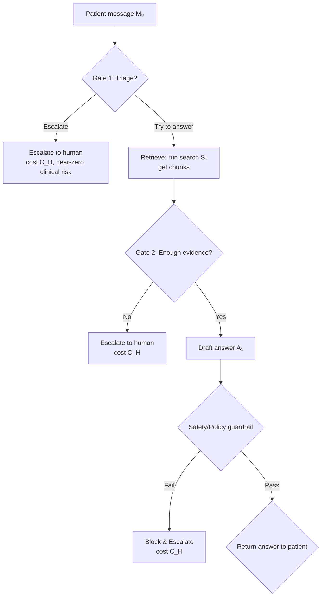

---
authors:
  - jxnl
categories:
  - AI
comments: true
date: 2025-01-29
description: A comprehensive framework for implementing two-stage triage systems in AI applications with explicit error surfaces and cost optimization.
draft: false
tags:
  - AI Systems
  - Triage
  - Cost Optimization
  - Risk Management
  - Operational Playbooks
---

# Two-Stage Triage System

This artifact packages the decision flow, cost math, and operational playbook so the team can set defensible thresholds and understand trade-offs at a glance.

<!-- more -->

## 1. Decision Flow (Two-Stage Triage with Explicit Error Surfaces)

### Key Components

- **Gate 1**: A priori risk triage on the raw message (intent, symptom/risk cues). Bias to escalate when uncertain.
- **Gate 2**: Evidence check after retrieval. If knowledge base isn't decisive, don't guess—escalate or ask a clarifying question.
- **Guardrail**: Last-mile policy/safety filter over the drafted answer.
- **Feedback loop**: Structured signals to tighten thresholds over time.

## 2. False Positives / False Negatives by Gate

### Gate 1 (Pre-retrieval)

- **FP1** (Answer when should escalate) → clinical/regulatory risk. **High cost.**
- **FN1** (Escalate when bot could answer) → ops cost only. **Moderate/low cost.**

### Gate 2 (Post-retrieval)

- **FP2** (Claim sufficient evidence when it's not) → wrong/misleading guidance. **High cost.**
- **FN2** (Say insufficient even though it's enough) → ops cost only. **Moderate/low cost.**

### Core Principle

Bias toward high recall for escalation on risky classes. Missing an escalation hurts more than over-escalating.

## 3. Metrics (By Gate, By Intent)

### Gate 1 Metrics

- Recall on must-escalate ↑
- FP-answer rate on must-escalate ↓
- Deferral rate vs capacity targets
- Time to safe outcome

### Gate 2 Metrics

- Evidence sufficiency precision/recall (expert labels)
- Guardrail catch rate (should be ~0 post-tuning)
- Clarifying-question helpfulness rate

### Global Metrics

- Expected cost per conversation
- Satisfaction/reopen rate
- "Needed a human anyway" rate

## 3. Threshold Tuning Playbook

1. **Label dataset**: Create a small, high-quality set per intent ("must escalate" vs "may answer")
2. **Score and analyze**: For each gate, score performance; draw ROC/PR curves
3. **Set thresholds**: Pick thresholds via cost curve using current baseline and intentionally conservative margins
4. **Shadow deployment as a copilot**: Log decisions; act as autocompletion copilot to verify
