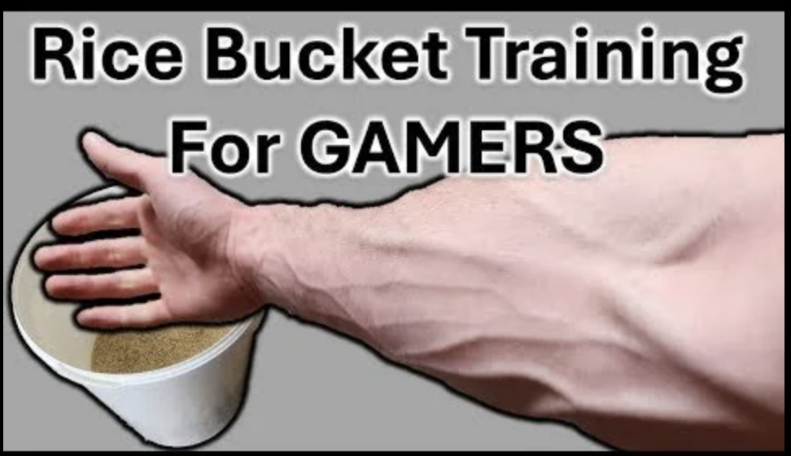
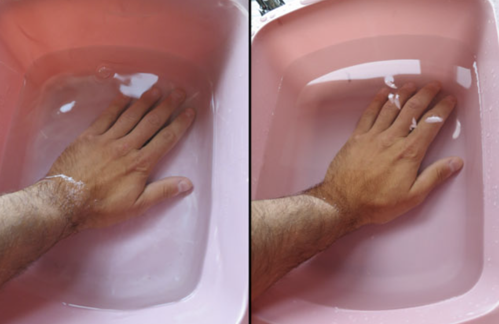
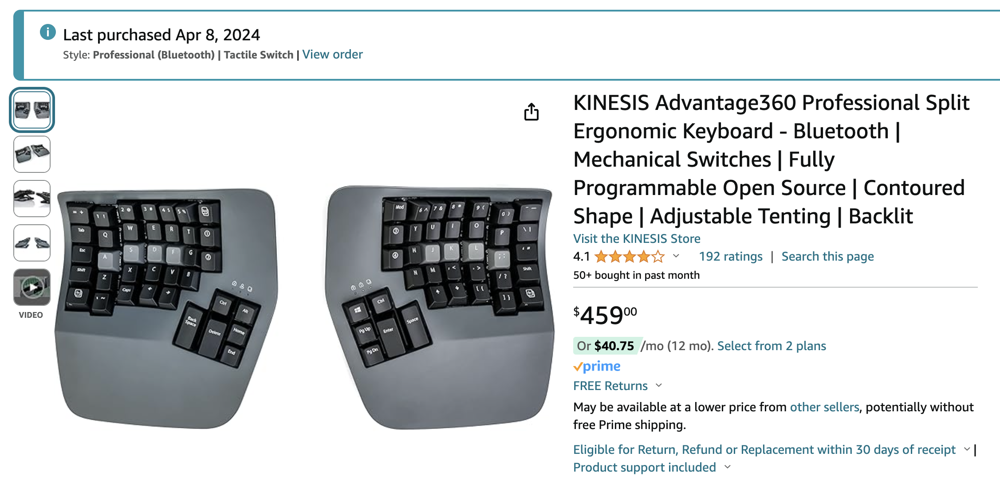

---
authors:
  - jxnl
  - jo
categories:
  - Losing my Hands
comments: true
date: 2024-05-27
description: Explore practical advice and tips for managing RSI, drawing from a personal
  journey of recovery and mindful usage of hands.
draft: false
slug: products-and-tips-for-rsi
tags:
  - RSI
  - Tendonitis
  - Hand Health
  - Personal Recovery
  - Ergonomics
---

# Losing my Hands, Advice and Tips for RSI

This is the final entry (for now) of a series I wrote about my experience with tendonitis in both my wrists and thumbs during COVID-19. The injury occurred in 2020 due to overworking at my previous job, where I would put in excessive hours for weeks on end with minimal breaks. The debilitating pain prevented me from eating, dressing myself properly, and programming, leading to a significant disruption in my work and personal life. Ultimately, this experience led me to make three major changes:

1. **Consulting full-time**: Sometimes, you need to take a leap of faith; other times, you need a swift, firm shove in the back to overcome your limitations. The RSI was the latter that lead me down the path of higher leverage.

2. **Revaluating my values**: This doesn't necessarily mean discarding the traits that led to me getting an RSI, but it certainly made me rethink what is actually valuable and what I am trying to do with my life. Sorry to disappoint, but there has been no 'epiphany'. I am not discarding worldly possessions and pursuing a spirit quest to find 'my true self'. My hands are now a limited commodity, and I fear reinjuring myself. This means if I'm going to use my hands, it must be purposeful and deliberate.

3. **Writing**: Thankfully, we live in an era where you no longer need hands to express yourself through text. Writing helped me realize that I have spent my first three decades learning and absorbing knowledge and information. Now, in my thirties, my goal will be to share the thoughts and stories I've collected.

You can read the previous two entries here: [Losing My Hands](./hands-part-1.md), [Losing My Hands Pt. 2: The Two Jasons](./hands-part-2.md).

<!-- more -->

After sharing my experience, many people asked me what I did to try to heal myself. I tried various treatments and products to aid my recovery. Whether or not the pain was psychosomatic or physical is still unclear, which is one of the most frustrating aspects of seeking treatment. Braces, exercises, and ergonomic devices provided some relief and support; I found that taking adequate time to rest was the most critical factor (not very sexy or satisfying, but it works wonders). In this blog, I'll share my experience with different products and provide some tips for anyone dealing with hand or wrist issues that provided relief to me.

## Products and Tips for RSI

### Using Braces

Two braces that I found particularly helpful were:

- [**Push Sports Thumb Brace**](https://www.amazon.com/dp/B074BR34LQ/ref=cm_sw_r_as_gl_api_gl_i_N1QANTX25AGP9Y3A6ZF4?linkCode=ml2&tag=567techblog-20) ($50 each, purchased for both hands) Ideal for thumb-specific injuries, which I had. It's also washable, which is ideal if you, like me, need to wear it all day or wear it while doing sports.

- [**Futuro wrist brace**](https://www.amazon.com/dp/B004LK2E90/ref=cm_sw_r_as_gl_api_gl_i_CK73E5E32T7BFKSNZZKJ?linkCode=ml2&tag=567techblog-20) ($25 each, purchased 2 for each hand): This brace offers general wrist support and reminds the user to rest the injured area. It is available at pharmacies like CVS. One thing to note is that Futuro recommends regularly replacing your braces after approximately six months of use. (I did not do this, and I’m unsure if this is one of those planned obsolescence things or if it doesn’t matter.)

Braces are fantastic and super helpful for short-term relief and support. It's a reminder that it was injured and prevented me from putting too much pressure on it while sleeping or outside. One thing I abide by and heard a lot from the specialists I worked with (and to be clear, I am not a doctor, so this is me simplifying their expertise) was that your body can become reliant on braces if you use them long term, and they can actually harm you if you’re not careful with them.

### Exercises for Strength and Mobility

[Hand putty](https://www.amazon.com/dp/B006LN4JN4/ref=cm_sw_r_as_gl_api_gl_i_QXHND7BY49NSKRVR2ANC?linkCode=ml2&tag=567techblog-20) and [rice bucket exercises](https://www.youtube.com/watch?v=iVum3vWlh4Q) were recommended to me as they are effective for gradually improving strength and dexterity:

- **Pinching and pulling apart therapy putty** helps restore hand strength. I didn’t have a particular movement or regime while using putty. It was more about playing with the putty and stimulating the hand.
- **Rice bucket exercises** involve submerging the hand in a rice bucket and opening/turning the wrist against the resistance. There are also about [a million videos](https://www.youtube.com/watch?v=iVum3vWlh4Q) on various techniques and versions of exercises you can do with rice buckets.

I found these exercises more natural and beneficial than elastic finger strengtheners; performing them in the morning and evening can aid recovery. They were easy to incorporate into a daily routine and didn’t require fancy tools or expensive equipment.

### Contrast Therapy for Circulation

Contrast therapy involves dunking your hands in ice water and then hot water in a cycle. It addresses circulation, which is critical because circulation is already low for something like a wrist (vs a bicep). Contrast Therapy can be done with a sauna, hot tub, ice bath, or two water basins.

This was one of the best treatments I experienced for helping circulation and pain relief when done correctly.

### Ergonomic Keyboard and Mouse

- [**Kinesis Pro keyboard**](https://www.amazon.com/dp/B0BCHMGZMD/ref=cm_sw_r_as_gl_api_gl_i_QP09RS5ZP2VVZKVV8TKA?linkCode=ml2&tag=567techblog-20) ($400+) - Expensive but effective in minimizing wrist strain. Typing speed may decrease initially but returns to baseline with practice. It also forces you to type ‘correctly’ and can help a lot of bad habits you may have picked up from using more standard layouts. But I found the thumb placement makes it so I don't have to fold my hands.
- [**Vertical mouse**] This keeps the wrist in a neutral position. Various models are available, but one I found works really well is Logitech’s MX Vertical ergonomic mouse.

While these devices are helpful, they aren't a substitute for rest and recovery. I think it’s probably best to view them as preventative measures. Use them, and you might be able to stave off hand injuries better than you would without them.

## The Importance of Rest

Ultimately, the most critical factor in recovering from hand and wrist injuries is giving your body adequate time to heal. While supporting products and therapies can provide relief, there's no substitute for rest. Listen to your body, take breaks when needed, and be patient with recovery. This feels like crap advice when you’re a young person who wants to get on with your life and always go a hundred miles an hour like I did. However, now that I’m a little bit older and hopefully a little wiser, there is nothing else like good rest. Rest is like our body's way of self-healing. It is so essential for everything we do, not just recovery.

## Teaching is Vocational

The saying ‘those who can’t do, teach’ is often used derisively to discuss a gap between theoretical and practical knowledge. It’s little more than a cheap provocation, and I’d like to propose a counter maxim: ‘You can just do more things.’ You can both do and teach and be good at both; nothing is stopping you.

I will likely bang this drum for the next few years of my life, but again, the skills that brought you to the dance are not the skills that will keep you happy or successful for the rest of your life. If there is any grand narrative, takeaway, or epiphanic moment for me in the saga of being injured, it’s that ‘constant personal growth is crucial’. Being able to continually learn to do new things in the face of adversity and not give up is critical. This drove me to write, consult, and learn new things when unable to work the way I used to. Now, I consult, the key to consulting is teaching people how to solve their problems.

Not to be too mystical, but this entire experience of losing my hands has called me to develop a new skill set. One that relies not on my hands but on the skills and knowledge I can leverage. I feel responsible for sharing what I know and have learned with others. If you produce work that impacts nobody, that strikes me as a sad way to live. We are not living in caves isolated from each other. Everything we do depends on how we can impact other living beings. The other significant push factor was I realized very few experts write. A lot of content on the internet is for beginners because that's the most significant population to speak to. I hope that by becoming more involved in producing content and being successful at it, more experts will see the value in producing it themselves.

Thank you, everyone, for reading, listening, and sharing your experiences with similar injuries. The road to recovery has been full of ups and downs, but sharing it with everyone and being vulnerable for a moment has been an incredible delight—not something I had imagined doing when starting this blog.
