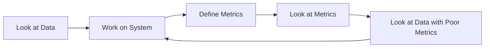
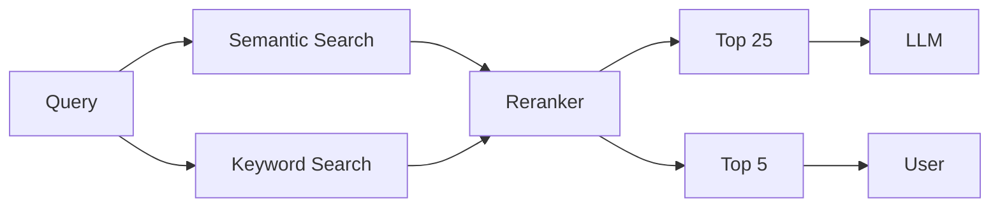

# Stop using LGTM@Few as a metric (Better RAG)

!!! warning "This is a draft"

    This is a draft. I would love to receive any PRs that correct any typos. Thanks.

When giving [advice](./rag.md) to developers on [improving](./rag-inverted.md) their retrieval augmented generation, I usually say two things:

1. Look at the Data
2. Don't just look at the Data

Wise men speak in paradoxes because we are afraid of half-truths. This blog post will try to capture when to look at data and when to stop looking at data in the context of retrieval augmented generation.

I'll cover the different relevancy and ranking metrics, some stories to help you understand them, their trade-offs, and some general advice on how to think.

<!-- more -->

## When to look at data?

Look at data when the problem is very new. Do not rely on any kinds of metrics just yet. Look at the queries people are asking. Look at the documents that people are submitting. Look at the text chunks and see whether or not a single text chunk could possibly answer a question your user might have.

There's a lot of intuition you can gain from just looking at the data.

## When to stop?

At some point, you're going to actually want to build a system. You're going to want to iterate and improve on it. You will likely get nowhere if all you're doing is 'looking at things'. You will spend too much time guessing as to what will improve something rather than trying to measure and improve something.

> "What gets measured gets managed."

Instead, define metrics, run tests, investigate when and where the metrics are poor, and then start looking at the data again.

Well, let's take a closer look at what kind of metrics we can use and how they might improve our system. And I'll give an intuitive understanding of why and how some of these metrics break down. But first I also want to talk about the importance of speed.

## Importance of Velocity

How quickly you can get metrics and run tests determines the nature of how you iterate on your software. If you're looking at a metric that takes a long time to compute, you're going to be waiting a long time to iterate on your system. So do whatever it takes to make the test that you run and the metrics you build as fast as possible!

**Example via RAG**

- **Slow Metric**: Collocating human preferences and consulting domain experts.
- **Still Slow Metric**: AI-generated metrics. When using something like GPT4, things can become very slow.
- **Fast Metrics**: Accuracy, Precision, Recall, MRR, NDCG, are computationally cheap given the labels.

The goal is to reason about the trade-offs between fast metrics and slow data. It takes a long time to get enough data so you can move fast. But if you never do that work, we're always gonna be stuck.

## Simple Metrics for Relevancy and Ranking

In the retrieval context, there are plenty of metrics to choose from. I'm gonna go describe a couple of them. But before we do that, we need to understand what @k means.

### Understanding @K

The simplest idea we should think about is the idea of @k. When we do RAG, we first have to retrieve a set of K documents. Then we will do some re-ranking potentially. And then select the top end results to show to a user or to a language model. Consider the following pipeline:

1. Fetch n documents via Keyword Search
2. Fetch n documents via Semantic Search
3. Combine them and re-rank
4. Select the top 25 chunks to show to LLM
5. Top 5 documents are shown to the user.

Now let's look at some interpretations of top-k.

| k   | Interpretation                      |
| --- | ----------------------------------- |
| 5   | Is what we show the user relevant?  |
| 25  | Is the reranker doing a good job?   |
| 50  | Is the retrieval system doing well? |
| 100 | Did we have a shot at all?          |

Here we're not going to worry about the details of generation with language models. Let's primarily focus on whether we could have answered the question by determining whether or not things were relevant to begin with. I'm going to give just a qualitative definition and then some anecdotes to help you understand and think about some of these metrics.

## Thinking about the metrics

My goal isn't to necessarily define all these equations and tell you how to implement them. Instead I wanted to show a simple explanation and a couple of anecdotes I used to explain these.

### Mean Average Recall (MAR) @ K

Focuses on the system's capability to retrieve all relevant documents within the top K results, emphasizing the breadth of relevant information captured.

**Formula for Standard Recall**

$$
Recall@K = \frac{\text{Number of relevant documents in top K}}{\text{Total number of relevant documents}}
$$

!!! tip "Intuition: Can we catch the right answer?"

    Recall is just figuring out whether or not the net that we cast can actually catch everything.

    Imagine throwing a net. Your goal is to catch fish, and the only thing we care about is if we catch all the fish. If we accidentally catch a dolphin or a sea turtle, we simply do not care.

    In a medical context, if I said that every single person on the planet had cancer, I would have very high recall. If the actual application of this prediction was to then send them to the hospital, we would not have enough capacity to actually treat every single person. This is why we often have to make trade-offs between how many things we catch and how precise we are in our predictions.

### Mean Average Precision (MAP) @ K

Assesses the accuracy of the top K retrieved documents, ensuring the relevance and precision of retrieved content.

**Formula for Standard Precision**

$$
Precision@K = \frac{\text{Number of relevant documents in top K}}{K}
$$

!!! tip "Intuition: Are we choosing too carefully?"

    "In the previous example, when considering the prediction of whether someone has cancer, if we were to assume that everyone on Earth has cancer, we would achieve a remarkably high recall. However, what does it mean to have 'really good precision'? What if the person I was treating was bleeding from their eyeballs and shitting themselves? If I were to solely treat that person as a doctor, many individuals with potentially less severe symptoms would remain untreated.

    Again, we see that in the case of precision and recall, we are often led to trade-offs.

In the context of a language model, recall describes whether or not we had a chance of getting the right answer. And precision is usually constrained by the context length, but also whether or not the irrelevant text chunks might mislead the LLM and give an incorrect answer.

| Recall | Precision | Interpretation                                |
| ------ | --------- | --------------------------------------------- |
| High   | Low       | We have a shot if the LLM is robust to noise  |
| Low    | High      | We might give an incomplete answer            |
| High   | High      | We have a shot and we're choosing carefully   |
| Low    | Low       | We're not doing well at all, nuke the system! |

### Mean Reciprocal Rank (MRR) @ K

Highlights the importance of quickly surfacing at least one relevant document, with an emphasis on the efficiency of relevance delivery, which matters a lot when there are only a few items we can show to the user at any given time.

**Formula**

$$
MRR = \frac{1}{|Q|} \sum_{i=1}^{|Q|} \frac{1}{\text{rank}_i}
$$

!!! tip "Intuition: How quickly can we get the right answer?"

    The best business example I can give of MRR is thinking about something like a "play next" button. If you're building Spotify, you probably don't really care if one of the next 50 songs might be a banger. If the songs in the queue are not good, users will likely churn. The same applies to YouTube rankings.

    The importance of bringing the right answer to the top is paramount. The third document is worth 1/3 of the first document. The 10th document is worth 1/10 of the first document. You can see how it dramatically decreases as you go lower. Whereas the precision and recall at K-metrics are unaffected by order.

### Normalized Discounted Cumulative Gain (NDCG) @ K

A nuanced measure that evaluates both the presence and graded relevance of documents, rewarding systems that present the most valuable information first.

$$
NDCG@K = \frac{DCG@K}{IDCG@K}
$$

!!! tip "What the fuck is even that?"

    Honestly, I wouldn't worry about it too much, especially in the context of retrieval or generation. If you want to learn more, check out [this great resource](https://www.evidentlyai.com/ranking-metrics/ndcg-metric).

    The TLDR I want to give you here is that this is just a more holistic measure of how well things are being ranked. It's not as aggressive as MRR.

    !!! note "Aggressive?"

        It's my belief that MRR and how it pushes certain rankings to the top is likely responsible for various kinds of echo chambers that might result in recommendation systems. For example, if you're watching a conspiracy theory video, the next thing you'll probably watch is going to be a conspiracy theory video.

        There's no way, for example, that TikTok can show such diverse results by using something like MRR.

## How to improve

Now the only thing you have to do is follow these steps:

1. Choose a metric that aligns with your goals.
2. Formulate a hypothesis and adjust the system.
3. Evaluate the impact on your chosen metric.
4. Iterate based on findings.

Here are some caveats that you need to make sure of.

!!! warning "Beware of [Simpson's Paradox](https://en.wikipedia.org/wiki/Simpson%27s_paradox)"

    > "A paradox in which a trend that appears in different groups of data disappears when these groups are combined, and the reverse trend appears for the aggregate data."

    This is just to say that if you can split your metric across different categories, it's really helpful to understand under what conditions we perform better and worse. This is very relevant and informed by my post on [Rag is more than embeddings](./rag.md).

    1. Cluster the data (e.g., by query type, data source, etc.).
    2. Determine if the metric is consistent across different clusters.
    3. If it is, consider building a router to conditionally select one implementation over another.

This is effectively for science. Going back between looking at data and defining metrics. It's a cycle that you should be doing to improve your system.

## Slow Metrics

All of these metrics must ultimately be in service of something else. By improving things like precision, recall, and relevancy, what we're really hoping to do is generate better results for the user. The question then you have to ask yourself is, "What does that actually improve?". Here are a couple of things that you might want to consider.

1. **User Satisfaction**: Are users happy with the answers they're getting? Could be defined by Thumb Up/Down or NPS.
2. **Engagement**: Are users coming back to the platform? Are they spending more time on the platform?
3. **Conversion**: Are users buying more things? Are they clicking on more ads?
4. **Retention**: Are users staying on the platform longer? Are they coming back more often? Do we want to improve time spent?
5. **Revenue**: Are we making more money?
6. **Cost**: Are we spending less money on infrastructure?
7. **Efficiency**: Are we able to answer more questions with the same amount of resources?

## Wrapping up

I hope this post has given you a good understanding of when to look at data and when to stop looking at data. Here's a quick summary of what we've covered.

1. Look at the data when the problem is new. Don't rely on any metrics just yet.
2. Define metrics, run tests, investigate when and where the metrics are poor, and then start looking at the data again.
3. We talked about the importance of speed and being able to quickly iterate on your system.
4. We covered some simple metrics for relevancy and ranking: MAR, MAP, MRR, and NDCG.
5. We talked about how to improve your system by defining metrics, making a hypothesis, changing something about the system, and measuring the metric to see if it improved.
6. We talked about how these metrics must ultimately be in service of some business outcomes.
