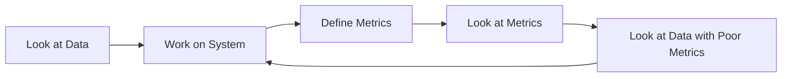
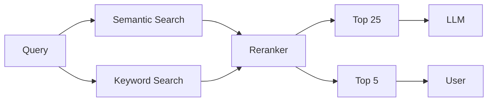

---
authors:
  - jxnl
categories:
  - RAG
comments: true
date: 2024-02-05
description: Explore why LGTM@Few is an ineffective metric for retrieval augmented
  generation and discover better alternatives for startups.
draft: false
slug: when-to-lgtm-at-k
tags:
  - RAG
  - Metrics
  - AI
  - Startups
  - Data Analysis
---

# Stop using LGTM@Few as a metric (Better RAG)

I work with a few seed series a startups that are ramping out their retrieval augmented generation systems. I've noticed a lot of unclear thinking around what metrics to use and when to use them. I've seen a lot of people use "LGTM@Few" as a metric, and I think it's a terrible idea. I'm going to explain why and what you should use instead.

If you want to learn about my consulting practice check out my [services](../../services.md) page. If you're interested in working together please reach out to me via [email](mailto:jason+hire@jxnl.co)

---

When giving [advice](./rag.md) to developers on [improving](./rag-inverted.md) their retrieval augmented generation, I usually say two things:

1. Look at the Data
2. Don't just look at the Data

Wise men speak in paradoxes because we are afraid of half-truths. This blog post will try to capture when to look at data and when to stop looking at data in the context of retrieval augmented generation.

I'll cover the different relevancy and ranking metrics, some stories to help you understand them, their trade-offs, and some general advice on how to think.

<!-- more -->

If you want to learn more about I systematically improve RAG applications check out my free 6 email improving rag crash course

[Check out the free email course here](https://dub.link/6wk-rag-email){ .md-button .md-button--primary }

## When to look at data?

Look at data when the problem is very new. Do not rely on any kinds of metrics just yet. Look at the queries people are asking. Look at the documents that people are submitting. Look at the text chunks and see whether or not a single text chunk could possibly answer a question your user might have, or if you need multiple text chunks to piece together a complete answer. Look at the results from initial prototypes to understand if the retrieval task is technically feasible.

There's a lot of intuition you can gain from just looking at the data.

## When to stop?

At some point, you're going to actually want to build a system. You're going to want to iterate and improve on it. You will likely get nowhere if all you're doing is 'looking at things'. You will spend too much time guessing as to what will improve something rather than trying to measure and improve something.

> "What gets measured gets managed."

Instead, define metrics, run tests, investigate when and where the metrics are poor, and then start looking at the data again.

Well, let's take a closer look at what kind of metrics we can use and how they might improve our system. And I'll give an intuitive understanding of why and how some of these metrics break down. But first I also want to talk about the importance of speed.

## Importance of Velocity

How quickly you can get metrics and run tests determines the nature of how you iterate on your software. If you're looking at a metric that takes a long time to compute, you're going to be waiting a long time to iterate on your system. So do whatever it takes to make the test that you run and the metrics you build as fast as possible!

**Example via RAG**

- **Slow Metric**: Collocating human preferences and consulting domain experts.
- **Still Slow Metric**: AI-generated metrics. When using something like GPT4, things can become very slow.
- **Fast Metrics**: Accuracy, Precision, Recall, MRR, NDCG, are computationally cheap given the labels.

The goal is to reason about the trade-offs between fast metrics and slow data. It takes a long time to get enough data so you can move fast. But if you never do that work, we're always gonna be stuck.

## Simple Metrics for Relevancy and Ranking

In the retrieval context, there are plenty of metrics to choose from. I'm gonna go describe a couple of them. But before we do that, we need to understand what @k means.

### Understanding @K

The simplest idea we should think about is the idea of @k. When we do RAG, we first have to retrieve a set of K documents. Then we will do some re-ranking potentially. And then select the top end results to show to a user or to a language model. Consider the following pipeline:

1. Fetch n documents via Keyword Search
2. Fetch n documents via Semantic Search
3. Combine them and re-rank
4. Select the top 25 chunks to show to LLM
5. Top 5 documents are shown to the user.

Now let's look at some interpretations of top-k results.

| k   | Interpretation                      |
| --- | ----------------------------------- |
| 5   | Is what we show the user relevant?  |
| 25  | Is the reranker doing a good job?   |
| 50  | Is the retrieval system doing well? |
| 100 | Did we have a shot at all?          |

I strongly recommend you not focus too hard on generation from an LLM, And to stay focused on being able to provide the right context. You will be able to get a language model to be more robust and as language models improve, they will only get more resilient to irrelevant information. However, as you build out your business, this data set that you curate on relevancy will stay with you.

## Thinking about the metrics @ K

Now let's look at some metrics that we can use to evaluate the performance of our retrieval augmented generation system. The goal isn't to give a mathematical breakdown of these metrics, but instead give you a sense of what they mean and how they might be useful. And how I like to explain and interpret them at the limits.

### Mean Average Recall (MAR) @ K

Focuses on the system's capability to retrieve all relevant documents within the top K results, emphasizing the breadth of relevant information captured.

**Formula for Standard Recall**

$$
Recall@K = \frac{\text{Number of relevant documents in top K}}{\text{Total number of relevant documents}}
$$

!!! tip "Intuition: Can we catch the right answer?"

    Imagine throwing a net and goal is to catch fish, and the only thing we care about is if we catch all the fish. If we accidentally catch a dolphin or a sea turtle, thats fine!

    Consider a medical test that said every single person on the planet had cancer, I would have very high recall, because I would have found everyone, but it wouldnt be useful. This is why we often have to make trade-offs between how many things we catch and how precise we are in our predictions.

    In the context of search, recall is the fraction of relevant documents retrieved. Now, this is somewhat theoretical since we typically don't know how many relevant results there are in the index. Also, it's much easier to measure if the retrieved results are relevant, which brings us to ...

### Mean Average Precision (MAP) @ K

Assesses the accuracy of the top K retrieved documents, ensuring the relevance and precision of retrieved content.

**Formula for Standard Precision**

$$
Precision@K = \frac{\text{Number of relevant documents in top K}}{K}
$$

!!! tip "Intuition: Are we choosing too carefully?"

    If you want to go to the extremes of precision. We might want to consider a test that determines if someone is sick. If you want to be very precise, we should only identify those who are bleeding out of their eyeballs... but that's not very useful. There's gonna be a lot more people we miss as a result of our desire to be very precise.

    Again, we see that in the case of precision and recall, we are often led to trade-offs.

Here's a quick table of how I like to interpret my precision and recall trade-offs.

| Recall | Precision | Interpretation                                                                 |
| ------ | --------- | ------------------------------------------------------------------------------ |
| High   | Low       | We have a shot if the LLM is robust to noise, might run out of context length. |
| Low    | High      | We might give an incomplete answer, did not get all the content                |
| High   | High      | If we do poorly here, it's because our generation prompt is...bad.             |
| Low    | Low       | We're not doing well at all, nuke the system!                                  |

### Mean Reciprocal Rank (MRR) @ K

Highlights the importance of quickly surfacing at least one relevant document, with an emphasis on the efficiency of relevance delivery. Matters a lot when there are only a few items we can show to the user at any given time.

**Formula**

$$
MRR = \frac{1}{|Q|} \sum_{i=1}^{|Q|} \frac{1}{\text{rank}_i}
$$

!!! tip "Intuition: How quickly can we get the right answer?"

    The best business example I can give of MRR is thinking about something like a "play next" button. If you're building Spotify, you probably don't really care if one of the next 50 songs might be a banger. If the songs in the queue are not good, users will likely churn. The same applies to YouTube rankings.

    The importance of bringing the right answer to the top is paramount. The third document is worth 1/3 of the first document. The 10th document is worth 1/10 of the first document. You can see how it dramatically decreases as you go lower. Whereas the precision and recall at K-metrics are unaffected by order.

### Normalized Discounted Cumulative Gain (NDCG) @ K

A nuanced measure that evaluates both the presence and graded relevance of documents, rewarding systems that present the most valuable information first.

$$
NDCG@K = \frac{DCG@K}{IDCG@K}
$$

!!! tip "What the fuck is even that?"

    Honestly, I wouldn't worry about it too much, especially in the context of retrieval or generation. If you want to learn more, check out [this great resource](https://www.evidentlyai.com/ranking-metrics/ndcg-metric).

    The TLDR I want to give you here is that this is just a more holistic measure of how well things are being ranked. It's not as aggressive as MRR.

    !!! note "Aggressive?"

        It's my belief that MRR and how it pushes certain rankings to the top is likely responsible for various kinds of echo chambers that might result in recommendation systems. For example, if you're watching a conspiracy theory video, the next thing you'll probably watch is going to be a conspiracy theory video.

## How to improve

Once you have a system in place and some metrics you want to improve, again, the steps are very simple.

1. Choose a metric that aligns with your goals. Distinguish between primary metrics (that must improve) and guardrail metrics (that must not regress).
2. Formulate a hypothesis and adjust the system.
3. Evaluate the impact on your chosen metric.
4. Look at poorly performing examples, and iterate.
5. Go back to step 2.

!!! warning "Beware of [Simpson's Paradox](https://en.wikipedia.org/wiki/Simpson%27s_paradox)"

    > A paradox in which a trend that appears in different groups of data disappears when these groups are combined, and the reverse trend appears for the aggregate data.

    It's very likely that you might improve the system for one type of query and make it worse for another.
    To avoid doing this on some level, we can do the following:

    1. Cluster the data (e.g., by query type, data source, etc.).
    2. Determine if the metric is consistent across different clusters.
    3. If it is, consider building a router to conditionally select one implementation over another.

## Metrics lead to Business Outcomes

All of these metrics must ultimately be in service of something else. By improving things like precision, recall, and relevancy, what we're really hoping to do is generate better results for the business. The question then you have to ask yourself is, "What does that actually improve?". Here are a couple of things that you might want to consider.

1. **User Satisfaction**: Are users happy with the answers they're getting? Could be defined by Thumb Up/Down or NPS.
2. **Engagement**: Are users coming back to the platform? Are they spending more time on the platform?
3. **Conversion**: Are users buying more things? Are they clicking on more ads?
4. **Retention**: Are users staying on the platform longer? Are they coming back more often? Do we want to improve time spent?
5. **Revenue**: Are we making more money?
6. **Cost**: Are we spending less money on infrastructure?
7. **Efficiency**: Are we able to answer more questions with the same amount of resources?

The sooner you can relate some of these short-term fast metrics with larger slow metrics, The more you can make sure that you're going down the right path. Rather than trying to optimize something that has no impact down the road.

## Conclusion

I hope this post has provided you with better intuition on how to think about relevancy of your text chunk.

1. Analyze data manually when facing a new problem, without relying on metrics initially.
2. Distinguish between primary metrics (that must improve) and guardrail metrics (that must not regress).
3. Velocity, clock speed of your iteration, is paramount. Make sure you can measure and iterate quickly.
4. Define metrics, conduct tests, investigate areas of poor performance, and then reevaluate the system.
5. Explore simple metrics for relevance and ranking, such as MAR, MAP, MRR, and NDCG.
6. Remember that these metrics should ultimately align with desired business outcomes.

## Additional Notes

1. Notice that for MAR and MAP, They do not depend on the rank only the presence of the relevant document in the top K. This is why they are often used in the context of retrieval.
2. Notice that for MRR and NDCG, they depend on the rank of the relevant document. This is why they are often used in the context of ranking. If you end up building a sophisticated RAG application, you'll find that a lot of the time, many of the queries are just asking for documents which great opportunity to consider a ranking metric above just a regular context retrieval mechanism. If each document is 20 pages, you'll likely really care about which document shows up first.
3. Showing your work is super important for products that need to gain the user's trust. Again, ranking becomes really relevant even though language models themselves might not care.

## Want to learn more?

I also wrote a 6 week email course on RAG, where I cover everything in my consulting work. It's free and you can:

[Check out the free email course here](https://dub.link/6wk-rag-email){ .md-button .md-button--primary }
