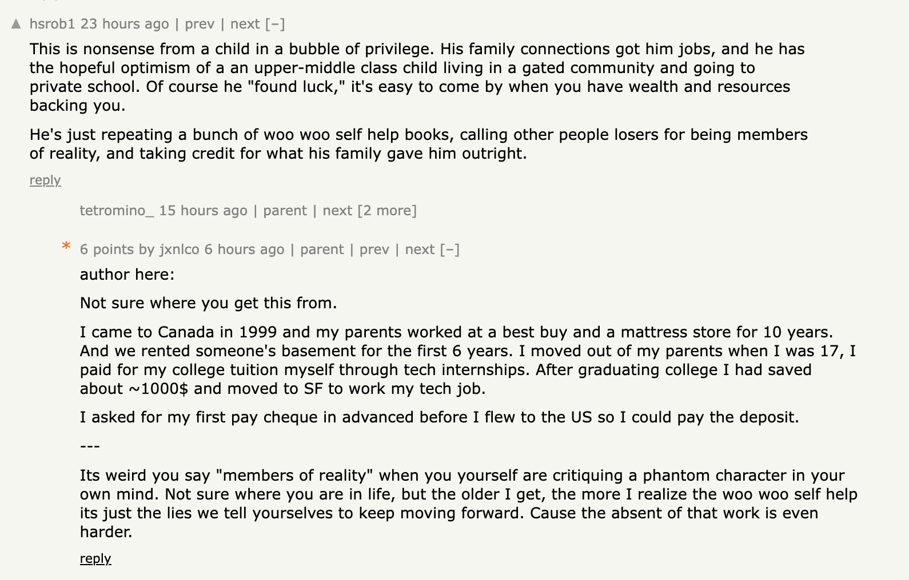

---
authors:
  - jxnl
categories:
  - Personal Growth
comments: true
date: 2024-01-09
description: A reflective piece on self-loathing and the complexities of wealth, envy,
  and personal growth written from a vulnerable perspective.
draft: false
slug: self-loathing
tags:
  - self-loathing
  - wealth
  - personal growth
  - vulnerability
  - imposter syndrome
---

# I used to hate rich people.

This entire piece of writing is dedicated to a recent response on Hacker News. I hope you can see, as a member of reality, that I write this sincerely.

—

??? note "Preamble"

    Also, I wrote this as a speech-to-text conversion. As I mentioned in my advice post about [writing more](./advice.md#write-more), my measure for writing more is simply putting more words on a page. If you're wondering how I can be so vulnerable, it's the same as what I mentioned about [confidence](./advice.md#how-to-be-confident). If you think this comment hurt me remember that you're just a [mirror](./advice.md#you-are-a-mirror).

    I've also learned that writing is a exorcism of your own thoughts. The more I write, the less these thoughts stick around in my head.

<!-- more -->

Maybe if you knew my background you’d understand why I wrote that piece.

When I was younger, I had so little in my life that I hated anyone who had anything. I used to be jealous of people who were able to have conversations with their families during dinner or the holidays because their parents did not work retail jobs. I also envied those who received Christmas and birthday gifts.

My parents were always working, so I haven't spent much time with them and resented them for not teaching me any life lessons. We didn't have much money, so whenever I needed something like a winter jacket or a pair of shoes, I had to choose between skipping my birthday or Christmas, or both. This was the case when I got my first cell phone in high school.

When I came to the US, I had about ~$1000 saved up. I asked my employer if I could get my first week's pay in advance so that I could pay the deposit for the apartment I was going to rent.

Four years into working, I pushed myself too hard and developed tendonitsis in both of my hands. I couldn't code or even hold a glass of beer. I thought I would lose my job.

!!! note "Everyone's suffering is maximum to them"

    I'm not here to compare suffering. I'm just trying to explain maybe the pre-training that went into my mental model of the world, and how it might have influenced what I wrote in that article. There no medal for the sad olympics. No one wins.

I thought the only thing I wanted was to make money so I wouldn't feel poor, because I didn't want to be like my parents. They would get into fights over late fees on the electrical bill, which meant less money for groceries. Even that was going to be taken away from me. I'm going to lose everything I told myself. At that time, I was clawing away at patriarchical self esteem and my only self worth as attached to money and work, and now, injured I thought I'd have nothing, again.

_Those were the stories I told myself._

The advice I wrote in that article, dedicated to my sister going back to college? They were truly the lies I told myself to get through it.

I want her to believe that you can just choose to be happy because the absence of choice is too dreadful.

Her life is very different than mine, my parents hae not materially supported me since I moved out when I was 17. I told myself I was a man and that they could just save the money and spend it on her.

Since then, I've known the price of every piece of clothing on my back. I know the price of every meal I've ever eaten. The reason I talk so much about money in my life is that I'm always keeping track of what I have and what I might lose.

Those were all the mantras repeating in my head until I was 27. I spent all of my 20s trying to get there only to find out, now turning 30, that there is no "there."

I wrote that piece thinking if it helped my sister, it would be worth it. If I shared it, maybe it would help someone and save them the trouble I went through.

But I was surprised at the reception. Everyone took something different from it. Older men told me that they resonated with the cost of being a champion and the importance of separating goodness and greatness.

Students told me it was about imposter syndrome.

Some thought it was about inverted thinking and the value of being by yourself.And part of that felt really healing. When I got a C in Grade 10 English, my English teacher said it was fine because I was an ESL student. I thought with a grade like that, I wouldn't be able to get into college. When I went to Waterloo, I also failed the entry English exam, IELTS.

I had always accepted it as being an immigrant and always struggling to express myself because I spent so much time by myself. It was like some scar tissue from my childhood. I had no choice in the matter.

So I believe that many of the kind words I received healed a bit of that. Not only could I express myself, but I was also worth listening to.

But I think the greatest compliment came from you.

**For you to believe that the only way someone could have written what I wrote was for me to have been a privileged optimist who was given everything in life.**

**It must mean that the lies I told myself worked. Not only am I trying to choose happiness, but I was also able to fool myself and others too, so I must have carried my struggles well.**

You were a mirror that helped me see myself. I hope one day you can see yourself in my words too.

I'll end this with quote from Naval, for `hsrob1`.

> If you despise the wealthy, it will elude you.

I used to hate rich people _too_.

---

ps: Its not just about wealth.
