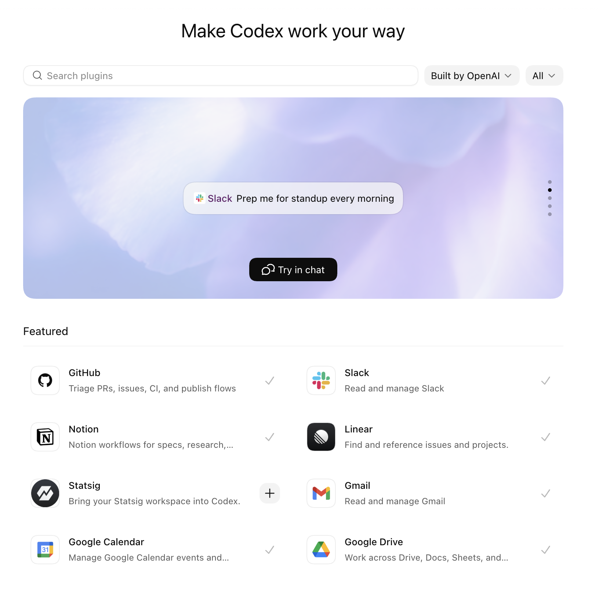

# Six levels of complexity in a Codex morning brief

This is the easiest way I know to teach someone how to use AI.

Not by starting with models, agents, or some abstract taxonomy of what the technology can do. Start with a job people already understand, then make that job quietly more powerful.

The morning brief works because almost everyone already has one. They just assemble it badly.

I think the morning brief is the first Codex workflow that normal people actually understand.

You wake up, open Slack, check your calendar, click into email, forget why you opened email, go back to Slack, then realize you have a meeting in seven minutes and no idea what happened yesterday.

The appeal is simple: help me remember what is going on.

When we were talking about Codex onboarding, this was the first workflow that felt both boring enough to teach and strong enough to matter. It starts as a dumb little orientation prompt. If you keep pushing it, it turns into a pretty good model for how people actually graduate into using Codex seriously.

Start with the thing a beginner can understand. Then add one real capability at a time until the shape of the whole system becomes obvious.

I think there are six real levels.

<!-- more -->

## Level 1: ask your actual day what is going on

The first version is almost embarrassingly small.

Connect Slack, Gmail, and Calendar, then ask:



> Using Slack, Gmail, and Calendar, what do I have going on today?

Just see whether Codex can look across the three places your work usually hides and tell you something you actually care about.

Maybe it notices the Slack thread where someone is waiting on you. Maybe it finds the meeting you forgot to prepare for. Maybe it catches the email that changes what that meeting is even about.

If that gives you a cleaner first ten minutes of the day, it worked.

## Level 2: add an agents file

The second level is adding a little bit of persistent instruction.

You already have enough raw surface area for Codex to be useful. Now you need to stop it from being generically helpful every single morning.

This is where an agents file becomes useful. Not as a piece of infrastructure trivia, but as a place to say how you want this work shaped by default.

For the morning brief, that might look like:

```text
Give me a morning brief.

Focus on:
- people waiting on me
- meetings that need preparation
- commitments I made yesterday that are still open
- anything that changed overnight and affects today's priorities

Use clear headers and bullet points.

Organize the brief into:
- To-dos
- Needs replies
- Project-level updates

For anything in "Needs replies":
- include the direct Slack link
- say what the person is waiting on
- include just enough context for me to decide whether to answer now

Keep it short, structured, and easy to scan.
```

You do not need to worry about where the file lives. Just tell Codex:

```text
I want you to save this in your agents file so you use it every time you prepare my morning brief.
```

Then paste in the instructions above. The point is to define your taste once, then let every future brief start from there.

You are not trying to sound sophisticated. You are trying to make tomorrow morning less annoying than this morning.

For other jobs, the instructions change. Recruiters might want briefs grouped by candidate. Engineers might want blockers separated from code review. Comms people might want external scans split from internal asks. But the move is the same: first give Codex the real context, then give it your defaults.

## Level 3: ask it to keep an eye on this

The third level is adding recurrence, but I do not think I would teach it as "create an automation."

I would say:

> Keep an eye on this every weekday morning.

That is the instruction people actually remember.

Under the hood, yes, you are turning the morning brief into a recurring automation. In practice, you are just saying: this is useful enough that I want it to come back on its own.

The unit of value stops being, "I remembered to ask." It becomes, "the brief is already waiting."

And because it lives in the same thread, you can keep tuning it without rewriting the prompt from scratch. If it overweights calendar events, say so. If it keeps missing open loops from Slack, say so. If it should separate `needs reply`, `needs prep`, and `worth knowing`, teach it once and let the thread carry the preference forward.

This is why I like the thread version more than a generic scheduled report. The brief improves as you complain about it.

The recurring prompt can stay simple:

```text
Keep an eye on this every weekday morning.
Check Slack, Gmail, and Calendar.
Tell me:
- what needs my attention
- what I should prepare for
- what changed that I might miss
- what seems blocked on me

Keep it short.
If nothing important changed, say that.
```

At this point the morning brief starts paying rent. You wake up to something that already did the first pass through the sludge.

## Level 4: split it into multiple project-level briefs

Eventually one brief gets mushy.

This came up directly in the conversation. I do not really want one universal daily assistant forever. I usually have multiple project threads, and each one gives me its own morning brief.

One thread for a launch.

One for a project.

One for open source.

One for chief-of-staff-ish personal triage.

Each thread has a different definition of "important."

The project thread cares about blockers, PRs, decisions, and whether some promised draft ever got finished.

The recruiting thread might care about interview briefs for candidates coming in today and whether any context changed overnight.

The personal thread cares about messages, scheduling, travel, and whatever low-grade obligation is quietly sitting in the background.

This is where pinned threads start to make obvious sense. A recurring morning brief is not just a report. It is a way to keep each project warm on its own terms.

The reason the prompt gets better is that the thread already knows which "launch thing" you meant.

## Level 5: let the brief draft the work

At this level, the morning brief should not only tell me what happened. It should draft the obvious work that follows from the brief.

Draft the Slack reply, but do not send it.

Pull together the candidate brief.

Write the meeting prep note.

Summarize the one thread I should read before I reply.

Tell me which decision looks stuck on me.

A good Level 5 brief might end like this:

> Here are the three messages I would reply to first. I drafted responses for each. Here are the two meetings that deserve prep. Here is the one decision that seems to be stuck on you.

I want the brief to leave a few obvious pieces of work half-done for me, not just hand me another summary to read.

This is also where I start using the phone more. If the context gathering already happened before I opened my laptop, I can glance at the brief while I am moving around, approve one small thing, or just decide what actually deserves my attention when I sit down.

## Level 6: save what matters in a memory vault

The sixth level is where the brief stops being only a morning ritual and starts feeding a memory system.

If the morning brief keeps finding the same people, same projects, same open loops, and same decisions, some of that should leave the thread and become durable.

Write the important bits down.

Update the project note.

Record the open loop.

Add the decision that should not be forgotten.

Preserve the context that will make next week's brief better.

This is the point where I start reaching for a vault. The short version is simple: I like memory as files I can inspect, diff, and reuse across threads.

The smallest useful version might look like this:

```text
vault/
├── TODO.md
├── people/
├── projects/
├── daily/
├── notes/
└── AGENTS.md
```

The outline is pretty simple:

- `TODO.md` keeps open loops from disappearing into chat history.
- `people/` stores durable context about recurring collaborators.
- `projects/` stores the state of important workstreams.
- `daily/` gives each day a place to leave behind the facts that mattered.
- `notes/` is where looser research or one-off memos can land.
- `AGENTS.md` tells Codex how to use the vault without inventing structure every time.

You should also update your agents file so the brief reads from the vault before it speaks. Something like:

```text
Before writing my morning brief:
- review TODO.md for open loops
- review people/ for relevant collaborator context
- review projects/ for active workstream state
- review notes/ for recent background that may change today's priorities

Use that vault context to make the brief more specific and less forgetful.
```

Once the brief has enough structure, you can also ask Codex to use subagents to search in parallel. One can review open to-dos, one can scan project notes, another can look at recent people context, then the main thread can assemble the actual brief and update the underlying documents when something material changed. You do not need that on day one, but it becomes useful once the brief has enough moving parts that a single serial pass starts to feel slow, shallow, or stale.

You can also ask Codex to review the work you are already doing and ask you questions that help organize the vault better. It might notice that the same person appears across three projects, that one project has no clear note yet, or that your `TODO.md` is mixing personal errands with launch blockers. That back-and-forth is useful. The vault gets better when Codex is allowed to say, "I think this wants a better home. Where should it live?"

The morning brief gets better when it can read from that vault before it runs and update the vault after something material changes. Tomorrow's project brief can remember the open decision from last week, the person who still needs a reply, or the status note that should not vanish just because the thread got long.

## Why I like this ladder

Each level teaches a more serious way of using Codex without asking the user to jump straight into some grand agent architecture.

Level 1 teaches the connectors.

Level 2 teaches defaults through an agents file.

Level 3 teaches recurrence by asking Codex to keep an eye on this.

Level 4 teaches project-level briefs in durable threads.

Level 5 teaches the trust boundary I actually care about: draft the work, do not impersonate me.

Level 6 teaches the part that compounds: save durable context in a vault so tomorrow's brief starts smarter than today's.

That is why I would teach Codex through the morning brief. It begins as a simple summary and ends as a miniature operating system for your work.
